# IPL Franchise Store

This is an e-commerce site for official IPL franchise merchandise: jerseys, caps, flags, autographed photos and accessories.
It is built as a senior-level reference solution: Clean Architecture, SOLID, safe under concurrent load, and fully tested.

| Stack | |
|---|---|
| API | ASP.NET Core 8 Web API (controllers, ProblemDetails, rate limiting, health checks, Swagger) |
| ORM | EF Core 8 + Npgsql. A plain SQL migrator applies the versioned scripts |
| Database | PostgreSQL 16 (ACID). Normalised write model + **denormalised read model** |
| Client | React 18 + TypeScript + Vite (kept deliberately plain) |
| Tests | xUnit + FluentAssertions (unit tests), WebApplicationFactory + Testcontainers (integration tests), Vitest |
| Delivery | Docker, docker-compose, GitHub Actions (CI, app CD and infra CD as separate pipelines), Terraform on Azure |

---

## Screenshots

Captured from the running app (React on `:5173`, API on `:5080`, seeded PostgreSQL).

### 1. Product list with prices
All 60 seeded products, paged, with franchise colours and INR prices.

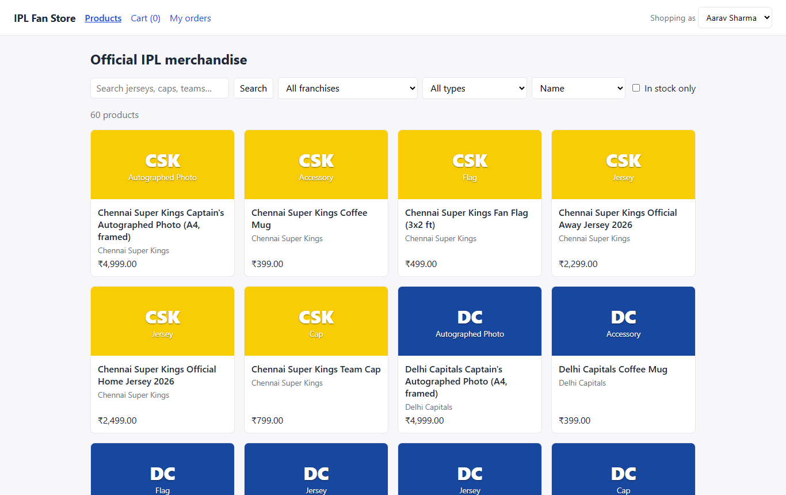

### 2. Search by name
`mumbai jersey` matches only products whose name, SKU, franchise or type contains **every** term.

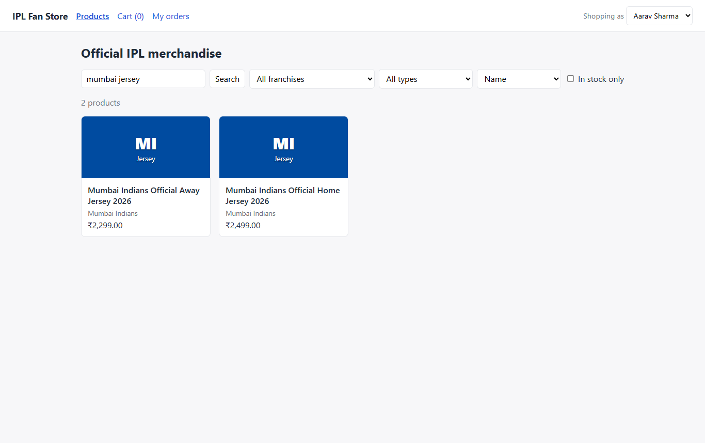

### 3. Filter by franchise and type, sort, in-stock only
Chennai Super Kings + Jersey, sorted by price high to low, in-stock items only.

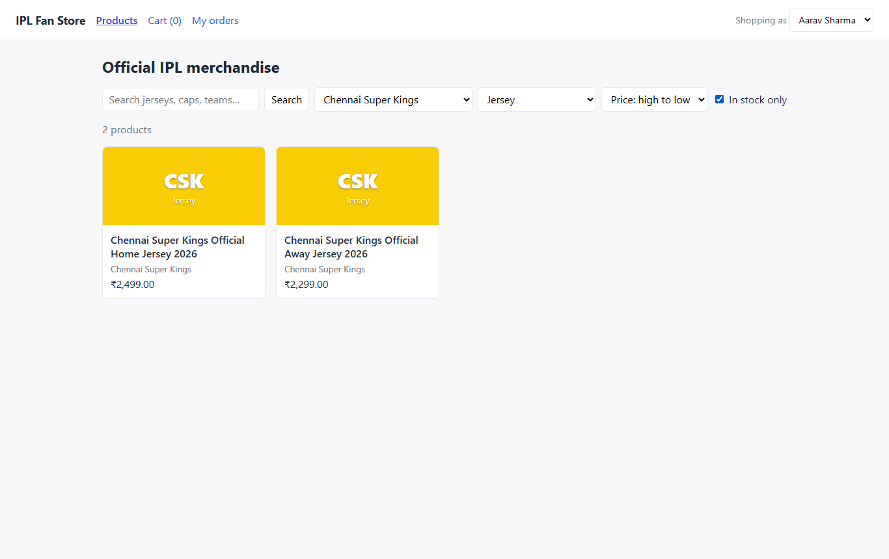

### 4. Product details
Description, attributes (sizes, material) and live stock.

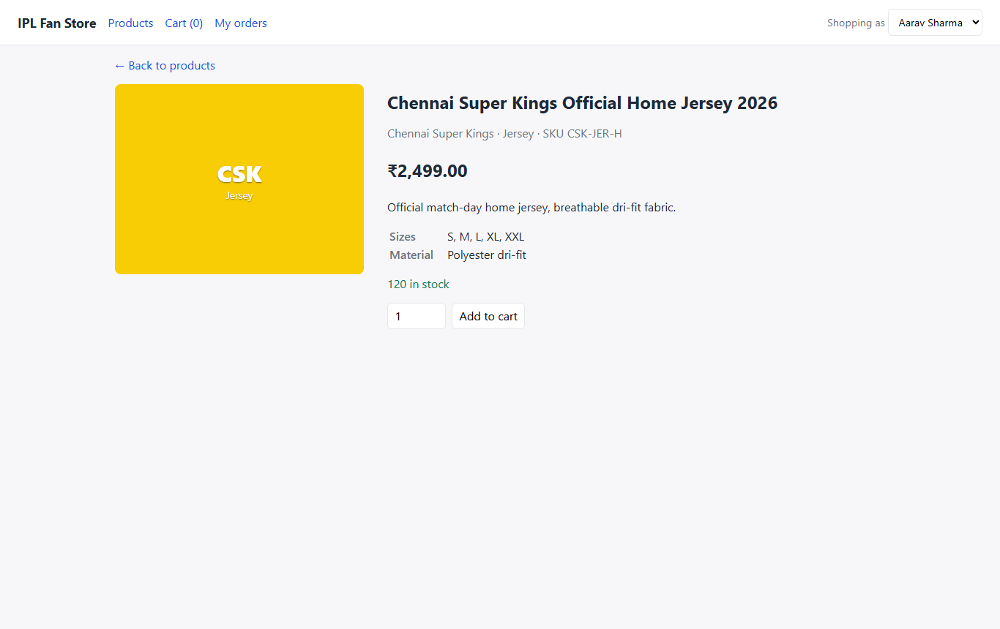

### 5. Add to cart
The cart count in the header updates straight away.

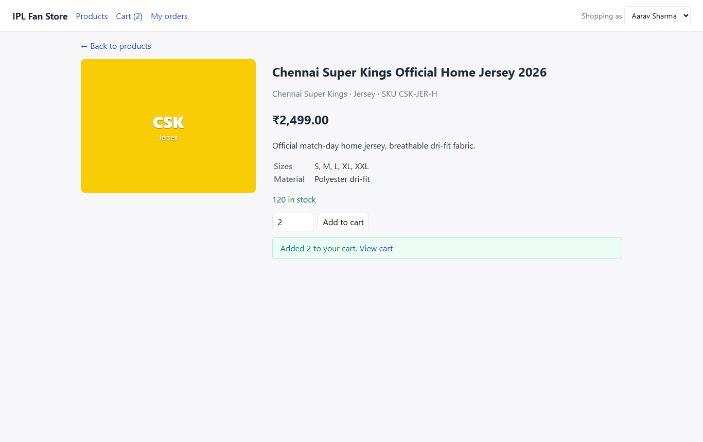

### 6. Business-rule validation
Asking for 50 units is rejected by the domain rule `Cart:MaxQuantityPerLine = 10` (configurable in `appsettings.json`).

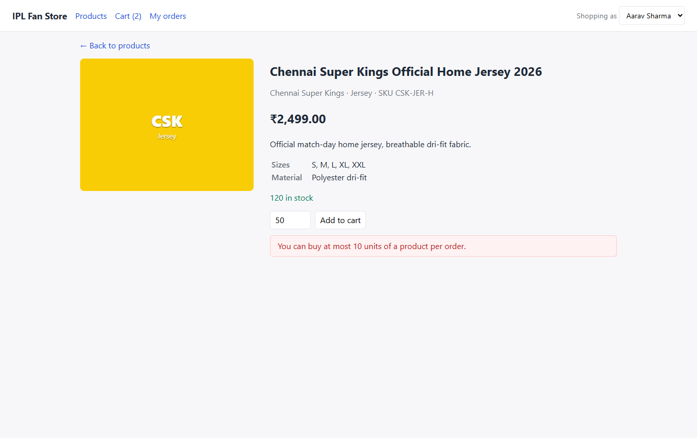

### 7. Cart with price breakdown
Quantity +/-, remove, subtotal, 18% GST and free shipping above ₹999. All come from the same `IPricingPolicy` that checkout uses.

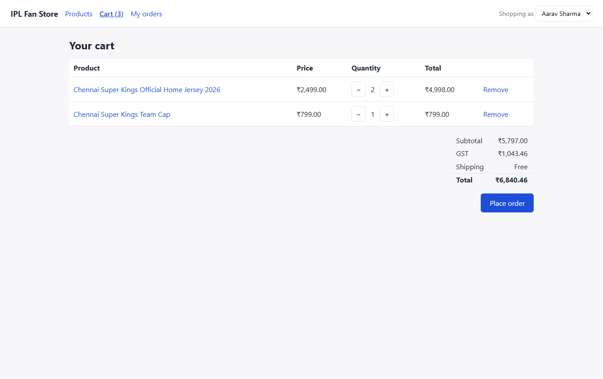

### 8. Checkout: order confirmation
Idempotent checkout (`Idempotency-Key` header). Product data and prices are copied into the order at purchase time.

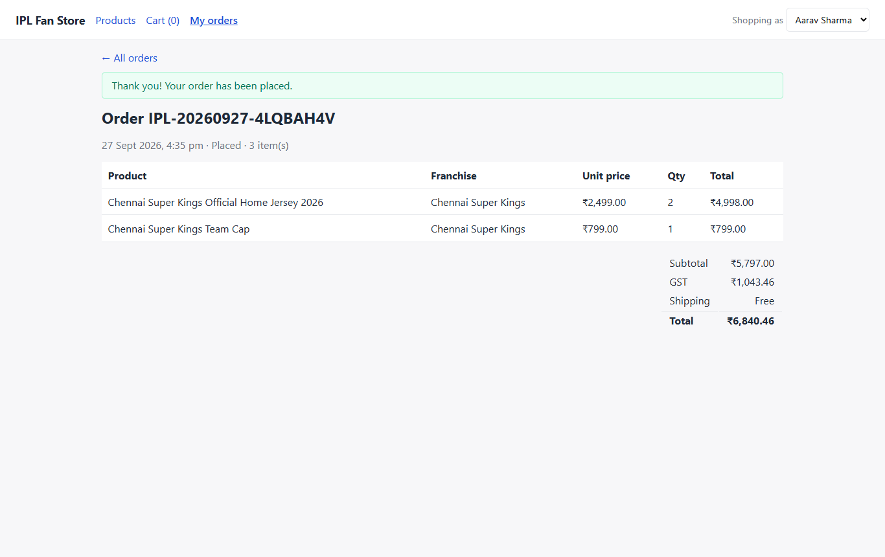

### 9. Order history
Newest first, per customer.

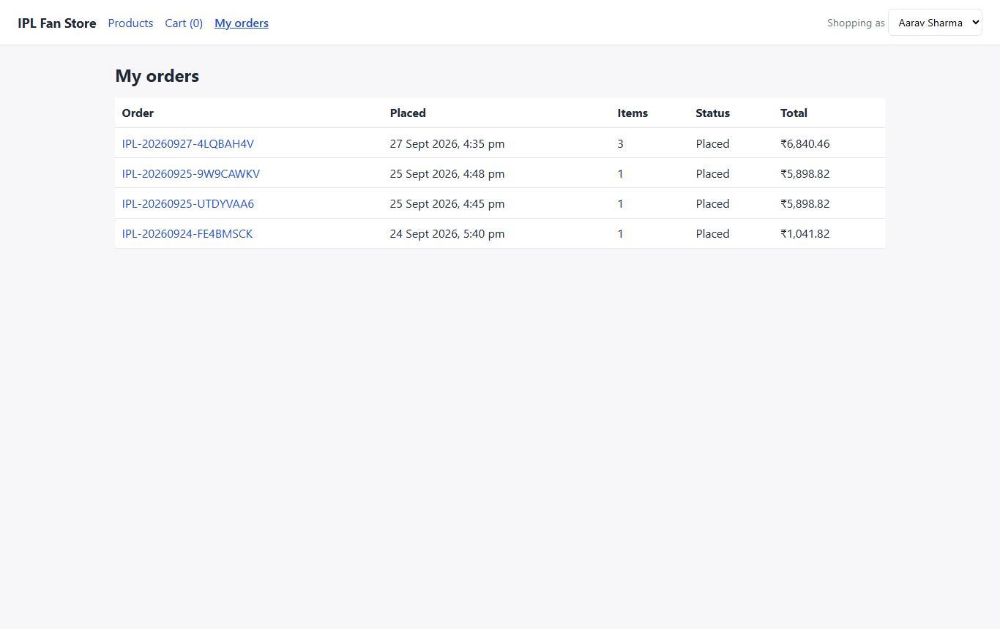

### 10. Switching shopper
Each customer has their own cart and orders (sent as the `X-Customer-Id` header).

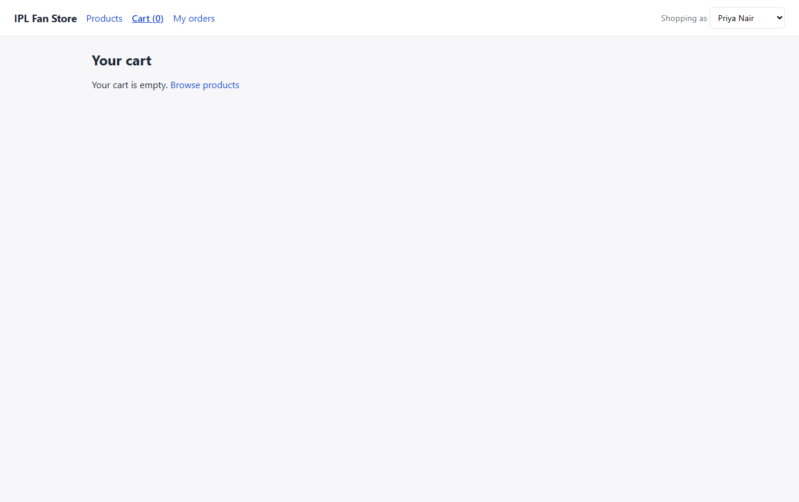

### 11. REST API (Swagger)
Versioned endpoints for catalogue, cart and orders, with `X-Customer-Id` and `Idempotency-Key` headers documented.

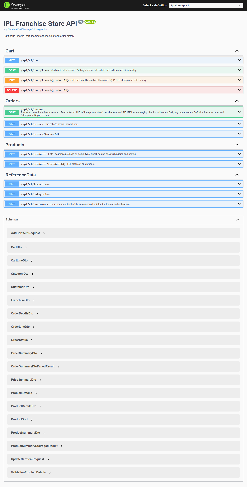

---

## 1. Run it locally

**Prerequisites:** .NET 8 SDK, Node 18+ and Docker Desktop. Docker is optional if you already have PostgreSQL.

```powershell
# Option A - IDE-friendly (3 terminals)
./scripts/dev.ps1 db     # PostgreSQL 16 in Docker on :5432
./scripts/dev.ps1 api    # API on http://localhost:5080  (Swagger: /swagger). Migrates + seeds automatically
./scripts/dev.ps1 web    # React on http://localhost:5173 (proxies /api to :5080)

# Option B - everything in containers
docker compose --profile full up -d --build   # web http://localhost:3000, API http://localhost:5080/swagger

# Tests
./scripts/dev.ps1 test   # backend unit + integration (Docker) + frontend
# or double-click scripts\verify-local.cmd -> writes verify-log.txt
node scripts/demo-concurrency.mjs   # live proof of exactly-once checkout + no overselling (API running, no Docker needed)
node scripts/simulate-failures.mjs  # fault injection: races, lost requests/responses, DB connection killed (API running)
```

**Using your own PostgreSQL instead of Docker:** edit `Database:ConnectionString` in
`backend/src/IplStore.Api/appsettings.json` (or set the env var `Database__ConnectionString`).
The API creates the schema and the 60 demo products on first start.

**Demo shoppers:** the header's *Shopping as* dropdown switches between two seeded customers.
Every request carries an `X-Customer-Id` header, which stands in for authentication (see the [roadmap](docs/07-deployment-roadmap.md)).

---

## 2. Requirements → where they live

| # | Requirement | UI | API | Core logic |
|---|---|---|---|---|
| 1 | Product list with prices | `pages/ProductListPage.tsx` | `GET /api/v1/products` | `CatalogService`, `CatalogQueries` |
| 2 | Product details | `pages/ProductDetailsPage.tsx` | `GET /api/v1/products/{id}` | `CatalogQueries.GetDetailsAsync` |
| 3 | Search by name, type, franchise | filters on the list page | `?search=&franchise=&category=&minPrice=&sort=` | `ICatalogFilter` pipeline |
| 4 | Cart | `pages/CartPage.tsx` | `GET/POST/PUT/DELETE /api/v1/cart[/items]` | `Cart` aggregate, `CartService` |
| 5 | Order history | `pages/OrderPages.tsx` | `POST/GET /api/v1/orders[/{id}]` | `CheckoutService`, `OrderQueries` |

## 3. Non-functional guarantees

| Guarantee | How | Proof |
|---|---|---|
| **No duplicates** | UNIQUE constraints (1 cart per customer, 1 line per product, 1 order per idempotency key) + `INSERT … ON CONFLICT` + cart row lock | `ConcurrencyTests.Parallel_first_requests_create_exactly_one_cart_and_one_line` |
| **No race conditions / lost updates** | `SELECT … FOR UPDATE` on the cart serialises one customer's writes. Stock uses an atomic conditional `UPDATE`. `xmin` optimistic token on products | `…never_oversell_limited_stock` |
| **No overselling** | `UPDATE products SET stock = stock - q WHERE id = @id AND stock >= q` + `CHECK (stock >= 0)` | same |
| **Exactly-once checkout** | `Idempotency-Key` header + UNIQUE `(customer_id, idempotency_key)` | `…same_idempotency_key_sent_concurrently_creates_exactly_one_order` |
| **Exactly-once add to cart** | `Idempotency-Key` on `POST /cart/items`, recorded in `idempotency_keys` in the same transaction as the change | `…same_idempotency_key_on_add_to_cart_sent_concurrently_adds_exactly_once` |
| **At-least-once delivery, no duplicates** | Client and server both retry; every effect is de-duplicated by key. No external I/O is done while a lock is held | `node scripts/simulate-failures.mjs`: 8 fault-injection scenarios (lost request, lost response, DB connection killed) |
| **Retry on unexpected errors** | The whole transaction is re-run with backoff on transient DB errors (`ResilienceOptions`). The client retries only idempotent calls | `EfUnitOfWork`, `httpClient.test.ts` |
| **Thread safety** | Stateless scoped services, immutable options snapshots, singletons are stateless or thread-safe | code review / [docs/04](docs/04-concurrency-idempotency-retry.md) |

### Database: normalised write model + denormalised read model

Writes go to **normalised (3NF) tables**: `products`, `franchises`, `product_categories`, `customers`, `carts`, `cart_items`, `orders`, `order_items`.
Catalogue reads (more than 95% of traffic) go to **one flat, pre-joined table**, `product_catalog`, so list, search and details need **no joins**.

```
 products ─┐                                    ┌─────────────── product_catalog (read model) ───────────────┐
           │  AFTER INSERT/UPDATE triggers      │ product_id  sku  name  description  price  currency        │
 franchises├──── same transaction ───────────►  │ stock_quantity  is_active  image_url  attributes (jsonb)   │
           │  (project_product upsert)          │ franchise_id  franchise_code  franchise_name  franchise_color │
 product_  │                                    │ category_id  category_code  category_name                  │
 categories┘                                    │ created_at  updated_at  search_text (GENERATED, trigram)   │
                                                └────────────────────────────────────────────────────────────┘
```

| Denormalised data | Why | Kept correct by |
|---|---|---|
| `product_catalog` (whole table) | Flat row per product, every filter indexed, replica-ready | Triggers on `products` / `franchises` / `product_categories`, **in the same transaction** |
| `product_catalog.search_text` | One GIN trigram index serves search by name, type or franchise | `GENERATED ALWAYS … STORED` |
| `order_items.{sku, product_name, franchise_name, category_name, unit_price}` | An order shows what was bought at the price paid, even after later changes | Written once at checkout |
| `orders.{customer_name, customer_email, item_count}` | Order history renders without joins | Written once at checkout |
| `cart_items.customer_id`, `order_items.customer_id` | Shard key: a customer's rows stay on one shard | Copied by the aggregate root |

**Full column-by-column structure, indexes, sync triggers, sample rows and trade-offs:** [docs/11 Denormalised table structure](docs/11-denormalised-tables.md).

## 4. Repository map

```
├── README.md                     ← you are here
├── docs/                         ← design: architecture, UML, ER, concurrency, API, distribution, deployment, change playbook, ADRs
├── database/
│   ├── migrations/V00x__*.sql    ← schema = source of truth (immutable, checksummed, embedded in the API)
│   └── seed/S00x__*.sql          ← demo data (idempotent, dev/test only)
├── backend/
│   ├── IplStore.sln · Directory.Build.props · Directory.Packages.props (central package versions) · Dockerfile
│   ├── src/
│   │   ├── IplStore.Domain/          entities + business rules. Zero dependencies
│   │   ├── IplStore.Application/     use cases, ports (interfaces), options, pricing strategy
│   │   ├── IplStore.Infrastructure/  EF Core/Npgsql adapters, read model, filters, migrator
│   │   └── IplStore.Api/             controllers, error mapping, composition root (DI)
│   └── tests/
│       ├── IplStore.UnitTests/       domain + use cases with in-memory fakes (no DB)
│       └── IplStore.IntegrationTests/ real HTTP + real PostgreSQL, parallel-request race tests
├── frontend/                     ← React + TS SPA, retrying API client, Vitest tests
├── infra/terraform/              ← Azure: Container Apps, PostgreSQL Flexible (HA + replica), Key Vault, ACR, SWA
├── .github/workflows/            ← ci.yml · cd-app.yml · cd-infra.yml (+ reusable deploy/apply)
├── scripts/                      ← dev.ps1 / dev.sh / verify-local.cmd
└── docker-compose.yml
```

## 5. Documentation

| Doc | What's inside |
|---|---|
| [01 Architecture](docs/01-architecture.md) | Layers, request flow, patterns used, SOLID mapping, DI |
| [02 UML](docs/02-uml-class-diagram.md) | Class diagrams (domain, ports and adapters), sequence diagrams |
| [03 Database & ER](docs/03-database-er.md) | ER diagram, normalised vs denormalised tables, constraints, indexes |
| [04 Concurrency, idempotency, retry](docs/04-concurrency-idempotency-retry.md) | Every race condition we handle, with failure scenarios |
| [05 API reference](docs/05-api-reference.md) | Endpoints, headers, status and error codes |
| [06 Distributed database](docs/06-distributed-database.md) | HA, read replicas, sharding with Citus, partitioning |
| [07 Deployment & roadmap](docs/07-deployment-roadmap.md) | Azure resources, CI/CD, code vs infra deployment, phased roadmap |
| [08 Change playbook](docs/08-change-playbook.md) | **How to make common changes quickly and cleanly (for the live review)** |
| [09 Review guide](docs/09-review-guide.md) | Walkthrough order, trade-offs, likely questions |
| [10 Design document](docs/10-design-document.md) | **Everything in one place: code flow, sequence diagrams, DB, trade-offs and a demo playbook** |
| [11 Denormalised tables](docs/11-denormalised-tables.md) | `product_catalog` read model column by column, sync triggers, indexes, order snapshots, trade-offs |
| [ADRs](docs/adr) | Why each key decision was made |

## 6. Tunable parameters (no code changes)

Every knob is a property on an **options object** bound from `appsettings.json` (or env vars such as `Pricing__TaxRate=0.12`).
All options are validated at start-up, so the app fails fast on bad config. Pricing, cart and catalogue options are read through `IOptionsMonitor`, so edits apply without a restart.

| Section | Examples |
|---|---|
| `Pricing` | `TaxRate`, `FlatShippingFee`, `FreeShippingThreshold`, `Currency` |
| `Cart` | `MaxQuantityPerLine`, `MaxDistinctLines`, `ValidateStockOnAdd` |
| `Checkout` | `RequireIdempotencyKey`, `MaxIdempotencyKeyLength` |
| `Catalog` / `Paging` | `MaxSearchTerms`, `MaxFilterValues`, `DefaultPageSize`, `MaxPageSize` |
| `Resilience` | `MaxRetryCount`, `MaxRetryDelayMilliseconds`, `AdditionalTransientErrorCodes` |
| `Database` | `ConnectionString`, `ReadReplicaConnectionString`, `ApplyMigrationsOnStartup`, `SeedDemoData` |
| `RateLimiting` / `Cors` | `PermitLimit`, `WindowSeconds`, `AllowedOrigins` |
