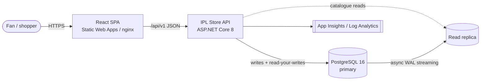
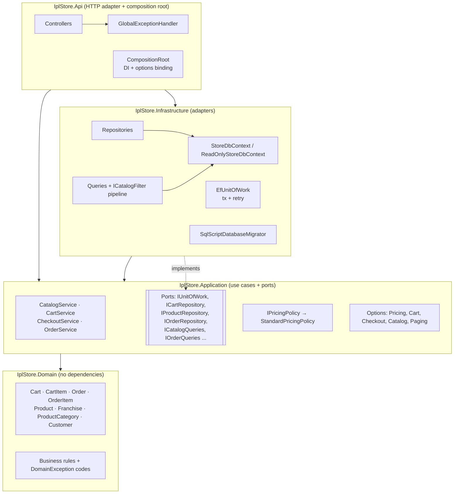
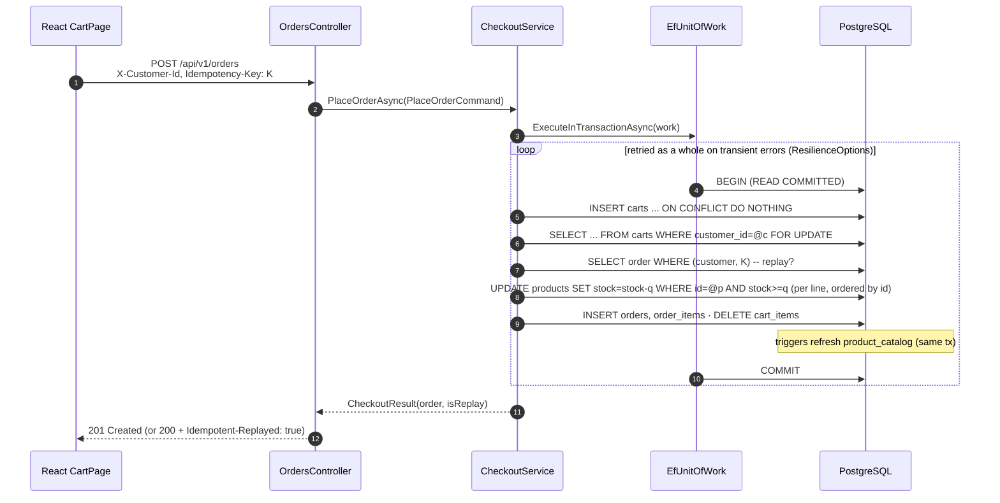

# 01 · Architecture

## 1.1 System context

## 1.2 Clean Architecture: dependencies point inwards

| Layer | Knows about | Must NOT know about |
|---|---|---|
| **Domain** | nothing but C# | EF Core, HTTP, config, PostgreSQL |
| **Application** | Domain, `Microsoft.Extensions.*` abstractions | EF Core, HTTP, PostgreSQL |
| **Infrastructure** | Application, EF Core, Npgsql | HTTP / controllers |
| **Api** | everything, but only to wire it together | business rules (controllers are 1-line translators) |

The compiler enforces these rules through the project references. A `using Microsoft.EntityFrameworkCore` in Domain does not compile.

## 1.3 Request flow (checkout)

## 1.4 Design patterns used (and why)

| Pattern | Where | Why it matters for change |
|---|---|---|
| **Clean / Hexagonal architecture** (ports and adapters) | project layout | Swap the DB or ORM without touching the use cases |
| **Aggregate root** (DDD) | `Cart`, `Order` | All cart rules live in one class that is easy to unit test |
| **Repository** | `ICartRepository`, `IProductRepository`, … | Use cases don't know about SQL |
| **Unit of Work** | `IUnitOfWork` → `EfUnitOfWork` | One place for the transaction, retry and conflict translation |
| **CQRS-lite** | commands use the write model; queries use `ICatalogQueries` on the read model and replica | Reads scale separately. No joins on the hot path |
| **Strategy** | `IPricingPolicy`, `IOrderNumberGenerator`, `ICurrentCustomerAccessor` | Change behaviour by registering a different class |
| **Specification / Pipeline** | `ICatalogFilter` implementations | A new search filter is a new class (Open/Closed) |
| **Parameter Object** | `SearchProductsQuery`, `PlaceOrderCommand`, `OrderPlacement`, `PricingRequest`, `CartPolicy` | Adding a field never changes a method signature |
| **Options pattern** | `*Options` classes + `IOptionsMonitor` | Tune behaviour from config, validated at start-up, hot-reloaded |
| **Factory method** | `Order.Place(OrderPlacement)` | An invalid order cannot be constructed |
| **Decorator-style cross-cutting** | `GlobalExceptionHandler`, rate limiter, `EfUnitOfWork` wrapping work | Controllers and services stay free of try/catch and retry loops |
| **Object Mother / Fakes** | `TestData`, `InMemoryStore` | Readable, fast tests with real rollback semantics |

## 1.5 SOLID, concretely

| Principle | Evidence in the code |
|---|---|
| **S**ingle responsibility | `CartService` orchestrates, `Cart` enforces rules, `CartRepository` persists, `CartQueries` reads and `StandardPricingPolicy` prices. Each class has one reason to change |
| **O**pen/closed | New filter = new `ICatalogFilter`. New pricing = new `IPricingPolicy`. New category = a row in the DB. New sort = one enum value plus one switch arm |
| **L**iskov | `ReadOnlyStoreDbContext` is a `StoreDbContext` for every read. Any `IPricingPolicy` returns a valid `PriceBreakdown` |
| **I**nterface segregation | Write ports (`I*Repository`) are separate from read ports (`I*Queries`). `IUnitOfWork` has one method |
| **D**ependency inversion | Application defines the interfaces and Infrastructure implements them. `CompositionRoot` is the only place that picks concrete classes |

## 1.6 Dependency injection and lifetimes

| Service | Lifetime | Reason |
|---|---|---|
| `StoreDbContext`, `ReadOnlyStoreDbContext`, repositories, queries, `EfUnitOfWork`, use-case services | **Scoped** | One DbContext per request. DbContext is not thread-safe, so it is never shared |
| `IPricingPolicy`, `ICatalogFilter`s, `IOrderNumberGenerator`, `IDatabaseMigrator`, `TimeProvider` | **Singleton** | Stateless or thread-safe (`RandomNumberGenerator` is thread-safe) |
| Options | Singleton via `IOptions`/`IOptionsMonitor` | Services take a `CurrentValue` snapshot once per call, so a config reload mid-request can't mix old and new values |

## 1.7 Error model

All errors are returned as RFC 7807 `application/problem+json`, with a stable `code` and a `traceId`:

| Exception | HTTP | Example `code` |
|---|---|---|
| `RequestValidationException` / model validation | 400 | `validation.failed` |
| `MissingCustomerIdentityException` | 401 | `auth.missing_customer` |
| `EntityNotFoundException` | 404 | `product.not_found`, `order.not_found` |
| `ConcurrencyConflictException` | 409 | `concurrency.conflict` |
| `DomainException` | 422 | `product.insufficient_stock`, `cart.quantity_limit_exceeded`, `cart.empty` |
| anything else | 500 | `server.error` (details are logged, never leaked) |
