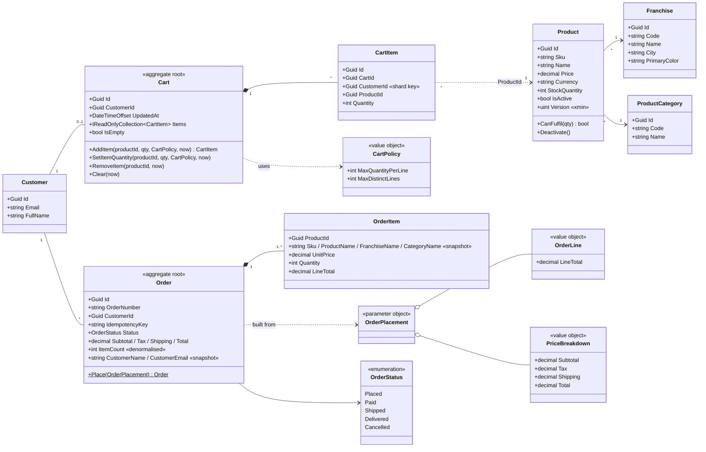
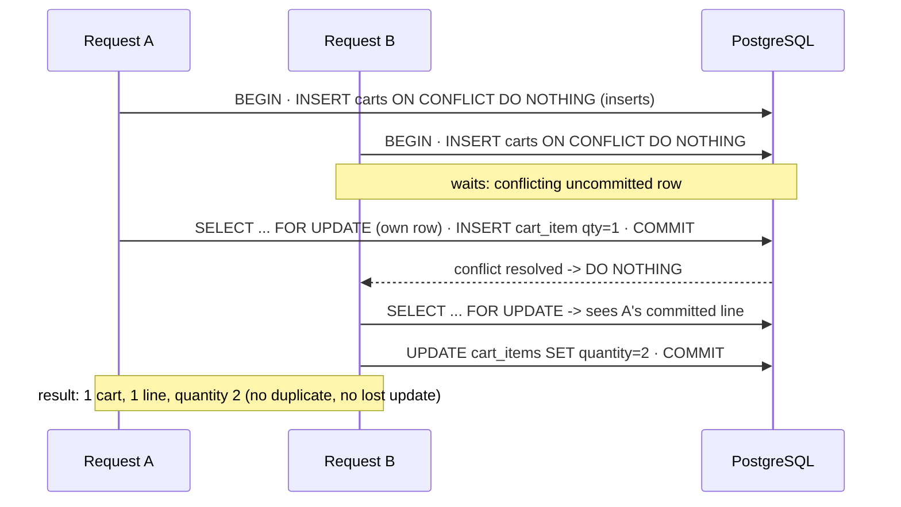
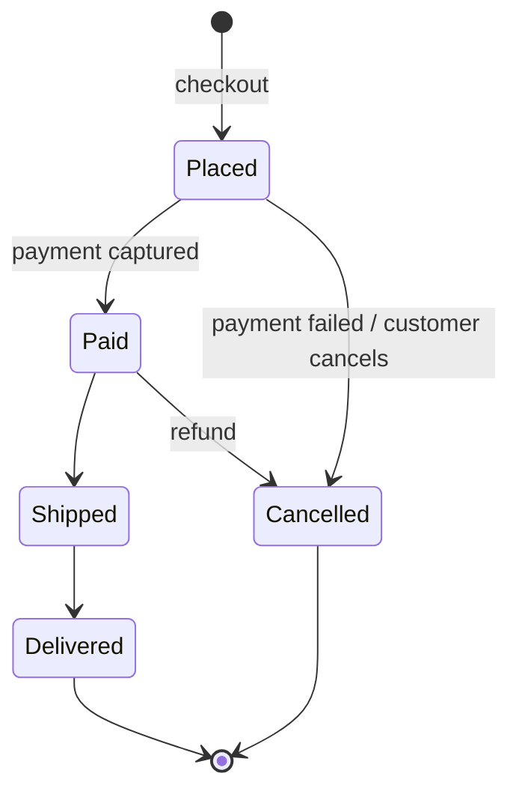

# 02 · UML

## 2.1 Domain model (class diagram)

## 2.2 Application ports and Infrastructure adapters

```mermaid
classDiagram
    direction TB
    class ICheckoutService {
        <<interface>>
        +PlaceOrderAsync(PlaceOrderCommand) CheckoutResult
    }
    class ICartService {
        <<interface>>
        +GetAsync()
        +AddItemAsync()
        +UpdateItemAsync()
        +RemoveItemAsync()
    }
    class ICatalogService {
        <<interface>>
        +SearchAsync(SearchProductsQuery)
        +GetProductAsync(id)
    }
    class IOrderService {
        <<interface>>
        +ListAsync()
        +GetAsync()
    }

    class IUnitOfWork {

        <<interface>>

        +ExecuteInTransactionAsync(work)

    }
    class ICartRepository {
        <<interface>>
        +GetOrCreateForUpdateAsync(customerId) Cart
    }
    class IProductRepository {
        <<interface>>
        +FindAsync()
        +GetWithReferencesAsync()
        +TryReserveStockAsync() bool
    }
    class IOrderRepository {
        <<interface>>
        +FindByIdempotencyKeyAsync()
        +Add(Order)
    }
    class ICatalogQueries {
        <<interface>>
        +SearchAsync(criteria, page)
        +GetDetailsAsync()
    }
    class IOrderQueries {
        <<interface>>
        +ListAsync()
        +GetAsync()
    }
    class ICartQueries {
        <<interface>>
        +GetAsync(customerId) CartView
    }
    class IPricingPolicy {
        <<interface>>
        +Calculate(PricingRequest) PriceBreakdown
    }
    class IOrderNumberGenerator {
        <<interface>>
        +Next(placedAt) string
    }
    class ICatalogFilter {
        <<interface>>
        +Apply(query, criteria)
    }

    CheckoutService ..|> ICheckoutService
    CartService ..|> ICartService
    CatalogService ..|> ICatalogService
    OrderService ..|> IOrderService
    StandardPricingPolicy ..|> IPricingPolicy

    CheckoutService --> IUnitOfWork
    CheckoutService --> ICartRepository
    CheckoutService --> IProductRepository
    CheckoutService --> IOrderRepository
    CheckoutService --> IPricingPolicy
    CheckoutService --> IOrderNumberGenerator
    CartService --> ICartQueries
    CatalogService --> ICatalogQueries

    EfUnitOfWork ..|> IUnitOfWork
    CartRepository ..|> ICartRepository
    ProductRepository ..|> IProductRepository
    OrderRepository ..|> IOrderRepository
    CatalogQueries ..|> ICatalogQueries
    CatalogQueries --> "*" ICatalogFilter
    OrderQueries ..|> IOrderQueries
    CartQueries ..|> ICartQueries
    OrderNumberGenerator ..|> IOrderNumberGenerator
    SearchTermFilter ..|> ICatalogFilter
    FranchiseFilter ..|> ICatalogFilter
    CategoryFilter ..|> ICatalogFilter
    PriceRangeFilter ..|> ICatalogFilter
    InStockFilter ..|> ICatalogFilter
```

## 2.3 Sequence: concurrent "add to cart" for the same customer

## 2.4 State machine: order status (roadmap for payments and fulfilment)

