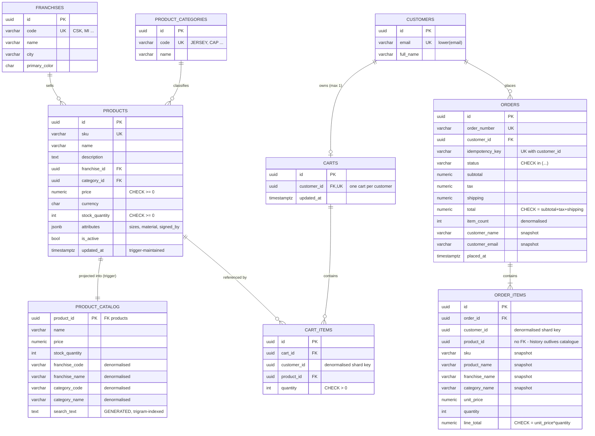

# 03 · Database design & ER model

**Engine:** PostgreSQL 16. It gives full ACID, row-level locking, `ON CONFLICT` upserts, `CHECK` constraints, triggers,
generated columns, trigram indexes and a well-trodden path to replicas and sharding (Citus).

**Ownership:** the schema lives in `database/migrations/*.sql` (SQL-first, reviewed like code). EF Core only *maps*
to it. The migrator applies each script once, in order, inside a transaction, with a checksum and an advisory lock.

## 3.1 ER diagram



## 3.2 Normalised write model and denormalised read model

The **write model is in 3NF**: every fact is stored once, so a franchise rename is a single-row update.
On top of it sit **deliberate denormalisations**, each with a named reason and a named consistency mechanism:

| Denormalised data | Why | Kept consistent by |
|---|---|---|
| **`product_catalog`** (whole table) | List, search and details are >95% of traffic. One flat row replaces a 3-way join, every filter column is indexed, and the table can be served from a **read replica** or pushed to a search engine later | `AFTER INSERT/UPDATE` triggers on `products`, `franchises` and `product_categories`. They run **inside the writer's transaction**, so the read model is never stale on the primary |
| `product_catalog.search_text` | One trigram GIN index answers "search by name, type or franchise" | `GENERATED ALWAYS AS (...) STORED` |
| `order_items.{sku, product_name, franchise_name, category_name, unit_price}` | **Historical truth.** An order must show what was bought at the price paid, even after a rename, reprice or deletion | Written once at checkout. Immutable |
| `orders.{item_count, customer_name, customer_email}` | The order-history list renders without touching `order_items` or `customers` | Written once at checkout. `CHECK` constraints guard totals |
| `cart_items.customer_id`, `order_items.customer_id` | **Distribution key.** With Citus, child rows are co-located on the same shard as their parent (docs/06) | Copied by the aggregate root on creation |

This follows the standard rule: *normalise for writes, denormalise for reads, and write down who keeps each copy in sync.*
Column-by-column detail, trigger flow and sample rows: [11 Denormalised table structure](11-denormalised-tables.md).

## 3.3 Constraints = correctness under concurrency

| Constraint | Invariant | Race it defends against |
|---|---|---|
| `uq_carts_customer` | 1 cart per customer | Two first-ever "add to cart" calls at once |
| `uq_cart_items_cart_product` | 1 line per product per cart | Two "add same product" calls at once |
| `uq_orders_customer_idempotency` | 1 order per checkout attempt | Double click, client retry after a timeout |
| `pk_idempotency_keys` (`customer_id, operation, idempotency_key`) | 1 application of an "add to cart" click | Client retry after a lost response, server transaction retry after an ambiguous commit |
| `ck_products_stock_non_negative` | Stock never below 0 | Any buggy writer. This is the last line of defence |
| `ck_orders_total`, `ck_order_items_line_total` | Money adds up | Arithmetic bugs |
| `uq_products_sku`, `uq_orders_order_number`, `uq_customers_email` (case-insensitive) | Natural keys unique | Duplicate data entry |

## 3.4 Indexes and the queries they serve

| Index | Query |
|---|---|
| `ix_product_catalog_search_trgm` (GIN, `gin_trgm_ops`) | `search_text ILIKE '%mumbai%' AND search_text ILIKE '%jersey%'` |
| `ix_product_catalog_franchise / _category / _price / _created` (partial `WHERE is_active`) | filters and sorts on the list page |
| `ix_orders_customer_placed (customer_id, placed_at DESC)` | "my orders, newest first" with paging |
| `ix_order_items_order`, `ix_cart_items_customer` | detail pages, cart view |

## 3.5 Transactions and isolation

- **READ COMMITTED** (the PostgreSQL default) plus **explicit locking** where it matters. This is cheaper than SERIALIZABLE and just as correct here:
  - `SELECT … FOR UPDATE` on the cart row serialises one customer's cart and checkout operations.
  - The conditional `UPDATE products … WHERE stock_quantity >= @q` re-checks the predicate after acquiring the row lock (EvalPlanQual), so it can never act on a stale read.
- Stock rows are locked in **ascending product id** order, so two checkouts can't deadlock. If a deadlock ever happens anyway (40P01), the transaction is retried.
- Monetary values use `numeric(12,2)`, never floating point.

## 3.6 Migration workflow

```
database/migrations/V004__add_player_name.sql   ← new file, never edit an applied one
                   ↓ embedded into IplStore.Infrastructure.dll at build
API start-up (dev)  or  `IplStore.Api --migrate-only` job (CD)
                   ↓
pg_advisory_lock → for each unapplied script: BEGIN; script; INSERT schema_migrations; COMMIT → unlock
```

For zero-downtime releases, use **expand/contract** migrations. First add a nullable column or a new table. Next, deploy code that
writes to both. Then backfill. Finally remove the old column in a later release, once no running revision reads it.
