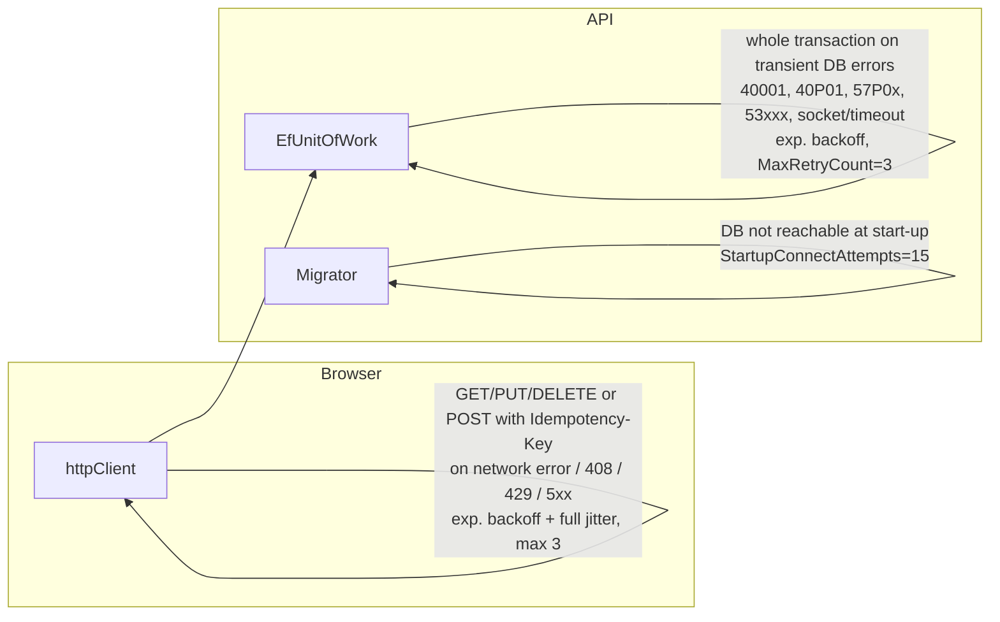

# 04 · Concurrency, idempotency & retry

The goals: **thread safe, no race conditions, no duplication, retry on unexpected errors.**
This page lists each hazard, the mechanism that handles it, and the test that proves it.

## 4.1 Hazards and mechanisms

| # | Hazard | Scenario | Mechanism | Test |
|---|---|---|---|---|
| H1 | **Duplicate cart** | Two first requests for a new customer | `INSERT … ON CONFLICT (customer_id) DO NOTHING` + `uq_carts_customer` | `Parallel_first_requests_create_exactly_one_cart_and_one_line` |
| H2 | **Duplicate cart line / lost update** | 10 × "add 1" in parallel. A read-modify-write without a lock would end at quantity 1 or 2 | Cart row lock (`FOR UPDATE`) serialises the transactions. The aggregate merges into the existing line. `uq_cart_items_cart_product` is the backstop | same test (expects qty = 10) |
| H3 | **Overselling** | 8 buyers, 3 units left | Single-statement conditional decrement `WHERE stock_quantity >= @q` + `CHECK (stock_quantity >= 0)` | `Concurrent_checkouts_never_oversell_limited_stock` |
| H4 | **Duplicate order** | Double-click, or the client times out and retries after the server already committed | `Idempotency-Key` + `uq_orders_customer_idempotency`. The check runs *after* the cart lock, so a waiting duplicate sees the committed order and replays it | `Same_idempotency_key_sent_concurrently_creates_exactly_one_order` + unit test |
| H5 | **Partial order** | Line 1 reserved, line 2 out of stock | Everything is in one transaction, and the `DomainException` rolls back all reservations | `Insufficient_stock_on_any_line_rolls_back_every_reservation` |
| H6 | **Deadlock between checkouts** | A buys [X, Y] while B buys [Y, X] | Locks are always taken in ascending `product_id` order. Retry on `40P01` as a safety net | design + retry |
| H7 | **Lost update on product edits** (future admin) | Two admins edit a price | `xmin` optimistic concurrency token → `DbUpdateConcurrencyException` → 409 | mapping in `EfUnitOfWork` |
| H8 | **Migration race** | 5 replicas start at once | `pg_advisory_lock` around the migrator. Scripts are checksummed and applied once | `Migrations_are_idempotent_and_safe_to_run_from_many_instances_at_once` |
| H9 | **Read model drift** | Franchise renamed | Triggers update `product_catalog` in the same transaction | `Renaming_a_franchise_is_reflected_in_the_denormalised_catalogue` |
| H10 | **Shared mutable state in the API** | Parallel requests on one instance | No static mutable state. DbContext is scoped per request. Singletons are stateless. Options are read as one snapshot per call | code review |

## 4.2 Why a row lock and not SERIALIZABLE or optimistic retries?

- **SERIALIZABLE** would also be correct, but every conflict becomes a `40001` abort and a retry. Under a hot product drop
  (for example 10,000 fans buying the new CSK jersey) the abort rate climbs sharply.
- **Optimistic concurrency on the cart** would also be correct, but a user's parallel tabs would get 409s.
- **Pessimistic lock on the customer's own cart row** means contention exists only between requests *from the same customer*,
  which is rare and naturally sequential. Different customers never block each other on carts.
- **Stock** is contended *across* customers. There we use the cheapest correct primitive: one conditional `UPDATE`
  (the row lock is held only until commit, and no read-then-write gap exists).

## 4.3 Idempotency contract

```
POST /api/v1/orders
X-Customer-Id: 1111…
Idempotency-Key: 4f1c…   ← client generates ONCE per checkout attempt, reuses on every retry of that attempt
```

| Call | Response |
|---|---|
| First | `201 Created` + `Location` + order body |
| Any repeat with the same key (even concurrent) | `200 OK` + `Idempotent-Replayed: true` + **the same order** |
| Missing key | `400` (configurable: `Checkout:RequireIdempotencyKey=false` generates one server-side, but then retries are not safe) |

The frontend (`CartPage.tsx`) keeps the key in a ref until the checkout succeeds, so the automatic retry *and* a manual
"Try again" click both reuse it.

## 4.4 Retry policy: what is retried, where, and why it's safe



| Layer | Retries | Never retries | Configured by |
|---|---|---|---|
| Browser (`httpClient.ts`) | Idempotent methods and keyed POSTs, on network errors and 408/429/5xx. Honours `Retry-After` | "Add to cart" POST (not idempotent), and any 4xx business error | `frontend/src/config.ts → retry` |
| API (`EfUnitOfWork`) | The **entire** use-case delegate, with a fresh change tracker, on PostgreSQL transient errors | Business errors (422), validation (400), unique violations (translated to 409) | `Resilience:*` |
| Start-up (`SqlScriptDatabaseMigrator`) | Connecting to a DB that is still booting | Script errors, checksum mismatch | `Resilience:Startup*` |

**The commit-ambiguity edge case.** If the connection drops *during* `COMMIT`, the server may already have committed.
EF re-runs the delegate. For checkout this is safe because the idempotency check finds the committed order and replays it.
This is why idempotency and retry are designed together.

## 4.5 Thread safety checklist (what a reviewer can verify)

- [x] No `static` mutable fields in any service (`grep -r "static " backend/src` shows only constants and pure functions).
- [x] `DbContext` is scoped and never captured by a singleton. Health checks resolve it per scope.
- [x] `OrderNumberGenerator` uses `RandomNumberGenerator`, which is thread-safe.
- [x] `StandardPricingPolicy` reads `IOptionsMonitor.CurrentValue` **once** per calculation.
- [x] Aggregates are loaded per request. No entity instance is shared across requests.
- [x] Rate limiter is partitioned per customer or IP, so one noisy client can't exhaust DB connections.
