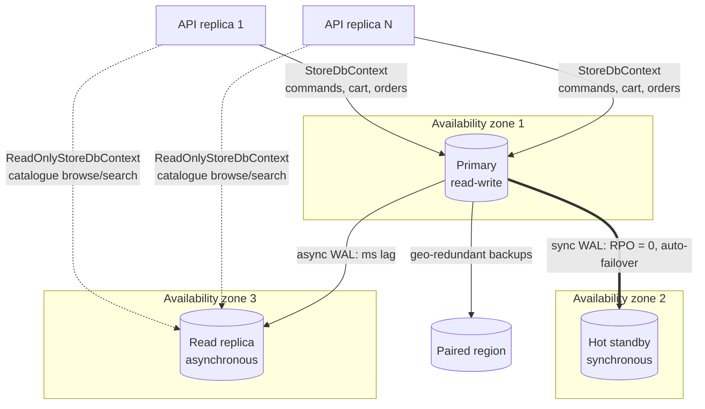

# 06 · Distributed nature of the database

Growth path: **one node → HA pair → read replicas → sharded (Citus)**. Each step is enabled by a decision
already made in the code or schema. None of them requires a rewrite.

## 6.1 Target topology (prod)

| Concern | Choice | Numbers |
|---|---|---|
| **High availability** | Zone-redundant HA (sync standby) | Automatic failover, typically 60–120 s. RPO = 0 |
| **Read scaling** | Async read replica(s) | Catalogue reads never touch the primary |
| **Disaster recovery** | Geo-redundant backups, PITR 35 days | Restore to the paired region |
| **Connection scaling** | Npgsql pool per instance (`Maximum Pool Size`) + PgBouncer (built into Flexible Server) | Protects the primary from N×pool connections |

## 6.2 Read/write split, already in the code

- `DatabaseOptions.ConnectionString` → **primary**. Used by `StoreDbContext`.
- `DatabaseOptions.ReadReplicaConnectionString` → **replica**. Used by `ReadOnlyStoreDbContext` (no tracking, `SaveChanges` throws).
- Routing is a **per use case decision**, made in `DependencyInjection.cs`:

| Query | Store | Why |
|---|---|---|
| Catalogue list, search, details (`CatalogQueries`) | replica | Tolerates ms lag. Highest volume |
| Cart view (`CartQueries`) | primary | Read-your-writes: the item you just added must show |
| Order history (`OrderQueries`) | primary | The order you just placed must show |
| Checkout (stock, idempotency) | primary, in a transaction | Correctness |

If the replica setting is empty, everything uses the primary. Turning the replica on is a config change.

## 6.3 Consistency model (CAP in practice)

- **Commands are strongly consistent** (single primary, ACID, synchronous standby).
- **Catalogue reads are eventually consistent** (replica lag is in milliseconds). The worst case is a price that is milliseconds stale on the list page.
  Checkout **always re-prices from the primary**, and the cart preview uses the same `IPricingPolicy`, so the customer never pays a stale price.
- The **stock shown** on the list is advisory. The **stock reserved** at checkout is authoritative.

## 6.4 Horizontal scale-out: sharding with Citus (Azure Cosmos DB for PostgreSQL)

When one primary can't take the write volume (for example a flash sale), shard by **`customer_id`**:

| Table | Citus type | Why |
|---|---|---|
| `carts`, `cart_items`, `orders`, `order_items` | **distributed** on `customer_id` | Every cart and order operation is single-customer, so it becomes a **single-shard transaction** (fast, ACID). This is why `cart_items.customer_id` and `order_items.customer_id` are already denormalised: children co-locate with their parent |
| `customers` | distributed on `id` (= customer_id) | Co-located with the carts and orders above |
| `franchises`, `product_categories` | **reference** (replicated to every node) | Small, read-mostly, joined everywhere |
| `products`, `product_catalog` | reference (or distributed on `id` at very large catalogue sizes) | Stock decrement is a single-row update |

Changes needed at that point (small, and planned for now):
1. Unique constraints must include the distribution column. `uq_orders_customer_idempotency` already does. Change `orders` PK to `(customer_id, id)`.
2. `SELECT create_distributed_table('orders', 'customer_id', colocate_with => 'customers')` etc. in a new migration.
3. No application change for cart and order paths: every query already filters by `customer_id`.

**Why UUIDs, not sequences:** ids are generated in the app, so there is no central sequence hot spot and they are safe to create on any node.
The same holds for order numbers (random, not sequential).

## 6.5 Partitioning (before sharding)

`orders` / `order_items` grow forever. Use native **range partitioning by `placed_at`** (monthly). Recent partitions stay hot,
old ones move to cheaper storage, and the retention policy becomes `DROP PARTITION` instead of a huge `DELETE`.

## 6.6 Beyond the database: events

For downstream systems (warehouse, email, analytics), add a **transactional outbox**: an `outbox_messages` row is inserted in
the *same* checkout transaction, and a background publisher (or Debezium CDC) ships it to Azure Service Bus or Event Hubs.
Because the event is written in the same transaction as the order, it can never be lost.
