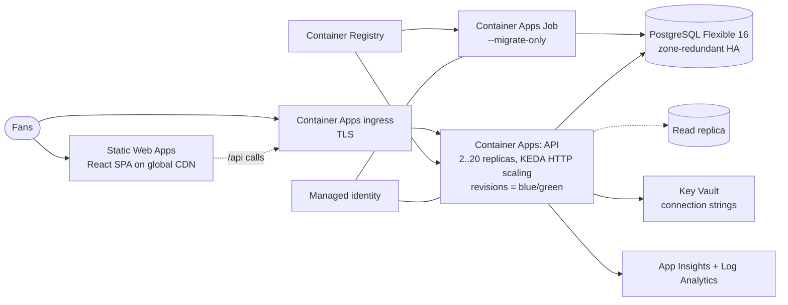
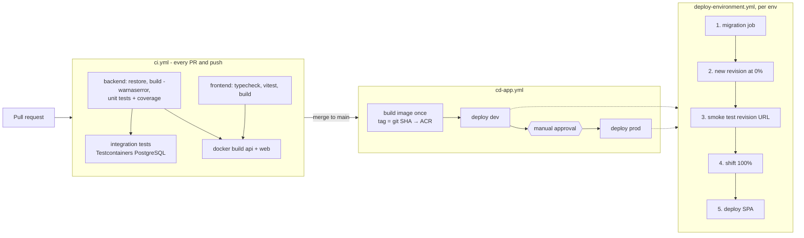

# 07 · Cloud deployment, CI/CD & roadmap

## 7.1 What we need in the cloud (Azure)

| Need | Azure service | Terraform file | Why this one |
|---|---|---|---|
| Run the API | **Container Apps** | `compute.tf` | Serverless containers, autoscale (scales to 0 in dev), revisions give built-in blue/green. Less to operate than AKS |
| Run migrations once per release | **Container Apps Job** (same image, `--migrate-only`) | `compute.tf` | Schema changes before the code rollout, never in N replicas at once |
| Host the SPA | **Static Web Apps** | `frontend.tf` | Global CDN, free TLS, PR preview environments |
| Relational DB (ACID) | **PostgreSQL Flexible Server 16** | `database.tf` | Managed HA, PITR, read replicas, PgBouncer, pg_trgm |
| Secrets | **Key Vault** (RBAC) | `secrets.tf` | Apps read secrets through **managed identity**. No secrets in pipelines |
| Images | **Container Registry** | `compute.tf` | Private registry with `AcrPull` for the identity only |
| Observability | **Log Analytics + Application Insights** | `main.tf` | Logs, traces, metrics, alerts in one place |
| Terraform state | Storage account + blob lease locking | `environments/*.backend.hcl` | Shared, locked, versioned state |
| *(Phase 2)* Edge | **Front Door + WAF** | – | One domain, `/api` routing, bot/DDoS protection, caching |
| *(Phase 2)* Private network | VNet + private endpoints | – | DB not reachable from the internet |

Estimated dev cost is roughly the price of a B1ms DB, with the API scaling to zero. Prod is sized in `environments/prod.tfvars`.

## 7.2 Code deployment and infra deployment are separate

| | **Infrastructure pipeline** (`cd-infra.yml`) | **Application pipeline** (`cd-app.yml`) |
|---|---|---|
| Trigger | changes under `infra/**` | changes under `backend/**`, `frontend/**`, `database/**` |
| Tool | Terraform | Docker + `az containerapp` + SWA deploy |
| Owns | shape: SKUs, scaling, env vars, secrets, identity, network | the image tag and the SPA bundle |
| Frequency | rare, reviewed plan | many times a day |
| Rollback | re-apply the previous commit | shift traffic to the previous revision (seconds, no rebuild) |

The seam between them: Terraform sets `lifecycle { ignore_changes = [template[0].container[0].image] }`, so an infra apply never
reverts an app release, and an app release never needs Terraform.

## 7.3 CI/CD pipelines (GitHub Actions)

Principles:
- **Build once, promote the same immutable image** (tagged by commit SHA) from dev to prod. Only configuration differs.
- **OIDC federation** (`azure/login` with `id-token: write`), so GitHub holds no cloud passwords.
- **GitHub Environments** `dev` / `prod` have protection rules (required reviewers) and environment-scoped variables.
- **Blue/green** with Container Apps revisions. The new revision gets 0% traffic until its `/health/ready` and a smoke query pass.
- **Concurrency groups** make sure two deployments or two `terraform apply` runs never overlap.

### One-time setup

1. `az ad app create` + federated credential for `repo:<org>/<repo>:environment:dev|prod`. Grant *Contributor* + *User Access Administrator* (for role assignments) on the subscription or resource group.
2. Create the Terraform state storage (`rg-iplstore-tfstate / stiplstoretfstate / tfstate`).
3. GitHub secrets: `AZURE_CLIENT_ID`, `AZURE_TENANT_ID`, `AZURE_SUBSCRIPTION_ID`, and per environment `SWA_DEPLOYMENT_TOKEN` (Terraform output).
4. GitHub environment variables (from Terraform outputs): `RESOURCE_GROUP`, `API_APP_NAME`, `MIGRATION_JOB_NAME`, `ACR_LOGIN_SERVER`, `API_BASE_URL`.
5. Run **CD - Infrastructure** once, then **CD - Application**.

## 7.4 Environments and configuration

| Setting | Local | Dev | Prod |
|---|---|---|---|
| DB | docker-compose Postgres | B1ms, single zone | D4ds_v5, zone-redundant HA + read replica, geo backups |
| API replicas | 1 | 0–2 | 2–20 |
| Migrations | on start-up | job | job |
| Demo seed | yes | yes | **no** |
| Swagger | yes | yes | no |
| Secrets | appsettings (local only) | Key Vault | Key Vault |

## 7.5 Observability and operations

- **Health:** `/health/live` (process up) and `/health/ready` (DB reachable). These drive the Container Apps probes.
- **Logs:** structured `ILogger` → Log Analytics. Every error response carries the `traceId` for correlation.
- **Alerts (roadmap):** 5xx rate, p95 latency, DB CPU > 80%, replica lag > 5 s, failed migration job.
- **Runbook, rollback:** `az containerapp ingress traffic set -g <rg> -n <app> --revision-weight <previous>=100`.

## 7.6 Roadmap

| Phase | Scope |
|---|---|
| **0 (this submission)** | Catalogue, search, cart, idempotent checkout, order history. Local stack, tests, IaC, CI/CD |
| **1 Identity and payments** | Entra External ID (B2C) login → replace `HeaderCurrentCustomerAccessor` with a JWT claims accessor (one DI line). Payment gateway (Razorpay or Stripe) with webhooks driving the `Placed → Paid` transition. Admin API for products (uses the `xmin` token) |
| **2 Hardening** | Front Door + WAF, private endpoints, OpenTelemetry tracing, Redis output cache for the catalogue, load tests (k6) in CI |
| **3 Scale and events** | Transactional outbox → Service Bus (emails, warehouse). Monthly partitioning of orders. Azure AI Search for the catalogue |
| **4 Flash sales** | Citus sharding by `customer_id` (docs/06). Queue-based checkout for drops. Per-product purchase limits |
