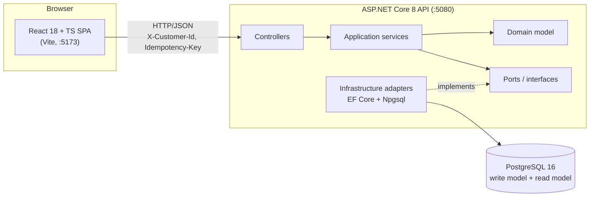
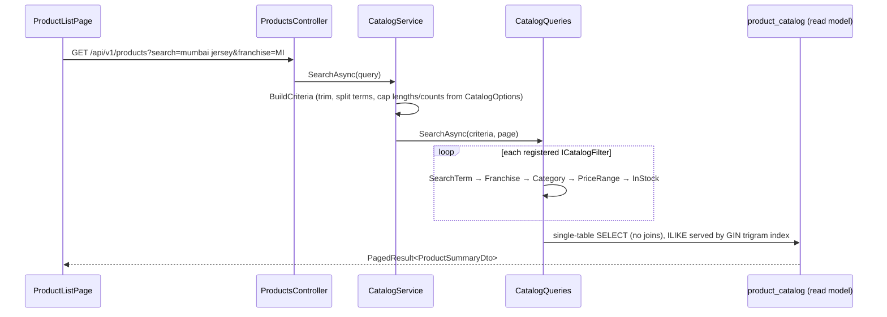
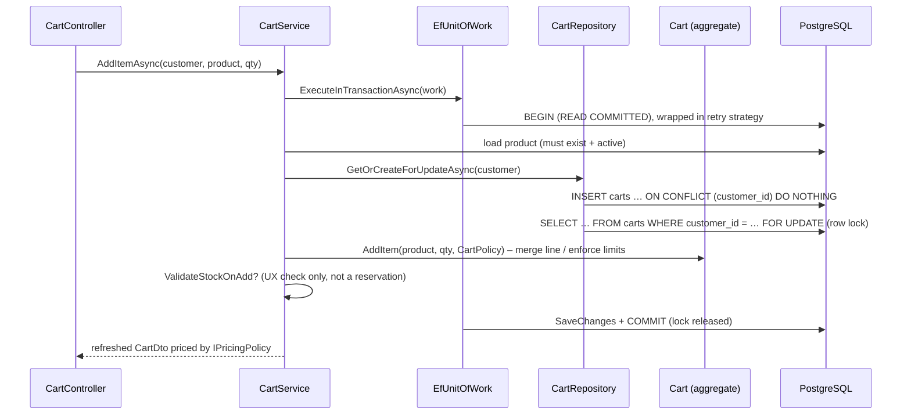
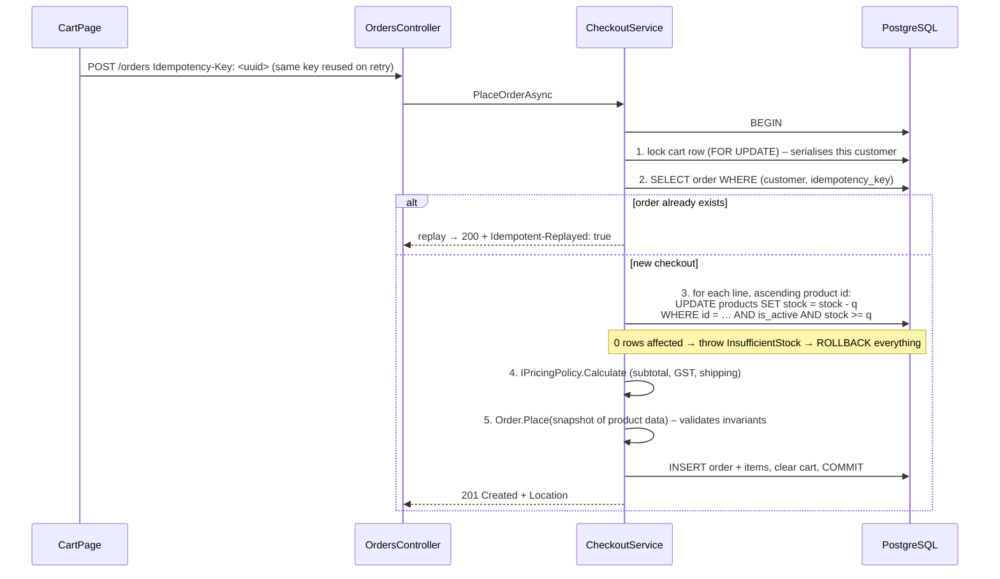
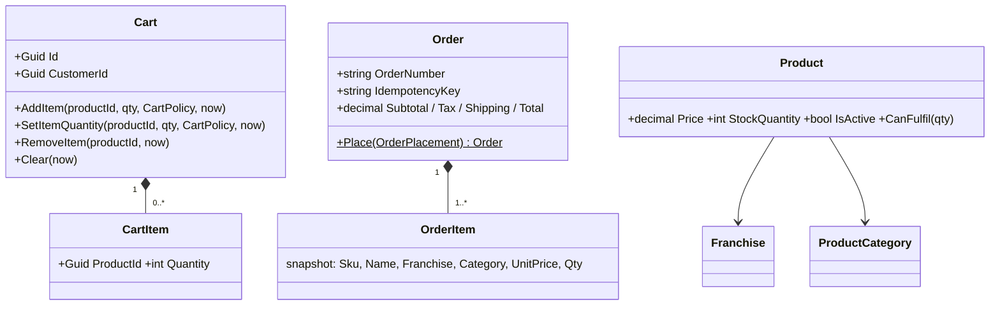

# 10 · Design Document: IPL Franchise Store

This document covers the whole system in one place. It explains what was built, how a request travels through the code, why each decision was made, and which changes show those decisions working in a live demo.
The numbered docs (01–09) go deeper on single topics. Each section here links to the one it summarises.

---

## 1. Problem statement

Build an e-commerce store for official IPL franchise merchandise (jerseys, caps, flags, autographed photos, accessories) with:

| # | Functional requirement |
|---|---|
| F1 | List products with prices |
| F2 | Show product details |
| F3 | Search by name, product type and franchise |
| F4 | Shopping cart (add, change quantity, remove) |
| F5 | Checkout and order history |

| # | Non-functional requirement | Target |
|---|---|---|
| N1 | No duplicate records | One cart per customer, one line per product, one order per checkout attempt |
| N2 | No race conditions / lost updates | Concurrent requests for the same customer never corrupt the cart |
| N3 | No overselling | Stock can never go below zero, even under parallel checkouts |
| N4 | Exactly-once checkout | A retried or double-clicked checkout creates exactly one order |
| N5 | Retry on transient failure | DB blips and dropped connections are retried safely |
| N6 | Maintainable / changeable | Common changes are one file or pure config |
| N7 | Deployable | Containerised, with IaC and CI/CD design for Azure |

---

## 2. High-level architecture



**Clean Architecture (dependency rule: arrows point inwards).**

| Project | Responsibility | Depends on |
|---|---|---|
| `IplStore.Domain` | Entities, aggregates, business rules (`Cart`, `Order`, `Product`) | nothing |
| `IplStore.Application` | Use cases (`CartService`, `CheckoutService`, `CatalogService`), ports (`ICartRepository`, `IUnitOfWork`, `IPricingPolicy`), options | Domain |
| `IplStore.Infrastructure` | EF Core `DbContext`, repositories, read-model queries, SQL migrator, retry | Application, Domain |
| `IplStore.Api` | HTTP: controllers, error mapping, identity, rate limiting, Swagger, **composition root** | all |

The Domain and Application layers contain no SQL, EF or HTTP code. That is why the 43 unit tests run in about 20 ms with in-memory fakes.
More: [01-architecture.md](01-architecture.md), [02-uml-class-diagram.md](02-uml-class-diagram.md), [ADR-0001](adr/0001-clean-architecture.md).

---

## 3. Code map: where each requirement lives

| Req | Frontend | Endpoint | Controller | Use case | Data access |
|---|---|---|---|---|---|
| F1 | `pages/ProductListPage.tsx` | `GET /api/v1/products` | `CatalogControllers.cs` | `CatalogService.SearchAsync` | `CatalogQueries.SearchAsync` (read model) |
| F2 | `pages/ProductDetailsPage.tsx` | `GET /api/v1/products/{id}` | `CatalogControllers.cs` | `CatalogService` | `CatalogQueries.GetDetailsAsync` |
| F3 | filters on list page | `?search=&franchise=&category=&minPrice=&maxPrice=&inStockOnly=&sort=` | same | `BuildCriteria` | `ICatalogFilter` pipeline (`CatalogFilters.cs`) |
| F4 | `pages/CartPage.tsx` | `GET /cart`, `POST /cart/items`, `PUT/DELETE /cart/items/{productId}` | `CartController.cs` | `CartService` + `Cart` aggregate | `CartRepository` (row lock) |
| F5 | `pages/OrderPages.tsx` | `POST /orders`, `GET /orders`, `GET /orders/{id}` | `OrdersController.cs` | `CheckoutService`, `OrderService` | `ProductRepository.TryReserveStockAsync`, `SalesQueries` |

---

## 4. How the code flow actually works

### 4.1 Application start-up (`Program.cs`)

1. `builder.Services.AddIplStore(config)` → `Composition/CompositionRoot.cs`
   - binds **every options section** (`Pricing`, `Cart`, `Checkout`, `Paging`, `Catalog`, `Database`, `Resilience`, `Cors`, `RateLimiting`) and validates it with `ValidateOnStart`. A bad value such as `TaxRate: 2` stops the app immediately.
   - `AddApplication()` registers the use cases and the `IPricingPolicy` strategy.
   - `AddInfrastructure()` registers the DbContexts (write plus read-only/replica), the repositories, the catalogue filters and the retry strategy.
   - `AddApiLayer()` registers the controllers, `GlobalExceptionHandler`, Swagger, health checks, CORS, the rate limiter, and `HeaderCurrentCustomerAccessor` (identity).
2. If `Database:ApplyMigrationsOnStartup`, `SqlScriptDatabaseMigrator` runs the embedded `database/migrations/V00x__*.sql` scripts (checksummed; an edited script is rejected). In Development it also runs `database/seed`.
3. `UseIplStorePipeline()`: exception handler → Swagger (dev) → CORS → rate limiter → controllers → `/health/live`, `/health/ready`.

### 4.2 Every HTTP request

```
Browser (httpClient.ts)                      adds X-Customer-Id, Idempotency-Key (checkout only), retries safely
  → RateLimiter                              100 req / 10 s per customer (429 otherwise)
  → Controller                               binds + validates the request DTO, reads customer id via ICurrentCustomerAccessor
  → Application service                      use case; opens a transaction via IUnitOfWork when writing
  → Domain aggregate                         enforces business rules, throws DomainException on violation
  → Repository / Query (Infrastructure)      EF Core + raw SQL where locking/atomicity matters
  → PostgreSQL                               constraints are the final backstop
  ← GlobalExceptionHandler                   maps exceptions to RFC 7807 ProblemDetails with a stable `code`
```

Error mapping (`ErrorHandling/GlobalExceptionHandler.cs`):

| Exception | HTTP | Example `code` |
|---|---|---|
| `RequestValidationException` | 400 | missing `Idempotency-Key` |
| `MissingCustomerIdentityException` | 401 | `auth.missing_customer` |
| `EntityNotFoundException` | 404 | product not found |
| `ConcurrencyConflictException` | 409 | `concurrency.conflict` |
| `DomainException` | 422 | `product.insufficient_stock`, `cart.empty`, `cart.quantity_limit_exceeded` |
| anything else | 500 | `server.error` |

### 4.3 Flow: search products (read path)



Key points:
- Reads hit **`product_catalog`**, a denormalised table that **database triggers** (`V002`) keep in sync with `products`, `franchises` and `product_categories` inside the same transaction. So the read model is never stale and the hot path has no joins ([ADR-0003](adr/0003-trigger-maintained-read-model.md)).
- Filters are small classes behind `ICatalogFilter`, so a new filter is one new class plus one DI line (Open/Closed).
- Sorting always ends with `ProductId`, so paging is deterministic.
- `ReadOnlyStoreDbContext` can point at a read replica through `Database:ReadReplicaConnectionString`.

### 4.4 Flow: add to cart (write path)



- **No duplicate cart**: `INSERT … ON CONFLICT DO NOTHING` plus `UNIQUE (customer_id)`.
- **No duplicate line**: `Cart.AddItem` merges into the existing line, with `UNIQUE (cart_id, product_id)` as the database backstop.
- **No lost update**: `FOR UPDATE` makes a second request for the same customer wait until the first commits. Other customers are not blocked.
- The cart preview is priced by the **same `IPricingPolicy`** as checkout, so the price shown is the price paid.

### 4.5 Flow: checkout (the critical path)

`Application/Orders/CheckoutService.cs → PlaceOrderInTransactionAsync`, all inside **one transaction**:



Why each step is there:

| Step | Guarantees | Mechanism |
|---|---|---|
| Lock the cart first | Two checkouts or a checkout plus a cart edit for the same customer can't interleave | `SELECT … FOR UPDATE` |
| Idempotency check **after** the lock | A duplicate request that waited on the lock sees the committed order and replays it | `UNIQUE (customer_id, idempotency_key)` |
| Atomic conditional `UPDATE` | No overselling. The check and the decrement are one statement, and PostgreSQL re-checks the `WHERE` after a concurrent writer commits | `stock >= q` + `CHECK (stock_quantity >= 0)` |
| Ascending product-id order | Two checkouts with overlapping items can't deadlock | deterministic lock order |
| One transaction | Failure on line 3 of 3 rolls back stock already reserved for lines 1–2. No partial orders | `EfUnitOfWork` |
| Snapshot columns in `order_items` | Order history stays correct if a product is renamed, repriced or deleted | name, SKU, price copied |

### 4.6 Retry and failure handling

| Layer | What is retried | Where |
|---|---|---|
| Server | The **whole transaction** is re-run on transient Npgsql errors (connection drop, failover, serialization failure) with exponential backoff. `ChangeTracker.Clear()` makes every attempt start clean | `Infrastructure/Persistence/EfUnitOfWork.cs`, `Resilience` options |
| Server, commit ambiguity | If the connection drops **during** commit, the retry re-runs checkout and the idempotency key finds the committed order instead of creating a second one | same + idempotency |
| Browser | GET/PUT/DELETE, and POST **only if it carries an `Idempotency-Key`**, with full-jitter backoff that honours `Retry-After`. "Add to cart" POST is never auto-retried | `frontend/src/api/httpClient.ts`, `config.ts` |
| Browser, checkout key | `CartPage` creates the key once per checkout attempt (`checkoutKey.current ??= crypto.randomUUID()`) and reuses it for retries and double-clicks | `pages/CartPage.tsx` |

More: [04-concurrency-idempotency-retry.md](04-concurrency-idempotency-retry.md), [ADR-0004](adr/0004-concurrency-strategy.md), [ADR-0005](adr/0005-idempotent-checkout.md).

---

## 5. Domain model



- **Aggregates** (`Cart`, `Order`) are the only way to change their children. Private setters and factory methods enforce invariants.
- `Order.Place` rejects empty orders, duplicate lines, non-positive quantities, and a subtotal that doesn't match the sum of the lines.
- Rules come from **policy/value objects** (`CartPolicy`, `PriceBreakdown`), which are built from config, so rules change without code changes.

---

## 6. Database design

PostgreSQL 16, **SQL-first migrations** (`database/migrations`, immutable and checksummed). EF Core is used only as a mapper ([ADR-0002](adr/0002-postgresql-sql-first-migrations.md)).

**Write model (normalised, 3NF):** `franchises`, `product_categories`, `products`, `customers`, `carts`, `cart_items`, `orders`, `order_items`.
**Read model (denormalised):** `product_catalog`, maintained by triggers `products_project`, `franchises_project`, `categories_project`.

Integrity lives in the database, not only in code:

| Constraint | Protects against |
|---|---|
| `uq_carts_customer UNIQUE (customer_id)` | duplicate carts |
| `uq_cart_items_cart_product UNIQUE (cart_id, product_id)` | duplicate cart lines |
| `uq_orders_customer_idempotency UNIQUE (customer_id, idempotency_key)` | duplicate orders |
| `ck_products_stock_non_negative CHECK (stock_quantity >= 0)` | overselling (last line of defence) |
| `ck_orders_total CHECK (total = subtotal + tax + shipping)` | inconsistent money |
| `ck_order_items_line_total CHECK (line_total = unit_price * quantity)` | inconsistent lines |
| `ck_orders_status CHECK (status IN (…))` | invalid states |

Indexes: GIN trigram on `product_catalog.search_text` (fast `ILIKE '%term%'`), partial indexes on franchise, category, price and created_at `WHERE is_active`, and `(customer_id, placed_at DESC)` for order history.
`order_items.product_id` deliberately has **no FK**, so history survives catalogue deletion.
More: [03-database-er.md](03-database-er.md), [06-distributed-database.md](06-distributed-database.md).

---

## 7. Configuration: everything tunable without code

All values live in `backend/src/IplStore.Api/appsettings.json` (or env vars `Section__Key`). `Pricing`, `Cart`, `Checkout` and `Catalog` are read through `IOptionsMonitor`, so **editing the file applies to the next request with no restart**.

| Section | Key | Default | Effect |
|---|---|---|---|
| Pricing | `TaxRate` | 0.18 | GST on subtotal |
| Pricing | `FlatShippingFee` / `FreeShippingThreshold` | 99 / 999 | shipping below threshold |
| Cart | `MaxQuantityPerLine` / `MaxDistinctLines` | 10 / 25 | cart limits (422 when exceeded) |
| Cart | `ValidateStockOnAdd` | true | reject adding more than in stock |
| Checkout | `RequireIdempotencyKey` | true | 400 if key missing |
| Resilience | `MaxRetryCount` / `MaxRetryDelayMilliseconds` | 3 / 2000 | server-side DB retry |
| Paging | `DefaultPageSize` / `MaxPageSize` | 12 / 100 | page sizes |
| RateLimiting | `PermitLimit` / `WindowSeconds` | 100 / 10 | per-customer throttling |
| Database | `ReadReplicaConnectionString` | "" | route catalogue reads to a replica |

---

## 8. Frontend design

- **React 18 + TypeScript + Vite**, deliberately plain (no Redux).
- `api/httpClient.ts`: fetch wrapper with safe retry and RFC 7807 → `ApiError`. Unit-tested in `httpClient.test.ts` (8 tests).
- `api/storeApi.ts`: one method per endpoint. Pages never call `fetch` directly.
- `context/SessionContext.tsx`: current shopper (the "Shopping as" dropdown) and cart count.
- `vite.config.ts` proxies `/api` to `:5080` in development.

---

## 9. Design patterns and SOLID

| Pattern | Where |
|---|---|
| Clean / Hexagonal architecture (ports and adapters) | `Application` interfaces, `Infrastructure` implementations |
| Aggregate root, factory method | `Cart`, `Order.Place` |
| Repository + Unit of Work | `CartRepository`, `EfUnitOfWork` |
| Strategy | `IPricingPolicy` → `StandardPricingPolicy` |
| Pipeline / chain of filters | `ICatalogFilter` implementations |
| Options pattern | every `*Options` class |
| CQRS-lite | writes through aggregates, reads through `ICatalogQueries` on the read model |
| Parameter object | `OrderPlacement`, `PricingRequest` |

S: one reason to change per class. O: new filter or pricing rule means a new class. L: fakes substitute for repositories in tests. I: small ports (`ICartRepository`, `IOrderQueries`). D: use cases depend on interfaces, wired only in `CompositionRoot`.

---

## 10. Testing strategy

| Suite | Scope | Runs without Docker? |
|---|---|---|
| `IplStore.UnitTests` (43) | Domain rules, use cases with in-memory fakes, pricing, filters | yes: `dotnet test backend/tests/IplStore.UnitTests` |
| `IplStore.IntegrationTests` | Real HTTP (`WebApplicationFactory`) + real PostgreSQL (Testcontainers): migrations, catalogue, **ConcurrencyTests** (parallel carts, oversell, same-key checkout) | no, needs Docker |
| Frontend (Vitest, 8) | retry and idempotency rules of the HTTP client | yes: `npm --prefix frontend test` |
| **Live demo script** | the same concurrency guarantees against the running API | yes: `node scripts/demo-concurrency.mjs` |

---

## 11. Deployment

Docker images for the API and the web app, `docker-compose.yml` for a full local stack, and Terraform for Azure (`infra/terraform`): Container Apps (blue/green revisions, migrations as a job), PostgreSQL Flexible Server (zone-redundant HA + read replica), Key Vault, ACR, Static Web Apps.
More: [07-deployment-roadmap.md](07-deployment-roadmap.md), [ADR-0006](adr/0006-azure-container-apps.md).

---

## 12. Trade-offs and known limitations

| Decision | Alternative | Why |
|---|---|---|
| Pessimistic lock on the cart row | Optimistic concurrency / SERIALIZABLE | Contention is per customer only, and users never see 409s |
| Conditional `UPDATE` for stock | Reservation table with TTL | Simplest correct option. Reservations are the flash-sale roadmap item |
| Trigger-maintained read model | App-maintained / CDC projection | Same-transaction consistency, but logic lives in the DB |
| Header identity (`X-Customer-Id`) | JWT | Out of scope. Isolated behind `ICurrentCustomerAccessor`, so switching is a one-line DI change |
| UUID v4 keys | bigint / UUIDv7 | Shard-friendly. UUIDv7 would be a drop-in improvement |

Limitations: no real authentication or payments; stock is reserved only at checkout (not when adding to the cart); two seeded customers.

---

## 13. Demo playbook: what to change to show results

Start the app (`./scripts/dev.ps1 api` and `./scripts/dev.ps1 web`), then:

| # | What the interviewer wants to see | What you change / do | Expected result (verified) |
|---|---|---|---|
| 1 | Config-driven pricing, no redeploy | `appsettings.json` → `"TaxRate": 0.12`, save, refresh the cart | Tax drops from ₹899.82 to ₹599.88 on a ₹4,999 item, with no restart |
| 2 | Shipping rule | `"FreeShippingThreshold": 9999` | ₹99 shipping appears on the cart |
| 3 | Business-rule validation | `"MaxQuantityPerLine": 2`, then add a 3rd unit | 422 "You can buy at most 2 units…" shown in the UI |
| 4 | Fail-fast config validation | `"TaxRate": 2`, restart the API | App refuses to start with a clear validation message |
| 5 | Exactly-once checkout | `node scripts/demo-concurrency.mjs` (demo 1) | 5 parallel POSTs with one key → 1 × 201, 4 × 200 replayed, one order number |
| 6 | No overselling | same script (demo 2) | two shoppers race for more than the stock → one 201, one 422 `product.insufficient_stock`, stock never negative |
| 7 | Isolation between customers | switch "Shopping as" in the header | separate carts and order histories |
| 8 | Idempotency in Swagger | `/swagger` → `POST /api/v1/orders` twice with the same `Idempotency-Key` | 201 then 200 + `Idempotent-Replayed: true` |
| 9 | Extensibility (code) | follow [08-change-playbook.md](08-change-playbook.md): new pricing strategy (one DI line), new filter (one class), new category (one SQL row) | no existing class modified |
| 10 | Tests | `dotnet test backend/tests/IplStore.UnitTests` | 43 passed |

**Revert** every config change after the demo (`TaxRate` 0.18, `FreeShippingThreshold` 999, `MaxQuantityPerLine` 10).
