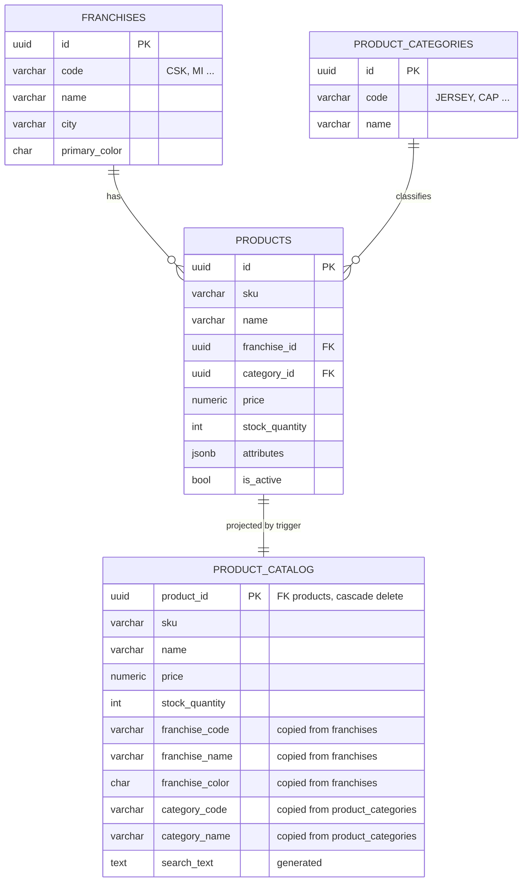
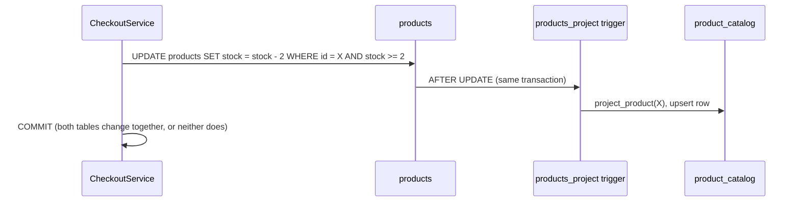

# 11 · Denormalised table structure

The database uses **two shapes of data**:

- **Write model (normalised, 3NF).** Every fact is stored once. Carts, checkout and stock updates write here.
- **Read model and snapshots (denormalised).** Copies of data are shaped for fast reads or kept as history.
  Every copy has a **named reason** and a **named mechanism** that keeps it correct.

> Rule followed: *normalise for writes, denormalise for reads, and write down who keeps each copy in sync.*

| Denormalised data | Type | Why | Kept correct by |
|---|---|---|---|
| [`product_catalog`](#1-product_catalog--the-read-model) (whole table) | Read model (CQRS-lite) | Catalogue pages get one flat row, with no joins | Triggers, in the same transaction |
| [`product_catalog.search_text`](#14-search_text-generated-column) | Generated column | One index serves search by name, type or franchise | `GENERATED ALWAYS … STORED` |
| [`order_items` product columns](#2-order_items--purchase-snapshot) | Historical snapshot | An order shows what was bought at the price paid | Written once at checkout |
| [`orders` customer columns + `item_count`](#3-orders--header-snapshot) | Snapshot / pre-computed | Order history list needs no joins | Written once at checkout |
| [`cart_items.customer_id`, `order_items.customer_id`](#4-customer_id-on-child-rows--distribution-key) | Distribution key | Keeps child rows on the same shard as their parent | Copied by the aggregate root |

Source: [`database/migrations/V001__write_model.sql`](../database/migrations/V001__write_model.sql) (write model and snapshots) and
[`V002__catalog_read_model.sql`](../database/migrations/V002__catalog_read_model.sql) (read model).

---

## 1. `product_catalog`: the read model

### 1.1 Why it exists

The product list, search and details pages are more than 95% of traffic. Each needs **product + franchise + category** together.

**Without the read model**, every request would run a 3-way join:

```sql
SELECT p.*, f.code, f.name, f.primary_color, c.code, c.name
FROM products p
JOIN franchises f         ON f.id = p.franchise_id
JOIN product_categories c ON c.id = p.category_id
WHERE p.is_active AND (p.name ILIKE '%jersey%' OR f.name ILIKE '%jersey%' OR c.name ILIKE '%jersey%' ...)
```

**With the read model**, it is a single-table lookup on indexed columns:

```sql
SELECT * FROM product_catalog
WHERE is_active AND search_text ILIKE '%jersey%' AND franchise_code = 'CSK'
ORDER BY price DESC;
```

It also means that:

- the table can be served from a **read replica** (the API's `ReadOnlyStoreDbContext`, see [06](06-distributed-database.md)).
- it can later be pushed to a search engine or cache without touching the write side.

### 1.2 Normalised → denormalised



### 1.3 Column-by-column structure

| # | Column | Type | Null | Copied from | Used for |
|---|---|---|---|---|---|
| 1 | `product_id` | `uuid` | PK | `products.id` | Details page lookup. `ON DELETE CASCADE` removes the row with the product |
| 2 | `sku` | `varchar(40)` | no | `products.sku` | Display, search |
| 3 | `name` | `varchar(200)` | no | `products.name` | Display, sort "Name", search |
| 4 | `description` | `text` | no | `products.description` | Details page |
| 5 | `price` | `numeric(12,2)` | no | `products.price` | Price filter, price sorts |
| 6 | `currency` | `char(3)` | no | `products.currency` | Display |
| 7 | `stock_quantity` | `integer` | no | `products.stock_quantity` | "In stock only" filter, "Sold out" badge |
| 8 | `is_active` | `boolean` | no | `products.is_active` | Hides discontinued products (partial indexes) |
| 9 | `image_url` | `varchar(500)` | yes | `products.image_url` | Display |
| 10 | `attributes` | `jsonb` | no | `products.attributes` | Details page (sizes, material, signed by…) |
| 11 | `franchise_id` | `uuid` | no | `franchises.id` | Lets the franchise trigger find rows to refresh |
| 12 | **`franchise_code`** | `varchar(8)` | no | **`franchises.code`** | Franchise filter |
| 13 | **`franchise_name`** | `varchar(100)` | no | **`franchises.name`** | Display, search |
| 14 | **`franchise_color`** | `char(7)` | no | **`franchises.primary_color`** | Product tile colour |
| 15 | `category_id` | `uuid` | no | `product_categories.id` | Lets the category trigger find rows to refresh |
| 16 | **`category_code`** | `varchar(40)` | no | **`product_categories.code`** | Product-type filter |
| 17 | **`category_name`** | `varchar(80)` | no | **`product_categories.name`** | Display, search |
| 18 | `created_at` | `timestamptz` | no | `products.created_at` | Sort "Newest" |
| 19 | `updated_at` | `timestamptz` | no | `products.updated_at` | Auditing |
| 20 | **`search_text`** | `text` | generated | name + sku + franchise code/name + category name | Free-text search |

**Bold** = the columns that are *duplicated from another table*. They remove the joins.

### 1.4 `search_text` (generated column)

```sql
search_text text GENERATED ALWAYS AS (
    lower(name || ' ' || sku || ' ' || franchise_code || ' ' || franchise_name || ' ' || category_name)
) STORED
```

PostgreSQL computes it on every insert or update, so the application never has to. Example value:

```
mumbai indians team cap mi-cap mi mumbai indians cap
```

A search for `mumbai cap` becomes `search_text ILIKE '%mumbai%' AND search_text ILIKE '%cap%'`. One GIN trigram index answers it.

### 1.5 Indexes

| Index | Definition | Serves |
|---|---|---|
| `product_catalog_pkey` | `btree (product_id)` | `GET /products/{id}` |
| `ix_product_catalog_search_trgm` | `gin (search_text gin_trgm_ops)` | `?search=` (fast `ILIKE '%term%'`) |
| `ix_product_catalog_franchise` | `btree (franchise_code) WHERE is_active` | `?franchise=CSK` |
| `ix_product_catalog_category` | `btree (category_code) WHERE is_active` | `?category=JERSEY` |
| `ix_product_catalog_price` | `btree (price) WHERE is_active` | `?minPrice/maxPrice`, price sorts |
| `ix_product_catalog_created` | `btree (created_at DESC) WHERE is_active` | `?sort=Newest` |

The partial indexes (`WHERE is_active`) skip discontinued products, so they stay smaller.

### 1.6 How it is kept in sync

Triggers on the three write tables re-project the affected rows. They run **inside the writer's transaction**,
so the read model commits or rolls back together with the write. It is never stale on the primary.

| Change on the write side | Trigger | Effect on `product_catalog` |
|---|---|---|
| `INSERT` / `UPDATE` on `products` (new product, price change, **stock reserved at checkout**) | `products_project` → `project_product(id)` | Upserts that one row (`INSERT … ON CONFLICT DO UPDATE`) |
| `DELETE` on `products` | none needed | Row removed by `ON DELETE CASCADE` |
| `UPDATE OF code, name, primary_color` on `franchises` | `franchises_project` | Set-based update of every row with that `franchise_id` |
| `UPDATE OF code, name` on `product_categories` | `categories_project` | Set-based update of every row with that `category_id` |
| Any `UPDATE` on `products` | `products_touch_updated_at` (BEFORE) | Keeps `updated_at` correct without relying on the writer |



`project_product()` is idempotent, so it is also safe for backfills and repeated calls.

### 1.7 Sample rows (live data)

| sku | name | price | stock | franchise_code | franchise_name | franchise_color | category_code | category_name |
|---|---|---|---|---|---|---|---|---|
| `CSK-JER-H` | Chennai Super Kings Official Home Jersey 2026 | 2499.00 | 118 | CSK | Chennai Super Kings | `#F9CD05` | JERSEY | Jersey |
| `MI-CAP` | Mumbai Indians Team Cap | 799.00 | 200 | MI | Mumbai Indians | `#004BA0` | CAP | Cap |

The stock of `CSK-JER-H` went from 120 to 118 after the checkout in the README screenshots. The trigger updated the read model in the same transaction.

### 1.8 Where the application uses it

| Layer | File |
|---|---|
| EF entity (read-only) | `backend/src/IplStore.Infrastructure/Persistence/ReadModels/CatalogItem.cs` |
| Queries (search, details) | `backend/src/IplStore.Infrastructure/Queries/CatalogQueries.cs` |
| Search filters | `backend/src/IplStore.Infrastructure/Queries/CatalogFilters/CatalogFilters.cs` |
| Context (replica-capable, no tracking) | `ReadOnlyStoreDbContext` in `Infrastructure/Persistence/StoreDbContext.cs` |

The application **never writes** to `product_catalog`. Only the triggers do.

---

## 2. `order_items`: purchase snapshot

| Column | Copied from | Why |
|---|---|---|
| `sku` | `products.sku` | The order must show what was bought, **even after the product is renamed, repriced or deleted** |
| `product_name` | `products.name` | same |
| `franchise_name` | `franchises.name` | same |
| `category_name` | `product_categories.name` | same |
| `unit_price` | `products.price` **at checkout time** | The customer paid this price. Later price changes must not rewrite history |
| `line_total` | computed | `CHECK (line_total = unit_price * quantity)` |
| `product_id` | `products.id` | Deliberately **no foreign key**: order history outlives the catalogue |

Written once by `CheckoutService` and never updated afterwards.

## 3. `orders`: header snapshot

| Column | Copied from | Why |
|---|---|---|
| `customer_name` | `customers.full_name` at purchase | Invoice or receipt shows the name used at the time |
| `customer_email` | `customers.email` at purchase | same |
| `item_count` | sum of `order_items.quantity` | The "My orders" list renders without reading `order_items` |
| `subtotal`, `tax`, `shipping`, `total` | `IPricingPolicy` result | Totals are frozen. `CHECK` constraints keep them consistent |

## 4. `customer_id` on child rows: distribution key

`cart_items.customer_id` and `order_items.customer_id` could be reached through their parent,
but they are copied onto the child row so that, with Citus sharding by customer, **a customer's cart and
orders live on one shard** and joins stay local. See [06 Distributed database](06-distributed-database.md).

---

## 5. Trade-offs

| Benefit | Cost | Mitigation |
|---|---|---|
| No joins on the hottest path, and every filter is indexed | Data is stored twice | Only `product_catalog` duplicates live data. The other columns are intentional snapshots |
| Read model is never stale on the primary | Writes to `products` do a little more work (one upsert) | Products change rarely compared with how often they are read |
| Can move reads to a replica or search engine | Replica reads lag by milliseconds | Checkout always re-reads stock on the primary with a conditional `UPDATE` |
| Consistency is enforced by the database, not by every caller | Logic lives in SQL triggers | Covered by integration tests, and recorded in [ADR-0003](adr/0003-trigger-maintained-read-model.md) |

## 6. See it yourself

```powershell
$env:PGPASSWORD = "ipl_local_only"
& "C:\Program Files\PostgreSQL\16\bin\psql.exe" -h localhost -U ipl -d iplstore
```

```sql
\d product_catalog                                   -- structure, indexes, FK

SELECT sku, name, price, stock_quantity, franchise_code, franchise_name, category_name, search_text
FROM product_catalog WHERE sku = 'CSK-JER-H';

-- Prove the trigger: change the write model, and the read model follows in the same statement
BEGIN;
UPDATE franchises SET name = 'Chennai Super Kings (TEST)' WHERE code = 'CSK';
SELECT DISTINCT franchise_name FROM product_catalog WHERE franchise_code = 'CSK';
ROLLBACK;                                            -- nothing is kept
```
