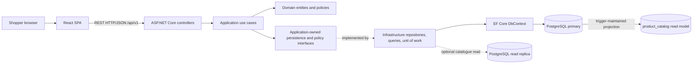
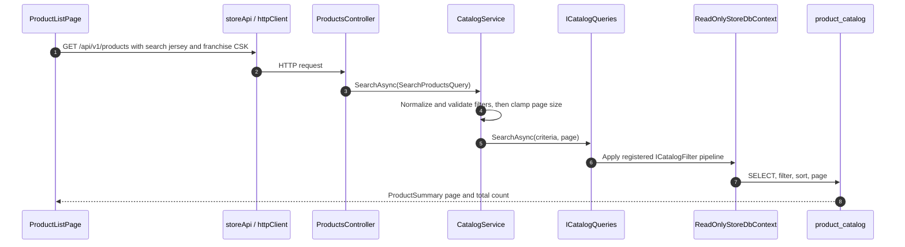
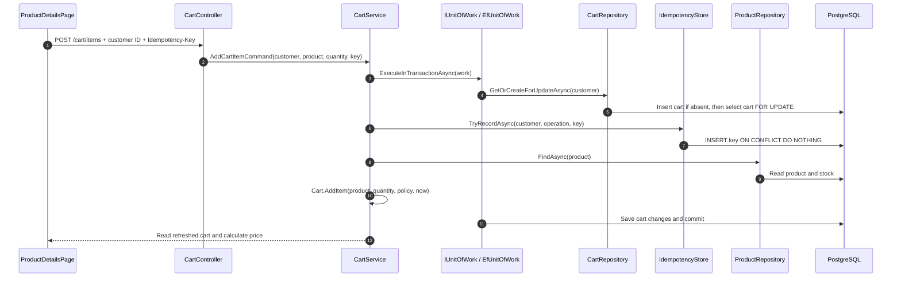
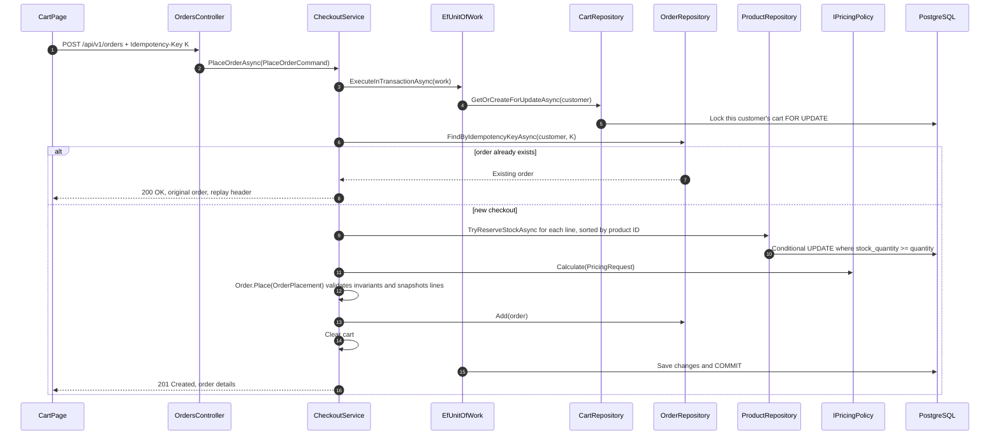
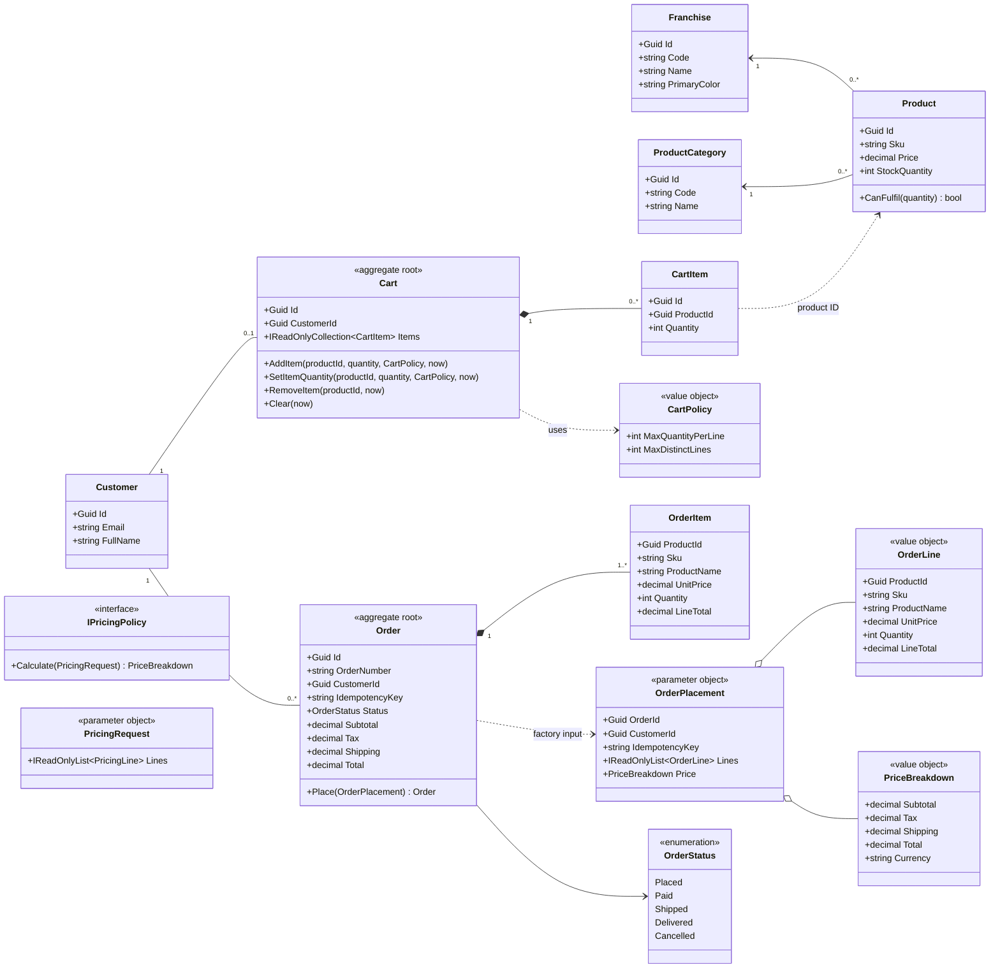
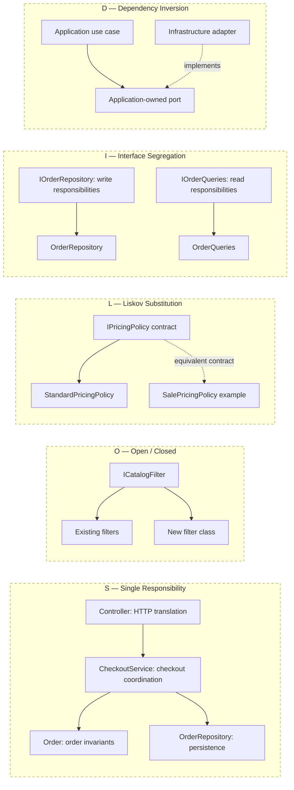
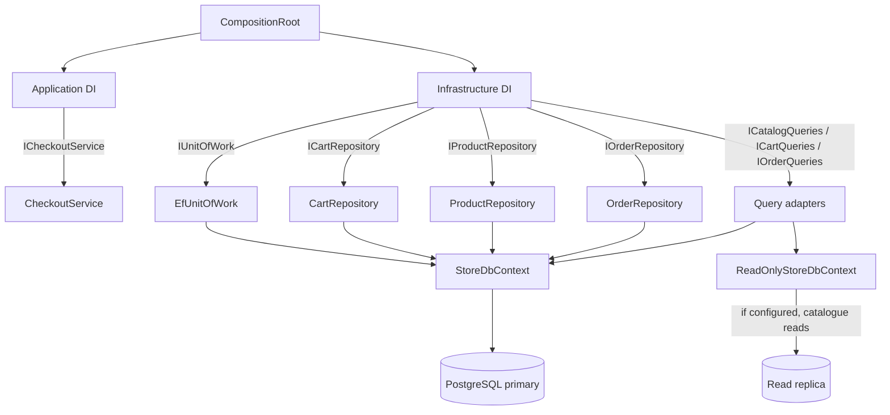

# Interview Design Guide: IPL Franchise Store

This guide connects the shopper's actions to the API, application use cases, domain rules, persistence ports, PostgreSQL tables, and tests. Use it to explain both **what is implemented** and **why it was designed that way**.

## 1. Opening Summary

> “This is a modular monolith for IPL merchandise. The React application calls one versioned ASP.NET Core API. The API is separated into HTTP, application, domain, and infrastructure projects, but those backend projects deploy together as one API. PostgreSQL is the source of truth. The main reliability goals are correct cart updates, no overselling, and no duplicate checkout effects when a request is repeated.”

Be precise about scope:

- Checkout creates an order in `Placed` status. There is no payment provider, payment service, payment table, or payment webhook implemented.
- Customer selection uses `X-Customer-Id` as a demo identity, not production authentication.
- Terraform describes an Azure target. It is not proof that the application is already deployed there.
- The public API is REST over HTTP/JSON, not gRPC. Internal application interactions are direct C# calls through dependency-injected interfaces, not RPC.
- The code has deliberate SOLID and pattern-based seams, but no system follows “strict SOLID” without trade-offs. Explain the specific boundaries and evidence rather than claiming perfection.

## 2. System and Request Path



| Diagram block | Responsibility and scope | Implementation reference |
|---|---|---|
| Shopper browser / React SPA | Renders pages and sends user intent; it does not own stock or checkout truth. | [Product list](../frontend/src/pages/ProductListPage.tsx), [cart](../frontend/src/pages/CartPage.tsx), [API client](../frontend/src/api/httpClient.ts) |
| API controllers | Translate HTTP requests and headers into application calls; keep business rules out of controllers. | [products](../backend/src/IplStore.Api/Controllers/ProductsController.cs), [reference data](../backend/src/IplStore.Api/Controllers/ReferenceDataController.cs), [cart](../backend/src/IplStore.Api/Controllers/CartController.cs), [orders](../backend/src/IplStore.Api/Controllers/OrdersController.cs) |
| Application use cases / ports | Orchestrate a user goal and define the interfaces required from persistence/policies. | [Application services](../backend/src/IplStore.Application), [ports](../backend/src/IplStore.Application) |
| Domain | Enforce cart/order/product rules independently of HTTP and database technology. | [Domain project](../backend/src/IplStore.Domain) |
| Infrastructure adapters / DbContext | Implement ports with EF Core, queries, transactions, and PostgreSQL. | [Infrastructure DI](../backend/src/IplStore.Infrastructure/DependencyInjection.cs), [DbContext](../backend/src/IplStore.Infrastructure/Persistence/StoreDbContext.cs) |
| PostgreSQL / product catalog / replica | Persist write-side state; the catalog is a trigger-maintained read projection; replica is optional. | [Write schema](../database/migrations/V001__write_model.sql), [catalog projection](../database/migrations/V002__catalog_read_model.sql) |

Local ports are documented in the repository setup: Vite serves the SPA at `5173`, the API at `5080`, and PostgreSQL at `5432`. Local Vite/nginx routing is not the same as Azure routing. Azure deployment and CI/CD are described as a target; configure and verify those before saying the application is deployed in Azure.

### Direction of dependencies

The Domain has no dependency on EF Core, HTTP, or PostgreSQL. Application depends on Domain and defines ports such as `IOrderRepository`. Infrastructure references Application and implements those ports. The API is the composition root: it registers the concrete implementations. That is the Dependency Inversion Principle in the project structure.

## 3. User Flows from UI to Database

### 3.1 Browse and search catalogue



| Participant | Responsibility and scope | Implementation reference |
|---|---|---|
| `ProductListPage` | Owns list-page state and URL-backed filters; does not query PostgreSQL directly. | [ProductListPage.tsx](../frontend/src/pages/ProductListPage.tsx) |
| `storeApi` / `httpClient` | Builds the HTTP request, customer header when present, and safe retry behavior. | [storeApi.ts](../frontend/src/api/storeApi.ts), [httpClient.ts](../frontend/src/api/httpClient.ts) |
| `ProductsController` | Maps the REST request into `SearchProductsQuery`. | [ProductsController.cs](../backend/src/IplStore.Api/Controllers/ProductsController.cs) |
| `CatalogService` | Validates/normalizes filters and paging; coordinates the catalogue use case. | [CatalogService.cs](../backend/src/IplStore.Application/Catalog/CatalogService.cs) |
| `ICatalogQueries` / `CatalogQueries` | Query contract and PostgreSQL-backed read adapter; applies the filter pipeline and projects DTOs. | [ICatalogQueries.cs](../backend/src/IplStore.Application/Catalog/ICatalogQueries.cs), [CatalogQueries.cs](../backend/src/IplStore.Infrastructure/Queries/CatalogQueries.cs) |
| `ReadOnlyStoreDbContext` / `product_catalog` | Maps read-only catalogue data from the primary or optional replica. | [StoreDbContext.cs](../backend/src/IplStore.Infrastructure/Persistence/StoreDbContext.cs), [catalog migration](../database/migrations/V002__catalog_read_model.sql) |

The catalogue path uses the read model `product_catalog`; it does not load each `Product` domain aggregate to render a page. `CatalogService` validates input and turns it into normalized criteria. `CatalogQueries` composes the registered filters and creates a DTO.

### 3.2 Add a product to cart



| Participant | Responsibility and scope | Implementation reference |
|---|---|---|
| `ProductDetailsPage` | Captures the shopper's add intent and reuses its key after a failed request. | [ProductDetailsPage.tsx](../frontend/src/pages/ProductDetailsPage.tsx) |
| `CartController` / `CartService` | Translate HTTP to the add-cart use case and orchestrate validation, idempotency, and transaction work. | [CartController.cs](../backend/src/IplStore.Api/Controllers/CartController.cs), [CartService.cs](../backend/src/IplStore.Application/Carts/CartService.cs) |
| `IUnitOfWork` / `EfUnitOfWork` | Defines and executes the transaction boundary; retries eligible transient database failures. | [IUnitOfWork.cs](../backend/src/IplStore.Application/Common/IUnitOfWork.cs), [EfUnitOfWork.cs](../backend/src/IplStore.Infrastructure/Persistence/EfUnitOfWork.cs) |
| `CartRepository` | Creates the cart if needed and locks that customer's cart for the transaction. | [CartRepository.cs](../backend/src/IplStore.Infrastructure/Repositories/CartRepository.cs) |
| `IdempotencyStore` | Records a customer/operation/key once, atomically with the cart change. | [IIdempotencyStore.cs](../backend/src/IplStore.Application/Common/IIdempotencyStore.cs), [IdempotencyStore.cs](../backend/src/IplStore.Infrastructure/Persistence/IdempotencyStore.cs) |
| `ProductRepository` / `Cart` | Reads current product/stock and applies cart aggregate rules such as quantity limits and merge behavior. | [ProductRepository.cs](../backend/src/IplStore.Infrastructure/Repositories/ProductRepository.cs), [Cart.cs](../backend/src/IplStore.Domain/Carts/Cart.cs) |
| Cart response and price | Reloads the cart view and applies the shared pricing strategy after the write transaction. | [CartService.cs](../backend/src/IplStore.Application/Carts/CartService.cs), [StandardPricingPolicy.cs](../backend/src/IplStore.Application/Pricing/StandardPricingPolicy.cs) |

Important behavior: adding increments quantity, so it is not naturally idempotent. The idempotency key and cart change are recorded in the same database transaction. A repeated key is a no-op. The cart lock serializes edits for the same customer; it does not block unrelated customers' cart rows.

### 3.3 Checkout



| Participant | Responsibility and scope | Implementation reference |
|---|---|---|
| `CartPage` / `OrdersController` | Sends checkout with a stable key per attempt; controller maps HTTP to a command and returns 201 or replay 200. | [CartPage.tsx](../frontend/src/pages/CartPage.tsx), [OrdersController.cs](../backend/src/IplStore.Api/Controllers/OrdersController.cs) |
| `CheckoutService` | Orchestrates customer/cart checks, replay lookup, stock reservation, pricing, order creation, and cart clear. | [CheckoutService.cs](../backend/src/IplStore.Application/Orders/CheckoutService.cs) |
| `EfUnitOfWork` / repositories | Own the transaction and implement cart lock, conditional stock update, and order persistence. | [EfUnitOfWork.cs](../backend/src/IplStore.Infrastructure/Persistence/EfUnitOfWork.cs), [CartRepository.cs](../backend/src/IplStore.Infrastructure/Repositories/CartRepository.cs), [ProductRepository.cs](../backend/src/IplStore.Infrastructure/Repositories/ProductRepository.cs), [OrderRepository.cs](../backend/src/IplStore.Infrastructure/Repositories/OrderRepository.cs) |
| `IPricingPolicy` | Calculates subtotal, tax, shipping, and total; checkout does not implement pricing inline. | [IPricingPolicy.cs](../backend/src/IplStore.Application/Pricing/IPricingPolicy.cs), [StandardPricingPolicy.cs](../backend/src/IplStore.Application/Pricing/StandardPricingPolicy.cs) |
| `Order.Place` | Domain factory validates order invariants and creates snapshot order items. | [Order.cs](../backend/src/IplStore.Domain/Orders/Order.cs), [OrderPlacement.cs](../backend/src/IplStore.Domain/Orders/OrderPlacement.cs) |
| PostgreSQL | Commits stock, order, order lines, and cart clear together; constraints are the final integrity guard. | [Write-model migration](../database/migrations/V001__write_model.sql) |

The controller is a transport adapter; the `CheckoutService` owns the use-case sequence; `Order.Place` enforces domain invariants. The unit of work gives the database operations one transaction boundary. The database's unique `(customer_id, idempotency_key)` constraint is a backstop against duplicate orders.

### 3.4 Read order history

`GET /api/v1/orders` goes from `OrdersController` to `OrderService`, then `IOrderQueries` / `OrderQueries`, which filters by the current customer and reads the primary database for read-your-writes consistency. The list uses denormalized order fields; details include snapshot `order_items`. A different customer's order ID returns not found.

## 4. Class and Interface Diagrams

### 4.1 Domain model and essential operations



| Class / contract | Responsibility and scope | Implementation reference |
|---|---|---|
| `Franchise`, `ProductCategory` | Catalogue reference data; no checkout orchestration. | [Franchise.cs](../backend/src/IplStore.Domain/Catalog/Franchise.cs), [ProductCategory.cs](../backend/src/IplStore.Domain/Catalog/ProductCategory.cs) |
| `Product` | Catalogue item and stock-related domain behavior such as `CanFulfil`. | [Product.cs](../backend/src/IplStore.Domain/Catalog/Product.cs) |
| `Customer` | Customer identity/profile record used by cart and order ownership. | [Customer.cs](../backend/src/IplStore.Domain/Customers/Customer.cs) |
| `Cart` / `CartItem` | Cart aggregate owns item merge, quantity limits, remove, and clear behavior. | [Cart.cs](../backend/src/IplStore.Domain/Carts/Cart.cs), [CartItem.cs](../backend/src/IplStore.Domain/Carts/CartItem.cs) |
| `CartPolicy` | Value object carrying configurable cart limits into aggregate operations. | [CartPolicy.cs](../backend/src/IplStore.Domain/Carts/CartPolicy.cs) |
| `Order` / `OrderItem` | Order aggregate validates creation; items keep purchase-time snapshots. | [Order.cs](../backend/src/IplStore.Domain/Orders/Order.cs), [OrderItem.cs](../backend/src/IplStore.Domain/Orders/OrderItem.cs) |
| `OrderPlacement`, `OrderLine`, `PriceBreakdown` | Immutable inputs/value objects used to construct and validate an order. | [OrderPlacement.cs](../backend/src/IplStore.Domain/Orders/OrderPlacement.cs), [OrderLine.cs](../backend/src/IplStore.Domain/Orders/OrderLine.cs), [PriceBreakdown.cs](../backend/src/IplStore.Domain/Orders/PriceBreakdown.cs) |
| `IPricingPolicy`, `PricingRequest` | Application strategy contract and input object for turning pricing lines into a breakdown. | [IPricingPolicy.cs](../backend/src/IplStore.Application/Pricing/IPricingPolicy.cs) |
| `OrderStatus` | Persisted order lifecycle enum; `Paid` is a status value, not implemented payment processing. | [OrderStatus.cs](../backend/src/IplStore.Domain/Orders/OrderStatus.cs) |

`Cart` and `Order` are aggregate roots: callers use them to make changes rather than mutating child rows directly. The model is intentionally not a claim that every table has a matching domain aggregate; `product_catalog` is an infrastructure read model.

### 4.2 Application ports, adapters, and database connection

```mermaid
classDiagram
    direction TB
    class CartController
    class OrdersController
    class ProductsController
    class ICartService {
        <<interface>>
        GetAsync(customerId)
        AddItemAsync(AddCartItemCommand)
        UpdateItemAsync(UpdateCartItemCommand)
        RemoveItemAsync(RemoveCartItemCommand)
    }
    class ICheckoutService {
        <<interface>>
        PlaceOrderAsync(PlaceOrderCommand, cancellationToken)
    }
    class ICatalogService {
        <<interface>>
        SearchAsync(SearchProductsQuery, cancellationToken)
        GetProductAsync(productId, cancellationToken)
    }
    class IOrderService {
        <<interface>>
        ListAsync(customerId, page, cancellationToken)
        GetAsync(customerId, orderId, cancellationToken)
    }
    class CartService
    class CheckoutService {
        +PlaceOrderAsync(command, cancellationToken)
    }
    class CatalogService
    class OrderService
    class IUnitOfWork {
        <<interface>>
        ExecuteInTransactionAsync(work, cancellationToken)
    }
    class ICartRepository {
        <<interface>>
        GetOrCreateForUpdateAsync(customerId, cancellationToken)
    }
    class IProductRepository {
        <<interface>>
        FindAsync(productId, cancellationToken)
        TryReserveStockAsync(productId, quantity, cancellationToken)
    }
    class IOrderRepository {
        <<interface>>
        FindByIdempotencyKeyAsync(customerId, key, cancellationToken)
        Add(order)
    }
    class ICustomerRepository {
        <<interface>>
        FindAsync(customerId, cancellationToken)
    }
    class IOrderNumberGenerator {
        <<interface>>
        Next(placedAt)
    }
    class ICartQueries {
        <<interface>>
        GetAsync(customerId, cancellationToken)
    }
    class ICatalogQueries {
        <<interface>>
        SearchAsync(criteria, page, cancellationToken)
    }
    class IOrderQueries {
        <<interface>>
        ListAsync(customerId, page, cancellationToken)
        GetAsync(customerId, orderId, cancellationToken)
    }
    class IIdempotencyStore {
        <<interface>>
        TryRecordAsync(customerId, operation, key, cancellationToken)
    }
    class StandardPricingPolicy
    class OrderNumberGenerator
    class EfUnitOfWork
    class CartRepository
    class ProductRepository
    class OrderRepository
    class CustomerRepository
    class IdempotencyStore
    class CatalogQueries
    class CartQueries
    class OrderQueries
    class StoreDbContext
    class ReadOnlyStoreDbContext
    class PostgreSQL

    CartController --> ICartService
    OrdersController --> ICheckoutService
    OrdersController --> IOrderService
    ProductsController --> ICatalogService
    CartService ..|> ICartService
    CheckoutService ..|> ICheckoutService
    CatalogService ..|> ICatalogService
    OrderService ..|> IOrderService
    OrdersController --> IOrderService
    CartService --> IUnitOfWork
    CartService --> ICartRepository
    CartService --> ICartQueries
    CartService --> IProductRepository
    CartService --> ICustomerRepository
    CartService --> IIdempotencyStore
    CheckoutService --> IUnitOfWork
    CheckoutService --> ICartRepository
    CheckoutService --> IProductRepository
    CheckoutService --> IOrderRepository
    CheckoutService --> ICustomerRepository
    CheckoutService --> IOrderQueries
    CheckoutService --> IPricingPolicy
    CheckoutService --> IOrderNumberGenerator
    StandardPricingPolicy ..|> IPricingPolicy
    EfUnitOfWork ..|> IUnitOfWork
    CartRepository ..|> ICartRepository
    ProductRepository ..|> IProductRepository
    OrderRepository ..|> IOrderRepository
    CustomerRepository ..|> ICustomerRepository
    IdempotencyStore ..|> IIdempotencyStore
    CatalogQueries ..|> ICatalogQueries
    CartQueries ..|> ICartQueries
    OrderQueries ..|> IOrderQueries
    OrderNumberGenerator ..|> IOrderNumberGenerator
    CartRepository --> StoreDbContext
    ProductRepository --> StoreDbContext
    OrderRepository --> StoreDbContext
    CustomerRepository --> StoreDbContext
    IdempotencyStore --> StoreDbContext
    EfUnitOfWork --> StoreDbContext
    CatalogQueries --> ReadOnlyStoreDbContext
    CartQueries --> StoreDbContext
    OrderQueries --> StoreDbContext
    StoreDbContext --> PostgreSQL
    ReadOnlyStoreDbContext --> PostgreSQL
```



| Class / contract | Responsibility and scope | Implementation reference |
|---|---|---|
| `ProductsController`, `CartController`, `OrdersController` | HTTP adapters; bind request/query/header data and call application services. | [ProductsController.cs](../backend/src/IplStore.Api/Controllers/ProductsController.cs), [CartController.cs](../backend/src/IplStore.Api/Controllers/CartController.cs), [OrdersController.cs](../backend/src/IplStore.Api/Controllers/OrdersController.cs) |
| `CatalogService`, `CartService`, `CheckoutService` | Application use cases: validate/coordinate browse, cart, and checkout respectively. | [CatalogService.cs](../backend/src/IplStore.Application/Catalog/CatalogService.cs), [CartService.cs](../backend/src/IplStore.Application/Carts/CartService.cs), [CheckoutService.cs](../backend/src/IplStore.Application/Orders/CheckoutService.cs) |
| `IUnitOfWork` / `EfUnitOfWork` | Port and adapter for transaction, save, retry, and conflict translation. | [IUnitOfWork.cs](../backend/src/IplStore.Application/Common/IUnitOfWork.cs), [EfUnitOfWork.cs](../backend/src/IplStore.Infrastructure/Persistence/EfUnitOfWork.cs) |
| `ICartRepository` / `CartRepository` | Cart write contract and adapter; creates/locks the customer cart. | [ICartRepository.cs](../backend/src/IplStore.Application/Carts/ICartRepository.cs), [CartRepository.cs](../backend/src/IplStore.Infrastructure/Repositories/CartRepository.cs) |
| `IProductRepository` / `ProductRepository` | Product lookup and atomic stock reservation contract/adapter. | [IProductRepository.cs](../backend/src/IplStore.Application/Catalog/IProductRepository.cs), [ProductRepository.cs](../backend/src/IplStore.Infrastructure/Repositories/ProductRepository.cs) |
| `IOrderRepository` / `OrderRepository` | Checkout order write and idempotency lookup; order history is a separate query adapter. | [IOrderRepository.cs](../backend/src/IplStore.Application/Orders/IOrderRepository.cs), [OrderRepository.cs](../backend/src/IplStore.Infrastructure/Repositories/OrderRepository.cs) |
| `IOrderService` / `OrderService` | Customer-scoped order list/details use case, separate from checkout orchestration. | [OrderService.cs](../backend/src/IplStore.Application/Orders/OrderService.cs) |
| `ICustomerRepository` / `CustomerRepository` | Looks up the customer used by cart and checkout use cases. | [ICustomerRepository.cs](../backend/src/IplStore.Application/Customers/ICustomerRepository.cs), [CustomerRepository.cs](../backend/src/IplStore.Infrastructure/Repositories/CustomerRepository.cs) |
| `IIdempotencyStore` / `IdempotencyStore` | Records keyed add-to-cart effects once per customer and operation. | [IIdempotencyStore.cs](../backend/src/IplStore.Application/Common/IIdempotencyStore.cs), [IdempotencyStore.cs](../backend/src/IplStore.Infrastructure/Persistence/IdempotencyStore.cs) |
| `IOrderNumberGenerator` / `OrderNumberGenerator` | Generates a display order number; it does not own order persistence. | [IOrderNumberGenerator.cs](../backend/src/IplStore.Application/Orders/IOrderNumberGenerator.cs), [OrderNumberGenerator.cs](../backend/src/IplStore.Infrastructure/Orders/OrderNumberGenerator.cs) |
| `ICatalogQueries`, `ICartQueries`, `IOrderQueries` | Read-side ports; separate list/detail projections from write repositories. | [ICatalogQueries.cs](../backend/src/IplStore.Application/Catalog/ICatalogQueries.cs), [ICartQueries.cs](../backend/src/IplStore.Application/Carts/ICartQueries.cs), [IOrderQueries.cs](../backend/src/IplStore.Application/Orders/IOrderQueries.cs) |
| `CatalogQueries`, `CartQueries`, `OrderQueries` | EF query adapters; each owns the projection for its read use case. | [CatalogQueries.cs](../backend/src/IplStore.Infrastructure/Queries/CatalogQueries.cs), [CartQueries.cs](../backend/src/IplStore.Infrastructure/Queries/CartQueries.cs), [OrderQueries.cs](../backend/src/IplStore.Infrastructure/Queries/OrderQueries.cs) |
| `StoreDbContext` / `ReadOnlyStoreDbContext` | Maps entities/read model to PostgreSQL; optional read context disables tracking and saving. | [StoreDbContext.cs](../backend/src/IplStore.Infrastructure/Persistence/StoreDbContext.cs) |

**How to read the diagram:** `..|>` means “implements”; `-->` means “uses/depends on”. `I*Repository` ports are write-side persistence contracts. `I*Queries` are read-side contracts. These are separate adapters, not “subrepositories” nested inside a repository. `StoreDbContext` points to the primary and is used for commands and read-your-writes flows. `ReadOnlyStoreDbContext` is configured to use the optional replica for catalogue reads when configured; otherwise it falls back to the primary.

The concrete adapters are registered in `IplStore.Infrastructure.DependencyInjection`; use cases are registered in the Application DI extension; `CompositionRoot` calls both. They are scoped per request where they use EF `DbContext`. The composition root is the place to replace an adapter or register a different strategy.

## 5. SOLID: Evidence and Boundaries

The dotted boxes group classes where a principle is visible; they are not extra runtime components.



| Principle group | What the shown blocks own | Code references |
|---|---|---|
| **SRP** | Controller translates HTTP; checkout service coordinates; `Order` validates invariants; repository persists. | [OrdersController.cs](../backend/src/IplStore.Api/Controllers/OrdersController.cs), [CheckoutService.cs](../backend/src/IplStore.Application/Orders/CheckoutService.cs), [Order.cs](../backend/src/IplStore.Domain/Orders/Order.cs), [OrderRepository.cs](../backend/src/IplStore.Infrastructure/Repositories/OrderRepository.cs) |
| **OCP** | Existing and new catalog filters implement one filter contract; query composition consumes the collection. | [ICatalogFilter](../backend/src/IplStore.Infrastructure/Queries/CatalogFilters/ICatalogFilter.cs), [one class per filter](../backend/src/IplStore.Infrastructure/Queries/CatalogFilters/), [CatalogQueries.cs](../backend/src/IplStore.Infrastructure/Queries/CatalogQueries.cs) |
| **LSP** | Pricing implementations must honor the same valid-input and price-breakdown contract. | [IPricingPolicy.cs](../backend/src/IplStore.Application/Pricing/IPricingPolicy.cs), [StandardPricingPolicy.cs](../backend/src/IplStore.Application/Pricing/StandardPricingPolicy.cs) |
| **ISP** | Order writes and order-history reads use distinct ports and adapters. | [IOrderRepository.cs](../backend/src/IplStore.Application/Orders/IOrderRepository.cs), [IOrderQueries.cs](../backend/src/IplStore.Application/Orders/IOrderQueries.cs), [OrderRepository.cs](../backend/src/IplStore.Infrastructure/Repositories/OrderRepository.cs), [OrderQueries.cs](../backend/src/IplStore.Infrastructure/Queries/OrderQueries.cs) |
| **DIP** | Application use cases depend on application-owned abstractions; Infrastructure supplies implementations via DI. | [CheckoutService.cs](../backend/src/IplStore.Application/Orders/CheckoutService.cs), [Application DI](../backend/src/IplStore.Application/DependencyInjection.cs), [Infrastructure DI](../backend/src/IplStore.Infrastructure/DependencyInjection.cs), [CompositionRoot.cs](../backend/src/IplStore.Api/Composition/CompositionRoot.cs) |

| Principle | Evidence in this codebase | What not to overclaim |
|---|---|---|
| **S** | Controllers translate HTTP; services coordinate use cases; aggregates enforce rules; repositories persist; pricing policy calculates prices. | A class can still grow too large. Review responsibilities as features are added. |
| **O** | Add an `ICatalogFilter` implementation and register it; add a new pricing implementation behind `IPricingPolicy`. | OCP is not “never edit any existing file.” Registration, mapping, and tests may need changes. |
| **L** | Implementations must honor the port contract. A pricing policy must return valid, internally consistent totals; a repository must preserve the transaction/locking semantics its use case relies on. | Implementing the same interface is insufficient if behavior differs. Contract tests are useful. |
| **I** | Read query ports and write repository ports are separate. Consumers depend on smaller interfaces than a single all-purpose data service. | Keep interfaces cohesive; don’t create one-interface-per-method without a reason. |
| **D** | Application defines ports; Infrastructure implements them; the composition root chooses concrete classes through DI. | The API composition root still depends on concrete projects to wire the application. That is intentional. |

### Composition over inheritance

Variable behavior is primarily composed through injected interfaces: `CheckoutService` receives `IPricingPolicy`, repositories, and `IUnitOfWork`. That lets behavior vary without subclassing the checkout service. The project still uses inheritance where it fits a framework/type relationship, such as exception types and the specialized read-only DbContext. The goal is to avoid inheritance as the default extension mechanism, not to ban it absolutely.

## 6. Patterns in Use

| Pattern | Where | Why it helps in a live change |
|---|---|---|
| Clean/Hexagonal architecture, Ports and Adapters | project boundaries and Application ports | Use cases depend on contracts, not EF/PostgreSQL. |
| Repository | `ICartRepository`, `IProductRepository`, `IOrderRepository` and Infrastructure implementations | Encapsulates persistence behavior, including locking and atomic stock updates. |
| Unit of Work | `IUnitOfWork` / `EfUnitOfWork` | Gives a use case one commit/rollback and retry boundary. |
| Aggregate Root / DDD | `Cart`, `Order` | Business invariants are enforced at domain entry points. |
| Factory Method | `Order.Place(OrderPlacement)` | An order is created only after validating its invariants. |
| Strategy | `IPricingPolicy` / `StandardPricingPolicy` | Pricing algorithm can change without changing callers. |
| Specification / Filter Pipeline | `ICatalogFilter` implementations | New independent search criteria can be added as filters. |
| Parameter Object | `SearchProductsQuery`, `PlaceOrderCommand`, `OrderPlacement`, `PricingRequest` | Related input travels as one named object instead of continually expanding method signatures. |
| CQRS-lite | command repositories vs read query ports; write tables vs `product_catalog` | Reads can use a denormalized projection and optional replica while writes preserve normalized truth. |
| Options | `CartOptions`, `PricingOptions`, `ResilienceOptions`, etc. | Behavior can be tuned and validated at startup. |
| Idempotent Receiver | order key and `idempotency_keys` table | Repeated client commands don’t repeat the database effect. |
| Composition Root / Dependency Injection | `CompositionRoot` and DI extensions | Concrete choices and lifetimes are centralized. |

Not currently used: gRPC/RPC between services, microservices, event broker, transactional outbox, payment gateway. Don’t describe these as existing patterns.

## 7. Database ER Diagram

```mermaid
erDiagram
    FRANCHISES ||--o{ PRODUCTS : sells
    PRODUCT_CATEGORIES ||--o{ PRODUCTS : classifies
    PRODUCTS ||--|| PRODUCT_CATALOG : projected_by_trigger
    CUSTOMERS ||--o| CARTS : owns_max_one
    CARTS ||--o{ CART_ITEMS : contains
    PRODUCTS ||--o{ CART_ITEMS : selected_in
    CUSTOMERS ||--o{ ORDERS : places
    ORDERS ||--|{ ORDER_ITEMS : contains
    CUSTOMERS ||--o{ IDEMPOTENCY_KEYS : scopes

    FRANCHISES {
        uuid id PK
        varchar code UK
        varchar name
        char primary_color
    }
    PRODUCT_CATEGORIES {
        uuid id PK
        varchar code UK
        varchar name
    }
    PRODUCTS {
        uuid id PK
        varchar sku UK
        uuid franchise_id FK
        uuid category_id FK
        numeric price
        char currency
        int stock_quantity
        jsonb attributes
        bool is_active
    }
    PRODUCT_CATALOG {
        uuid product_id PK_FK
        varchar sku
        numeric price
        int stock_quantity
        varchar franchise_name
        varchar category_name
        text search_text
    }
    CUSTOMERS {
        uuid id PK
        varchar email UK_case_insensitive
        varchar full_name
    }
    CARTS {
        uuid id PK
        uuid customer_id FK_UK
    }
    CART_ITEMS {
        uuid id PK
        uuid cart_id FK
        uuid customer_id denormalized
        uuid product_id FK
        int quantity
    }
    ORDERS {
        uuid id PK
        varchar order_number UK
        uuid customer_id FK
        varchar idempotency_key UK_with_customer
        varchar status
        numeric subtotal
        numeric tax
        numeric shipping
        numeric total
        int item_count
    }
    ORDER_ITEMS {
        uuid id PK
        uuid order_id FK
        uuid customer_id denormalized
        uuid product_id snapshot_no_FK
        varchar sku_snapshot
        varchar product_name_snapshot
        numeric unit_price_snapshot
        int quantity
        numeric line_total
    }
    IDEMPOTENCY_KEYS {
        uuid customer_id PK_FK_part
        varchar operation PK_part
        varchar idempotency_key PK_part
        timestamptz created_at
    }
```

| Entity / table | Responsibility and scope | Schema reference |
|---|---|---|
| `franchises`, `product_categories` | Reference rows that classify products. | [Franchise](../backend/src/IplStore.Domain/Catalog/Franchise.cs), [ProductCategory](../backend/src/IplStore.Domain/Catalog/ProductCategory.cs), [V001 schema](../database/migrations/V001__write_model.sql) |
| `products` | Normalized catalogue source of truth, including current price and stock. | [Product.cs](../backend/src/IplStore.Domain/Catalog/Product.cs), [V001 schema](../database/migrations/V001__write_model.sql) |
| `product_catalog` | Denormalized catalogue read projection maintained by triggers. | [CatalogItem.cs](../backend/src/IplStore.Infrastructure/Persistence/ReadModels/CatalogItem.cs), [V002 schema](../database/migrations/V002__catalog_read_model.sql) |
| `customers` | Shopper identity/profile record and owner of carts/orders. | [Customer.cs](../backend/src/IplStore.Domain/Customers/Customer.cs), [V001 schema](../database/migrations/V001__write_model.sql) |
| `carts`, `cart_items` | One active cart per customer and its current product quantities. | [Cart.cs](../backend/src/IplStore.Domain/Carts/Cart.cs), [CartItem.cs](../backend/src/IplStore.Domain/Carts/CartItem.cs), [V001 schema](../database/migrations/V001__write_model.sql) |
| `orders`, `order_items` | Checkout result and immutable purchase-time item/price snapshots. | [Order.cs](../backend/src/IplStore.Domain/Orders/Order.cs), [OrderItem.cs](../backend/src/IplStore.Domain/Orders/OrderItem.cs), [V001 schema](../database/migrations/V001__write_model.sql) |
| `idempotency_keys` | Deduplicates non-idempotent commands such as add-to-cart by customer, operation, and key. | [IdempotencyStore.cs](../backend/src/IplStore.Infrastructure/Persistence/IdempotencyStore.cs), [V004 schema](../database/migrations/V004__idempotency_keys.sql) |
| `schema_migrations` | Internal record of migration versions/checksums; not shopper or order data. | [SQL migrator](../backend/src/IplStore.Infrastructure/Persistence/Migrations/SqlScriptDatabaseMigrator.cs) |

The implementation has 11 public tables including `schema_migrations`. The ERD emphasizes business data; `schema_migrations` tracks applied SQL scripts and has no shopper-flow relationship. `idempotency_keys` is part of migration V004 and is included here even if an older ERD elsewhere omits it.

### How to explain the relationships

- `franchises` and `product_categories` are reference data. Each product references one of each; each reference row can classify many products.
- A customer has **zero or one** cart. A cart has zero or more cart lines; the unique cart/product constraint means a product has one line per cart.
- A customer can place many orders. An order has one or more order lines. The order line stores purchase-time names and unit price so history does not change when catalogue data changes.
- `product_catalog` is one projected row per product for browsing/search. Database triggers maintain it in the same transaction as relevant source-table changes. It is not the write-side source of truth.
- `orders` has a unique customer/key pair for checkout idempotency. `idempotency_keys` has a composite key `(customer_id, operation, idempotency_key)` for non-idempotent actions such as add-to-cart.
- `order_items.product_id` intentionally has no product foreign key; preserving historical order details is more important than requiring the current product to remain in the catalogue. `cart_items.product_id` does have a product FK because cart contents refer to current products.
- `cart_items.customer_id` and `order_items.customer_id` are denormalized distribution keys for a possible sharding strategy; the current database is not sharded.

## 8. Database Adapter: From Port to SQL



| Diagram block | Responsibility and scope | Implementation reference |
|---|---|---|
| `CompositionRoot` | Chooses application/infrastructure registrations and configures middleware/options. | [CompositionRoot.cs](../backend/src/IplStore.Api/Composition/CompositionRoot.cs) |
| Application / Infrastructure DI | Registers use cases separately from persistence adapters and lifetimes. | [Application DI](../backend/src/IplStore.Application/DependencyInjection.cs), [Infrastructure DI](../backend/src/IplStore.Infrastructure/DependencyInjection.cs) |
| Repositories / query adapters | Repositories implement command persistence; query adapters return read projections. | [Repositories](../backend/src/IplStore.Infrastructure/Repositories), [Queries](../backend/src/IplStore.Infrastructure/Queries) |
| `EfUnitOfWork` | Starts the transaction, runs work, saves, commits, and retries eligible transient failures. | [EfUnitOfWork.cs](../backend/src/IplStore.Infrastructure/Persistence/EfUnitOfWork.cs) |
| `StoreDbContext` / read-only context | Maps domain/read-model objects to the primary or optional catalogue replica. | [StoreDbContext.cs](../backend/src/IplStore.Infrastructure/Persistence/StoreDbContext.cs) |
| PostgreSQL | Owns durable state, constraints, transactions, and trigger-maintained catalogue projection. | [Migrations](../database/migrations) |

“Repository and subrepository” is not the code’s structure. There are separate repositories and query adapters implementing application ports. A repository is not required for every table: `OrderRepository` owns order writes, `OrderQueries` owns history reads, and `CartQueries` creates a cart view from cart lines plus current catalogue data.

The SQL migrations, not EF migrations, own the schema. EF Core maps the schema through `StoreDbContext` and entity configurations. The database migrator applies versioned SQL scripts with checksums and an advisory lock. That distinction lets the schema use PostgreSQL features such as triggers, generated columns, and trigram indexes.

## 9. Change Scenarios: Add Behavior with Minimal Regression Risk

“Additive” means existing callers and contracts stay stable where possible. It does **not** mean every change can be made by adding one class and touching nothing else. New behavior usually needs DI registration, input mapping, tests, or a migration. Prefer small, explicit changes over an abstraction that hides a real contract change.

### Add a catalogue filter

1. Add a class implementing `ICatalogFilter`.
2. Register it in Infrastructure DI in the intended order.
3. Add a focused unit/integration test.

`CatalogQueries` consumes `IEnumerable<ICatalogFilter>`, so it need not know the new filter type. This is the clearest Open/Closed seam in the project.

### Change pricing behavior

For a global policy change, implement `IPricingPolicy` and select it in the Application DI registration. Existing cart and checkout callers still call `Calculate(PricingRequest)`.

For different policies by customer, currency, or promotion, simply registering another implementation is not enough: inject a resolver/factory or a policy collection keyed by explicit criteria, then select the policy in the application layer. Add tests for the old and new cases. Keep cart preview and checkout on the same pricing decision so displayed totals match checkout.

### Add a search input or checkout input

The property-based `SearchProductsQuery` is already a good parameter object: add an optional `init` property with a safe default, then map and validate the HTTP input and pass it into criteria/filtering. Avoid changing a long method signature across controllers, services, and tests.

Important compatibility nuance: a parameter object does not make changes automatically non-breaking. `PlaceOrderCommand` and `OrderPlacement` are positional records; adding a positional constructor parameter breaks constructor call sites. For frequently evolving commands, prefer property-based objects with optional defaults, or add a new command/API version when the external contract must break. Do not turn one request into an unbounded “bag of everything”; keep it cohesive.

### Add payment or another external service

There is no existing payment interface to plug into. Add an application-owned payment port such as `IPaymentGateway`, a provider adapter in Infrastructure, and a workflow that models pending/authorized/failed states. Do not make a network call while a PostgreSQL transaction or cart lock is open. For reliable post-commit messages, use an outbox and asynchronous worker. A payment webhook must be authenticated and deduplicated by provider event ID. Add a compensation/stock-release policy for payment failure.

### Replace demo identity

The API already depends on `ICurrentCustomerAccessor`; add a claims-based implementation and change the composition-root registration. Test unauthenticated and cross-customer access. The current `X-Customer-Id` implementation is only a demo stand-in, not a security boundary.

## 10. Liskov, DI, and Contract Safety

To substitute one `IPricingPolicy` for another, the new one must preserve the observable contract: accept the same valid request shapes, return a valid `PriceBreakdown`, keep `Total = Subtotal + Tax + Shipping`, use the documented currency/rounding rules, and fail with documented validation behavior. A class compiling against the interface is not enough to prove LSP; test shared invariants against every implementation.

For repositories, preserve behavior callers rely on: cancellation, transaction participation, customer scoping, ordering/paging guarantees, and locking where the port requires it. `ICartRepository.GetOrCreateForUpdateAsync` explicitly must run inside a unit-of-work transaction. A fake that ignores locking may be suitable for ordinary use-case tests but cannot prove PostgreSQL concurrency behavior; integration tests are needed for that.

DI lifetime is part of correctness. `DbContext` and the repositories using it are scoped per request; do not capture a scoped context in a singleton. Stateless policies/filters may be singleton. Replacing an implementation is safe only if its lifetime and behavioral contract also fit its consumers.

## 11. Failure and Edge-Case Questions

| Panel challenge | Current behavior / answer | Evidence to show |
|---|---|---|
| Same checkout request arrives 5 times concurrently | One request creates the order; repeats return the existing order for the same customer/key. Unique constraint is the final guard. | `Same_idempotency_key_sent_concurrently_creates_exactly_one_order` |
| Different customers compete for last stock | Conditional `UPDATE ... WHERE stock_quantity >= quantity`; at most available units succeed. | `Concurrent_checkouts_never_oversell_limited_stock` |
| Cart add commits but HTTP response is lost | Client retries with the same key; `idempotency_keys` and cart update commit together. | `simulate-failures.mjs` add-response-lost scenario |
| Checkout commits but HTTP response is lost | Retry with the same checkout key finds and returns the original order. | fault-injection checkout-response-lost scenario |
| Database drops during checkout | Unit of work retries transient database faults as a whole; idempotency addresses commit ambiguity. Business errors are not transient retries. | `EfUnitOfWork`, failure simulation, integration tests |
| Second line has insufficient stock after first line reserved | Transaction rollback restores all stock changes and leaves the cart available to edit. | `Insufficient_stock_on_any_line_rolls_back_every_reservation` |
| Same customer's cart is updated concurrently | Cart row lock serializes that customer's mutations; unique constraints prevent duplicate carts/lines. | parallel-first-cart integration test |
| A product is renamed after purchase | Order item snapshot retains purchased name/SKU/price; history is not rebuilt from current catalogue. | order-item schema and order details query |
| Read replica is behind after checkout | Order history reads the primary for read-your-writes; catalogue is suitable for replica reads. | `IOrderQueries` and `ICatalogQueries` comments/registrations |
| Search input is invalid or huge | Application validates search length, ranges, sorts, filter counts, and page bounds; API returns structured errors. | `CatalogService.BuildCriteria`, catalog tests |
| A payment provider times out | Not implemented. Design a provider idempotency key, persisted payment attempt, verified webhook, and reconciliation path before claiming payment resilience. | State as a future feature |
| Poison message repeatedly fails | No broker or DLQ exists yet. With Service Bus, bound delivery attempts, dead-letter, alert, inspect, then replay idempotently. | State as future infrastructure |

“Exactly-once” should be phrased as **exactly-once database effect under at-least-once request delivery**, within the idempotency-key scope and retention policy. It is not a blanket guarantee across external systems that do not share the PostgreSQL transaction.

## 12. Tests as Evidence, Not Decoration

- **Domain unit tests:** cart limits, order invariants, duplicate lines, totals.
- **Application unit tests:** checkout orchestration, rollback semantics in fakes, idempotency behavior, pricing, validation.
- **HTTP/PostgreSQL integration tests:** actual serialization, constraints, transactions, concurrent requests, migrations, and API contracts.
- **Frontend tests:** retry rules and idempotency-key reuse behavior.
- **Fault-injection scripts:** demonstrate lost request/response behavior against a running API; they change demo state, so run only against a local/demo database.

Use the narrowest test that proves the claim. A fake database test cannot prove PostgreSQL row-lock semantics; the integration test can. A diagram explains intent; a test demonstrates behavior.

## 13. Suggested 4-Hour Live-Interview Operating Plan

1. **First 10 minutes:** explain problem, requirements, current architecture, and what is explicitly out of scope.
2. **Next 20 minutes:** trace browse → cart → checkout → history, using the sequence diagrams above.
3. **Next 20 minutes:** explain the class/port diagram, aggregate boundaries, DI registration, and database ERD.
4. **Next 20 minutes:** run one focused unit test and one PostgreSQL-backed integration/concurrency test; inspect database rows.
5. **Remaining time:** ask clarifying questions before changing code. Identify the owner layer, state the invariant, change the smallest seam, add/update a focused test, run it, then explain API/schema compatibility and rollback implications.

For any requested change, answer these before typing:

1. Is it a behavior change, a new use case, a persistence change, or a contract change?
2. Which layer owns the rule? Domain invariant, Application orchestration, Infrastructure mechanism, or API mapping?
3. What must remain true under retries/concurrency?
4. Is the change backward compatible for existing callers and stored data?
5. What test would fail before the fix and pass after it?

## 14. Short Defenses for Common Design Questions

**Why not microservices now?** The domain is one checkout workflow with strong transactional consistency requirements. A modular monolith keeps the order, cart, and stock transaction local. Split only when deployment, ownership, or scaling needs justify distributed consistency and operations.

**Why both normalized tables and `product_catalog`?** Normalized tables are the write source of truth; the flattened projection makes frequent catalogue reads/search cheaper. Triggers update it transactionally. The tradeoff is added database-side projection logic that must be tested and monitored.

**Why repositories and query interfaces?** They separate command persistence from read projections and isolate use cases from EF/PostgreSQL. They are not abstractions to add mechanically for every table.

**Why object parameters?** They group cohesive inputs and reduce method-signature churn. Property-based objects can add optional fields compatibly; positional record changes can still break callers. A parameter object is not a replacement for API versioning or careful validation.

**Why interfaces?** To define an inward-facing contract and make implementations replaceable/testable. Avoid adding an interface when there is no meaningful boundary or substitution/testing need.

**Can you guarantee no regression?** No change can be promised regression-free. Reduce risk with a narrow change, preserve invariants and contracts, add focused unit/integration tests, run relevant gates, and use backward-compatible migrations/API changes.

## 15. Source Map for the Walkthrough

| Concern | Start here |
|---|---|
| API startup and composition | `backend/src/IplStore.Api/Program.cs`, `Composition/CompositionRoot.cs` |
| Browse flow | `Api/Controllers/ProductsController.cs`, `Application/Catalog/CatalogService.cs`, `Infrastructure/Queries/CatalogQueries.cs` |
| Cart flow | `Api/Controllers/CartController.cs`, `Application/Carts/CartService.cs`, `Domain/Carts/Cart.cs`, `Infrastructure/Repositories/CartRepository.cs` |
| Checkout flow | `Api/Controllers/OrdersController.cs`, `Application/Orders/CheckoutService.cs`, `Domain/Orders/Order.cs` |
| Database transaction and stock | `Infrastructure/Persistence/EfUnitOfWork.cs`, `Infrastructure/Repositories/ProductRepository.cs` |
| Schema and ERD source | `database/migrations/V001__write_model.sql` through `V004__idempotency_keys.sql`, `V002__catalog_read_model.sql` |
| Tests | `backend/tests/IplStore.UnitTests`, `backend/tests/IplStore.IntegrationTests/Api/ConcurrencyTests.cs` |
| Existing architecture docs | `docs/01-architecture.md` through `docs/11-denormalised-tables.md` |