# 16. Azure Infrastructure and CI/CD Guide (and the Road to Production)

This guide explains, with diagrams, **what is built in Azure, how it is created, how code reaches it, and what is used when a request arrives**, then lists every gap between today's dev environment and a production setup.

Everything here is taken from the code: [infra/terraform/](../infra/terraform/), [.github/workflows/](../.github/workflows/), [scripts/deploy.ps1](../scripts/deploy.ps1) and the API composition root. Related: [13 runbook](13-azure-deployment-runbook.md), [14 Q&A walkthrough](14-deployment-walkthrough.md).

**Contents**

1. [The environment at a glance](#1-the-environment-at-a-glance)
2. [Who can do what (identities and roles)](#2-who-can-do-what-identities-and-roles)
3. [How the infrastructure is created (Terraform)](#3-how-the-infrastructure-is-created-terraform)
4. [How code reaches Azure (CI/CD)](#4-how-code-reaches-azure-cicd)
5. [What is picked up from where when the API starts](#5-what-is-picked-up-from-where-when-the-api-starts)
6. [What happens when a request comes in](#6-what-happens-when-a-request-comes-in)
7. [Dev vs prod today](#7-dev-vs-prod-today)
8. [Gaps to production](#8-gaps-to-production)
9. [Target production architecture](#9-target-production-architecture)
10. [Short answers for the panel](#10-short-answers-for-the-panel)

---

## 1. The environment at a glance

One resource group per environment, Central India. All names follow `<type>-iplstore-<env>` from [main.tf](../infra/terraform/main.tf#L10-L19).

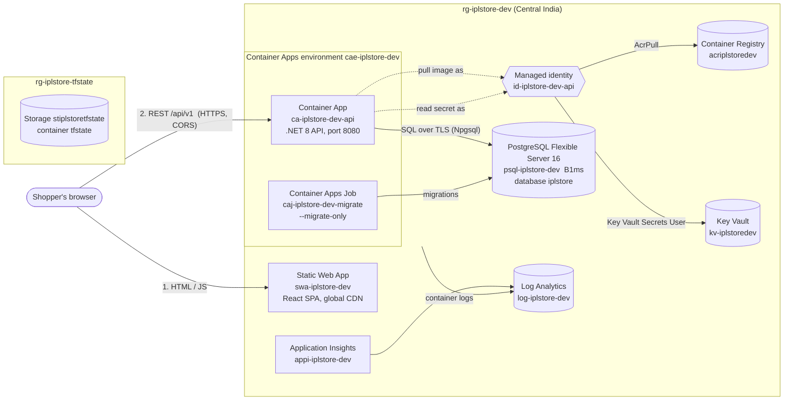

| Resource | Terraform | Why this service |
|---|---|---|
| Static Web App | [frontend.tf](../infra/terraform/frontend.tf) | Static files on a global CDN with free TLS; no server for a SPA. Free tier in dev, Standard in prod. |
| Container Apps environment | [compute.tf:23-36](../infra/terraform/compute.tf#L23-L36) | Serverless containers (Consumption profile), logs wired to Log Analytics. |
| Container App (API) | [compute.tf:50-149](../infra/terraform/compute.tf#L50-L149) | Revisions (deploy new, test, then switch), HTTP autoscaling, health probes. No cluster to run (vs AKS). |
| Container Apps Job (migrations) | [compute.tf:153-209](../infra/terraform/compute.tf#L153-L209) | Same image, runs once with `--migrate-only` before the new API revision gets traffic. |
| Container Registry | [compute.tf:8-21](../infra/terraform/compute.tf#L8-L21) | Private images, `admin_enabled = false`: pulled only by identity. |
| PostgreSQL Flexible Server | [database.tf](../infra/terraform/database.tf) | Same engine as local dev; triggers, trigram search and row locks the app relies on. |
| Key Vault | [secrets.tf](../infra/terraform/secrets.tf) | Holds the DB connection string; RBAC mode; apps read it by reference. |
| User-assigned managed identity | [main.tf:28-33](../infra/terraform/main.tf#L28-L33) | One identity for API and job: pulls images, reads secrets. No stored credentials. |
| Log Analytics + App Insights | [main.tf:36-54](../infra/terraform/main.tf#L36-L54) | Container logs today; App Insights provisioned for telemetry (see gaps). |
| Terraform state storage | [scripts/bootstrap-tfstate.ps1](../scripts/bootstrap-tfstate.ps1) | Created once, outside Terraform (Terraform can't create the place its own state lives). |

---

## 2. Who can do what (identities and roles)

Three kinds of principals touch Azure. None of them uses a stored Azure secret.

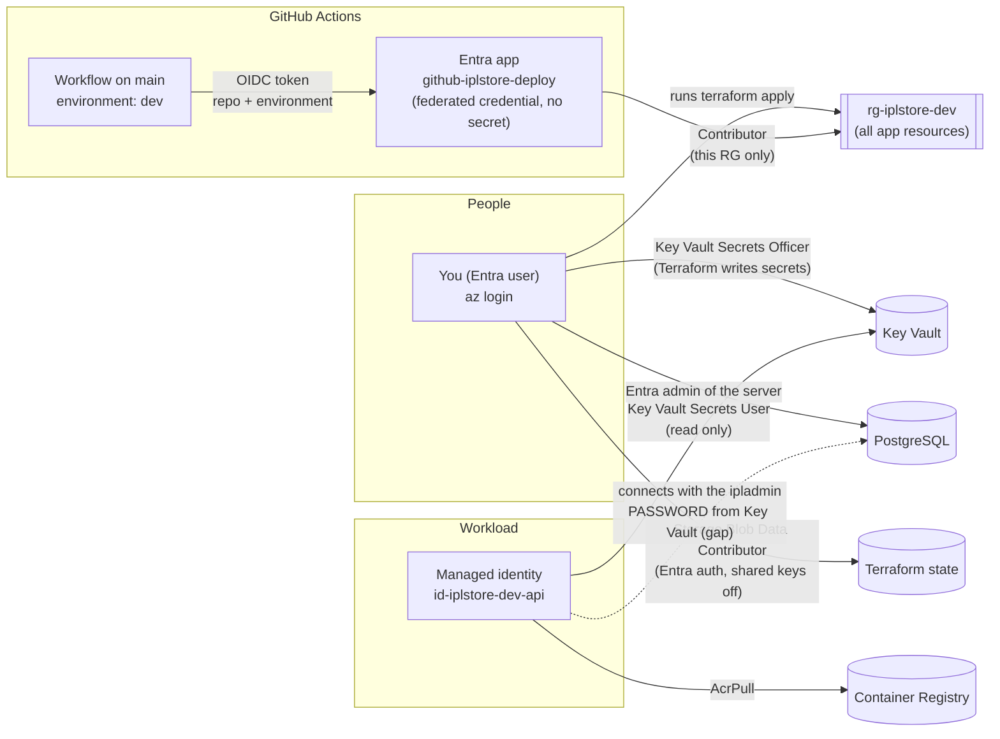

| Principal | Used by | Roles | Where defined |
|---|---|---|---|
| You (Entra user) | `terraform apply`, portal | Owner/Contributor on the subscription; Key Vault Secrets Officer; PostgreSQL Entra admin | [secrets.tf:17-21](../infra/terraform/secrets.tf#L17-L21), [database.tf:54-62](../infra/terraform/database.tf#L54-L62), `local.auto.tfvars` (git-ignored) |
| `github-iplstore-deploy` | CD workflow | Contributor on `rg-iplstore-dev` only | Created once in Entra; federated credentials for `repo:Abhishek-pers/IPL-Merchandise:environment:dev` |
| `id-iplstore-dev-api` | API container and migration job | AcrPull, Key Vault Secrets User | [compute.tf:17-21](../infra/terraform/compute.tf#L17-L21), [secrets.tf:24-28](../infra/terraform/secrets.tf#L24-L28) |

**How the pipeline signs in without a secret (OIDC):** GitHub issues a short-lived token that says "this is repo X, environment dev". Entra trusts that exact subject (the federated credential) and returns an Azure token for the app registration. The workflow only stores three **non-secret** IDs as repository variables: `AZURE_CLIENT_ID`, `AZURE_TENANT_ID`, `AZURE_SUBSCRIPTION_ID` ([cd.yml:53-58](../.github/workflows/cd.yml#L53-L58)).

---

## 3. How the infrastructure is created (Terraform)

Infrastructure and application are deployed by **different tools at different times**. Terraform owns the *shape* (resources, settings, secrets, identity, scaling); the pipeline owns the *image* that runs in it.

### 3.1 First-time creation, in order

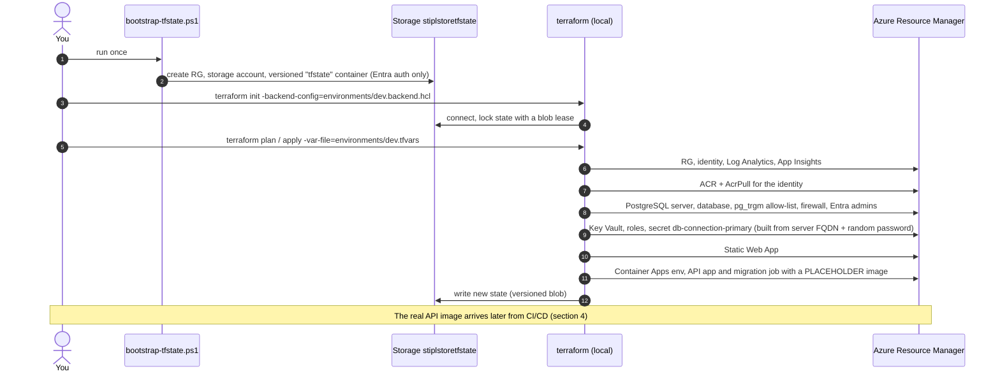

### 3.2 Resource dependency graph (what Terraform builds first)

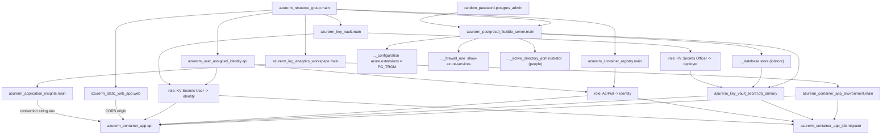

### 3.3 Terraform vs pipeline: who owns what

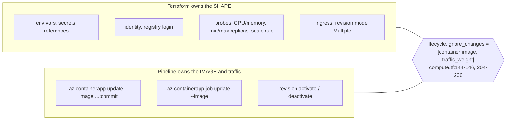

Without `ignore_changes`, the next `terraform apply` would put the placeholder image back and undo the last deployment.

**Configuration differences live only in tfvars** — the code is the same for every environment:

| Setting | [dev.tfvars](../infra/terraform/environments/dev.tfvars) | [prod.tfvars](../infra/terraform/environments/prod.tfvars) |
|---|---|---|
| PostgreSQL SKU / storage | B_Standard_B1ms / 32 GB | GP_Standard_D4ds_v5 / 128 GB |
| Zone-redundant HA standby | off | **on** (automatic failover) |
| Read replica | off | **on** (catalogue reads) |
| Backups | 7 days, local | 35 days, **geo-redundant** |
| API replicas | 1 – 1 | 2 – 20 |
| API CPU / memory | 0.5 / 1 GiB | 1 / 2 GiB |
| Key Vault purge protection, SWA tier, ACR tier | off, Free, Basic | on, Standard, Standard (computed in the .tf files) |
| `ASPNETCORE_ENVIRONMENT`, Swagger, demo seed | Staging, on, on | Production, off, off ([compute.tf:40-47](../infra/terraform/compute.tf#L40-L47)) |

---

## 4. How code reaches Azure (CI/CD)

### 4.1 Push to `main`, end to end

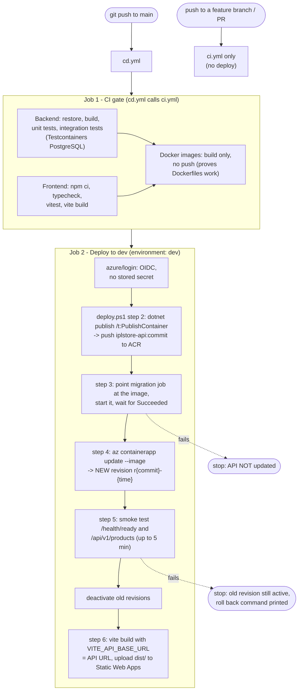

Code: [cd.yml](../.github/workflows/cd.yml), [ci.yml](../.github/workflows/ci.yml), [deploy.ps1](../scripts/deploy.ps1). The same script is used for manual deploys, so a laptop deploy and a pipeline deploy cannot drift apart. `concurrency: deploy-dev` stops two deployments overlapping.

### 4.2 The same deploy as a sequence (who talks to whom)

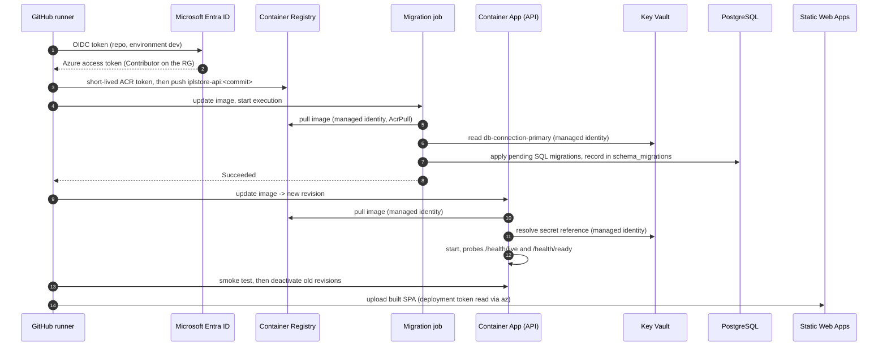

### 4.3 Why migrations run before the new revision

Migrations must be **additive** (expand/contract): add a column with a default, never rename or drop in the same release. Then the **old** revision still works on the **new** schema while the new revision starts, and a failed migration stops the deploy before any traffic moves.

---

## 5. What is picked up from where when the API starts

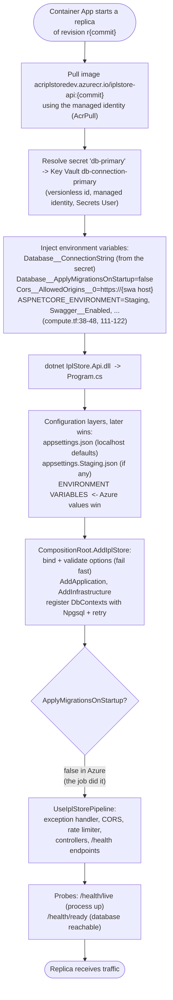

Key point: **the image is the same in every environment**. Everything environment-specific (database, CORS origin, Swagger, seed data) arrives as environment variables from Terraform, and secrets arrive through Key Vault references.

---

## 6. What happens when a request comes in

### 6.1 Page load and one API call

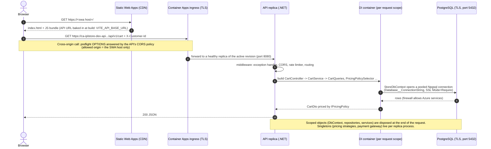

### 6.2 The same path as one picture (what is picked from where)

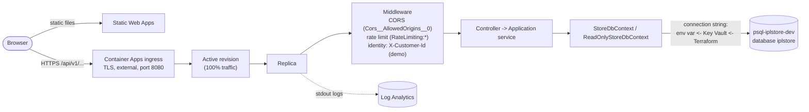

Note: the browser calls the API **directly** on its Container Apps URL, so CORS is required. A single domain with `/api` routed by Azure Front Door would remove CORS (see gaps).

---

## 7. Dev vs prod today

The prod tfvars and backend config exist, but **no prod environment has been created and no pipeline deploys to prod**. Everything that runs is dev.

| | Dev (live) | Prod (designed, not deployed) |
|---|---|---|
| Resource group / state file | `rg-iplstore-dev` / `iplstore-dev.tfstate` | `rg-iplstore-prod` / `iplstore-prod.tfstate` |
| Deployed by | `cd.yml` on every push to `main` | nothing yet |
| Terraform applied by | a person, locally | nothing yet |

---

## 8. Gaps to production

Grouped by area. **P1** = must fix before real customers, **P2** = should fix before go-live, **P3** = improve after.

### 8.1 Delivery (CI/CD)

| Gap | Today | Production target | How | Priority |
|---|---|---|---|---|
| Single environment | `main` deploys straight to dev | dev → staging → prod | `cd.yml` jobs per environment, each with its own GitHub environment and federated credential | P1 |
| No approval gate | every merge to `main` is live | manual approval before prod | GitHub environment **required reviewers** on `prod` | P1 |
| Build per environment | image built inside the deploy job | **build once, promote** the same image digest | Build + push in one job, pass the digest; prod deploy only re-tags/updates | P1 |
| No branch protection | direct pushes to `main` allowed | PR + green CI + review required | GitHub branch protection rules | P1 |
| Terraform applied by hand | `terraform apply` on a laptop | infra changes reviewed and applied by a pipeline | `terraform.yml`: `plan` on PR (posted as a comment), `apply` on merge with approval; separate identity per environment | P2 |
| No progressive rollout | old revision deactivated right after the smoke test | canary: 10% → watch metrics → 100% | `az containerapp ingress traffic set` with weights; keep the previous revision for instant rollback | P2 |
| Smoke test only | `/health/ready` + one product call | E2E tests against staging | Playwright suite in the staging job | P2 |
| Supply chain | no scanning | dependency, image and IaC scanning, SBOM | Dependabot, `dotnet list package --vulnerable`, `npm audit`, Trivy/Defender for container images, Checkov/tfsec, signed images | P2 |
| SPA token | SWA deployment token read with `az` at deploy time | same, or SWA GitHub integration | fine as is; rotate the token if leaked | P3 |

### 8.2 Security and identity

| Gap | Today | Production target | How | Priority |
|---|---|---|---|---|
| No real authentication | `X-Customer-Id` header picks the shopper | Entra External ID / Azure AD B2C sign-in, JWT on every call | `AddAuthentication().AddJwtBearer(...)`; replace `HeaderCurrentCustomerAccessor` with a claims-based accessor (already behind `ICurrentCustomerAccessor`) | P1 |
| Database password | API logs in as `ipladmin` with a password from Key Vault | passwordless, least privilege | Entra auth for `id-iplstore-dev-api`, a DML-only role, token via `UsePeriodicPasswordProvider`, password auth off (diagram in [14 §3](14-deployment-walkthrough.md)) | P1 |
| Admin used by the app | migrations and API share `ipladmin` | separate identities: migrator (DDL) vs API (DML) | second managed identity for the job | P1 |
| Public network | PostgreSQL public endpoint + "allow Azure services" (any Azure tenant) | private networking | VNet-integrated Container Apps environment, PostgreSQL private access / private endpoint, Key Vault and ACR private endpoints, public access off | P1 |
| No WAF / edge | API exposed directly | Azure Front Door Premium + WAF, single domain, `/api` routed to the API (no CORS) | Front Door with origin groups for SWA and Container Apps; restrict Container Apps ingress to Front Door | P1 |
| Custom domain and TLS | default `*.azurestaticapps.net` / `*.azurecontainerapps.io` | `store.<company>.com` with managed certificates | Front Door custom domain | P2 |
| Secret hygiene | connection string never expires | rotation, expiry and alerts | Key Vault expiry + Event Grid near-expiry event; becomes moot with passwordless DB | P2 |
| Broad deploy rights | deploy app is Contributor on the whole RG | least privilege per task | custom role or scoped roles (Container Apps contributor, AcrPush, SWA contributor) | P2 |
| Defender for Cloud | off | on for containers, Key Vault, databases, App Service | enable plans; fix recommendations | P2 |

### 8.3 Reliability and data

| Gap | Today (dev) | Production target | How | Priority |
|---|---|---|---|---|
| One replica | `min = max = 1` | `min 2` across zones | prod tfvars already say 2–20; use a **zone-redundant** Container Apps environment (needs VNet) | P1 |
| No HA database | single zone | zone-redundant HA standby | already in prod tfvars | P1 |
| Backups | 7 days, local | 35 days, geo-redundant, **restore tested** | already in prod tfvars; add a quarterly restore drill | P1 |
| In-memory payment state | `FakePaymentGateway` (per replica, lost on restart) | real provider + persisted payment attempts + webhooks | `IPaymentGateway` adapter for Razorpay/Stripe, `payments` table, signed webhook endpoint, outbox | P1 |
| Region failure | single region | documented DR: geo-restore or a warm secondary | geo-redundant backups + IaC to rebuild in Central/South India; RTO/RPO agreed | P2 |
| Expand/contract discipline | by convention | enforced | migration review checklist; CI test that applies migrations to the previous schema and runs the old API's tests | P3 |

### 8.4 Observability and operations

| Gap | Today | Production target | How | Priority |
|---|---|---|---|---|
| No telemetry | App Insights exists, `APPLICATIONINSIGHTS_CONNECTION_STRING` is set, but no SDK sends data | traces, metrics, dependencies, exceptions | add `Azure.Monitor.OpenTelemetry.AspNetCore` and `UseAzureMonitor()`; Npgsql tracing | P1 |
| No alerts | none | alerts on 5xx rate, p95 latency, failed migrations, DB CPU/storage/connections, replica restarts | Azure Monitor alert rules + action group, in Terraform | P1 |
| No dashboards / SLOs | none | availability and latency SLOs with error budgets | Workbook or Grafana; synthetic availability test | P2 |
| Cost control | none | budgets and alerts per RG | `azurerm_consumption_budget_resource_group` | P2 |
| Runbooks | [13](13-azure-deployment-runbook.md) covers deploy and teardown | incident runbooks (rollback, failover, restore, key rotation) | write and rehearse | P3 |

---

## 9. Target production architecture

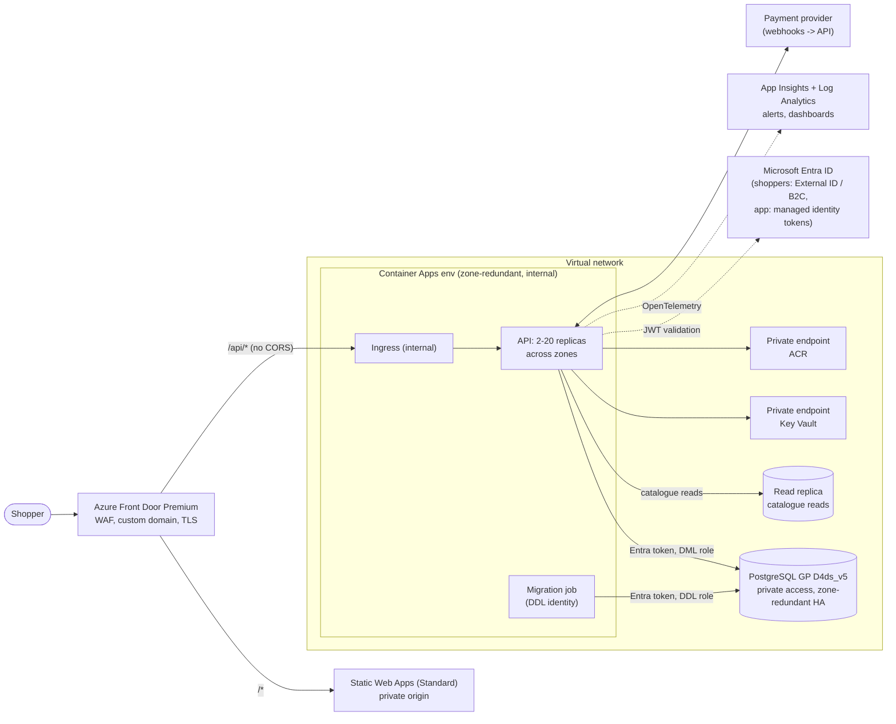

```mermaid
flowchart LR
    PR(["Pull request"]) --> CI["CI: build, unit + integration,<br/>scans, terraform plan comment"]
    CI --> MERGE(["Merge to main<br/>(protected)"])
    MERGE --> BUILD["Build ONCE<br/>push image by digest, SBOM, sign"]
    BUILD --> STG["Deploy staging<br/>migrate -> revision -> E2E tests"]
    STG --> APPROVE{{"Required reviewers<br/>(GitHub environment prod)"}}
    APPROVE --> PROD["Deploy prod: same digest<br/>migrate -> canary 10% -> metrics OK -> 100%"]
    PROD -. "alert / bad metrics" .-> RB(["Rollback: traffic back to<br/>previous revision"])
```

---

## 10. Short answers for the panel

> **"How is the infrastructure created?"** Terraform, one root module, one file per concern, remote state in an Azure Storage account with Entra-only access and blob-lease locking. Environment differences are only tfvars; the code is identical for dev and prod.

> **"What happens when you push to main?"** `cd.yml` runs the full CI as a gate, then signs in to Azure with OIDC (no secret), and runs the same `deploy.ps1` I use by hand: build and push the image to ACR tagged with the commit, run the migration job, roll out a new revision, smoke-test it, retire the old revision, then build and upload the SPA.

> **"When a request comes in, what is used from where?"** The browser gets the SPA from Static Web Apps and calls the API's Container Apps URL directly. Ingress sends it to a healthy replica of the active revision. That replica started from the commit-tagged image, pulled with the managed identity, and its connection string is an environment variable resolved from Key Vault by the same identity. DI builds the request's objects; `StoreDbContext` opens a pooled TLS connection to PostgreSQL.

> **"Is it production-ready?"** Not yet, and I can say exactly why: one environment with no approval gate, a demo identity header instead of real auth, a password-based admin database login, public network endpoints without a WAF, no telemetry or alerts, and an in-memory payment gateway. Prod tfvars already cover HA, replicas, backups and scale; the P1 list in section 8 is what I would do first.
