# 17. Request Data Path: From the Browser to PostgreSQL and Back

This document follows **one request at a time** from the click to the database and back, for **reads** and **writes**, and shows what happens only the **first time** versus on **every** request.

**How to read it:** every participant or box is a **real file** (or Azure / PostgreSQL where no file is involved). Every **number** in a diagram has a **row with the same number** in the table right under it, telling you the file, the method and what happens at that step.

Related: [18 which file does what](18-ui-to-database-layers.md) (each file's role, layer by layer), [16 Azure infrastructure and CI/CD](16-azure-cicd-infra-guide.md).

**Contents**

1. [The hops at a glance](#1-the-hops-at-a-glance)
2. [First-time setup](#2-first-time-setup)
3. [Read 1: search the catalogue](#3-read-1-search-the-catalogue)
4. [Read 2: view the cart](#4-read-2-view-the-cart)
5. [Write 1: add to cart](#5-write-1-add-to-cart)
6. [Write 2: place an order](#6-write-2-place-an-order)
7. [Write 3: pay and cancel](#7-write-3-pay-and-cancel)
8. [The way back to the browser](#8-the-way-back-to-the-browser)
9. [When something fails](#9-when-something-fails)
10. [First time vs every time](#10-first-time-vs-every-time)
11. [Short answers for the panel](#11-short-answers-for-the-panel)

---

## 1. The hops at a glance

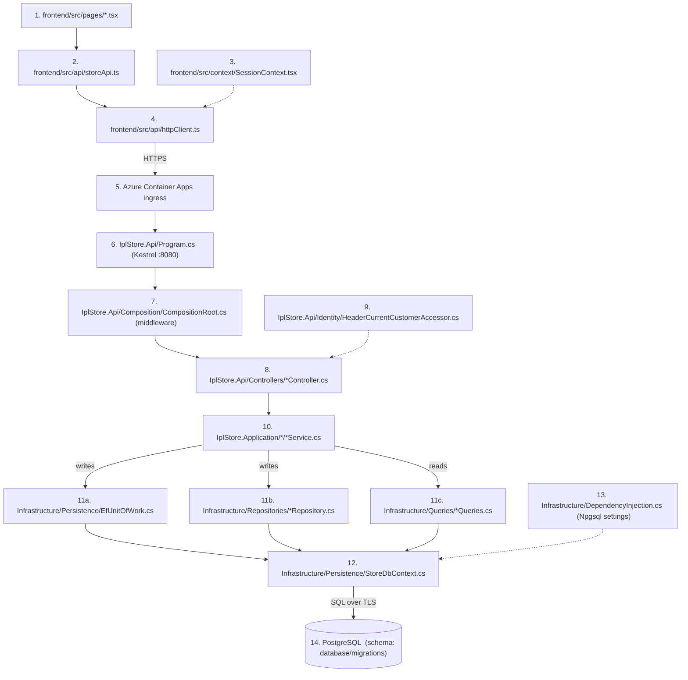

| # | File | What happens at this hop |
|---|---|---|
| 1 | [pages/*.tsx](../frontend/src/pages/) | the screen; a click or page load calls one `storeApi` function |
| 2 | [api/storeApi.ts](../frontend/src/api/storeApi.ts) | knows the URL and body for each endpoint |
| 3 | [context/SessionContext.tsx](../frontend/src/context/SessionContext.tsx) | provides the selected shopper's id |
| 4 | [api/httpClient.ts](../frontend/src/api/httpClient.ts#L84-L125) | the only `fetch`: adds `X-Customer-Id` (from 3), `Idempotency-Key`, retries safe requests |
| 5 | Azure ingress ([compute.tf:83-91](../infra/terraform/compute.tf#L83-L91)) | terminates TLS, forwards to a ready replica of the active revision |
| 6 | [Program.cs](../backend/src/IplStore.Api/Program.cs) | the running API process; Kestrel listens on port 8080 |
| 7 | [Composition/CompositionRoot.cs:52-76](../backend/src/IplStore.Api/Composition/CompositionRoot.cs#L52-L76) | middleware in order: exception handler → CORS → rate limiter → routing |
| 8 | [Controllers/](../backend/src/IplStore.Api/Controllers/) | binds input, builds a command, calls one service method |
| 9 | [Identity/HeaderCurrentCustomerAccessor.cs](../backend/src/IplStore.Api/Identity/HeaderCurrentCustomerAccessor.cs#L15-L31) | turns `X-Customer-Id` into a customer id (or 401) |
| 10 | [Application services](../backend/src/IplStore.Application/) | the use case: validation, rules, transaction boundary |
| 11a | [Persistence/EfUnitOfWork.cs](../backend/src/IplStore.Infrastructure/Persistence/EfUnitOfWork.cs#L29-L57) | writes only: retry → `BEGIN` → work → `SaveChanges` → `COMMIT` |
| 11b | [Repositories/](../backend/src/IplStore.Infrastructure/Repositories/) | writes: locks, atomic stock updates, adding orders |
| 11c | [Queries/](../backend/src/IplStore.Infrastructure/Queries/) | reads for screens |
| 12 | [Persistence/StoreDbContext.cs](../backend/src/IplStore.Infrastructure/Persistence/StoreDbContext.cs) | EF Core: turns LINQ and changes into SQL; `ReadOnlyStoreDbContext` (same file) for the catalogue |
| 13 | [Infrastructure/DependencyInjection.cs:67-98](../backend/src/IplStore.Infrastructure/DependencyInjection.cs#L67-L98) | connection string, retry on transient errors, timeout, pool (max 50 per replica) |
| 14 | PostgreSQL ([database/migrations/](../database/migrations/)) | tables, constraints, triggers |

---

## 2. First-time setup

"First time" happens at four levels; after each, the work is cached or reused.

| Level | Happens once per | What is paid once | Section |
|---|---|---|---|
| A | environment (and each deploy) | the migration job builds or upgrades the schema | 2.1 |
| B | replica (container) | start the process, register services, first database connection | 2.2 |
| C | process, per query shape | EF Core builds its model; each LINQ query is compiled | 2.2 |
| D | customer | the first cart change creates the customer's cart row | 5, step 9 |

### 2.1 Level A: the migration job builds the schema

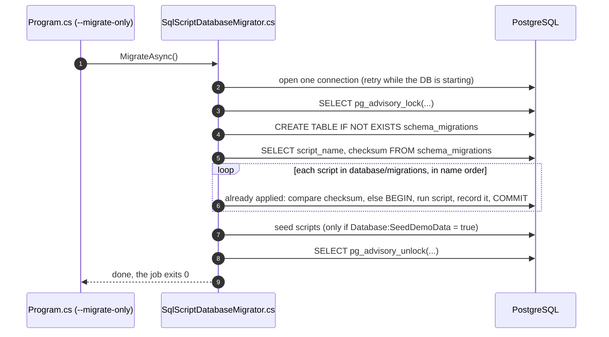

| # | File | Method | What happens |
|---|---|---|---|
| 1 | [Program.cs:20-29](../backend/src/IplStore.Api/Program.cs#L20-L29) | `MigrateDatabaseAsync` | the job starts the API image with `--migrate-only` |
| 2 | [SqlScriptDatabaseMigrator.cs](../backend/src/IplStore.Infrastructure/Persistence/Migrations/SqlScriptDatabaseMigrator.cs) | `MigrateAsync` | its own `NpgsqlConnection`; retries if PostgreSQL is not up yet |
| 3 | same | `MigrateOnceAsync` | advisory lock: if two migrators start, one waits |
| 4 | same | `CreateHistoryTableSql` | the history table (first time only it is actually created) |
| 5 | same | `LoadAppliedAsync` | which scripts already ran, with their checksums |
| 6 | same + [V001–V004](../database/migrations/) | loop | **first deploy:** runs V001→V004, each in its own transaction. **Later deploys:** only new scripts; an edited old script fails the deploy |
| 7 | [seed/S001__demo_catalog.sql](../database/seed/S001__demo_catalog.sql) | seed | demo customers and products; `ON CONFLICT DO NOTHING`, safe every time |
| 8 | migrator | unlock | releases the lock |
| 9 | Program.cs | return | process exits; the pipeline continues to roll out the API |

### 2.2 Level B and C: a replica starts and serves its first request

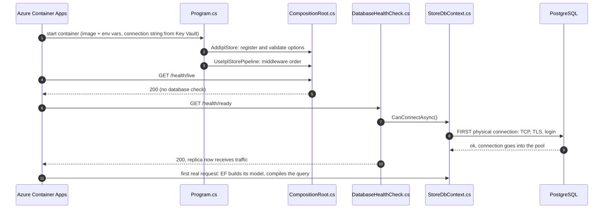

| # | File | What happens |
|---|---|---|
| 1 | Azure ([compute.tf:93-142](../infra/terraform/compute.tf#L93-L142)) | pulls the image with the managed identity, sets env vars, resolves the Key Vault secret |
| 2 | [CompositionRoot.cs:30-50](../backend/src/IplStore.Api/Composition/CompositionRoot.cs#L30-L50) | registers every class; options are validated at start-up (bad config = fails fast) |
| 3 | [CompositionRoot.cs:52-76](../backend/src/IplStore.Api/Composition/CompositionRoot.cs#L52-L76) | builds the middleware pipeline. Migrations are **skipped** in Azure (`ApplyMigrationsOnStartup = false`): the job did them |
| 4–5 | CompositionRoot.cs | liveness: the process answers; no database involved |
| 6–7 | [DatabaseHealthCheck.cs](../backend/src/IplStore.Api/Health/DatabaseHealthCheck.cs) | readiness asks EF whether it can connect |
| 8–9 | StoreDbContext.cs + [DependencyInjection.cs:67-98](../backend/src/IplStore.Infrastructure/DependencyInjection.cs#L67-L98) | the **first** TCP + TLS + login to PostgreSQL; the connection is kept in Npgsql's pool |
| 10 | — | ready; ingress starts sending requests |
| 11 | StoreDbContext.cs | **first request only:** EF builds its model (once per context type) and compiles the query (once per query shape). Later requests reuse both and a pooled connection |

---

## 3. Read 1: search the catalogue

The product list loads or the shopper types in the search box.

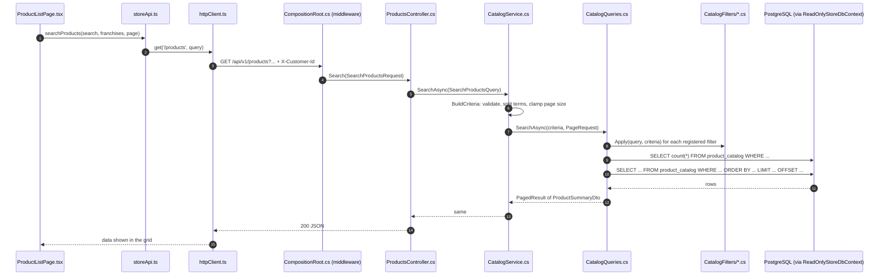

| # | File | Method | What happens |
|---|---|---|---|
| 1 | [ProductListPage.tsx:30](../frontend/src/pages/ProductListPage.tsx#L30) | load | asks for one page of products |
| 2 | [storeApi.ts](../frontend/src/api/storeApi.ts) | `searchProducts` | builds `/products` with the query |
| 3 | [httpClient.ts](../frontend/src/api/httpClient.ts) | `get` | adds headers; GET can be retried |
| 4 | [CompositionRoot.cs](../backend/src/IplStore.Api/Composition/CompositionRoot.cs#L52-L76) | middleware | CORS, rate limit, routes to the controller |
| 5 | [ProductsController.cs](../backend/src/IplStore.Api/Controllers/ProductsController.cs) | `Search` | binds the query string, calls the service |
| 6 | [CatalogService.cs:58-98](../backend/src/IplStore.Application/Catalog/CatalogService.cs#L58-L98) | `BuildCriteria` | trims, splits terms, upper-cases codes, checks limits (400 if invalid) |
| 7 | [CatalogQueries.cs:26-59](../backend/src/IplStore.Infrastructure/Queries/CatalogQueries.cs#L26-L59) | `SearchAsync` | starts from active rows of `product_catalog` |
| 8 | [CatalogFilters/](../backend/src/IplStore.Infrastructure/Queries/CatalogFilters/) | `Apply` | search text, franchise, category, in-stock filters added to the query |
| 9 | PostgreSQL | count | total rows for the pager |
| 10 | PostgreSQL | page | one page, sorted by [CatalogSorting.cs](../backend/src/IplStore.Infrastructure/Queries/CatalogSorting.cs); text search uses the trigram index |
| 11–15 | back up the chain | — | DTOs → JSON → the grid |

**Connection:** `ReadOnlyStoreDbContext` → read replica if configured, otherwise the primary (today). No transaction, no change tracking, no joins.

---

## 4. Read 2: view the cart

The cart page or the header badge loads the cart.

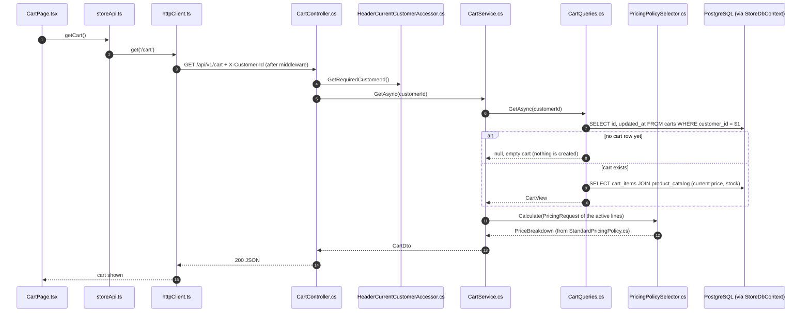

| # | File | Method | What happens |
|---|---|---|---|
| 1 | [CartPage.tsx:13](../frontend/src/pages/CartPage.tsx#L13) (also [SessionContext.tsx:31](../frontend/src/context/SessionContext.tsx#L31) for the badge) | load | asks for the cart |
| 2–3 | storeApi.ts → httpClient.ts | `getCart` → `get` | `GET /cart` with the shopper header |
| 4 | [HeaderCurrentCustomerAccessor.cs](../backend/src/IplStore.Api/Identity/HeaderCurrentCustomerAccessor.cs) | `GetRequiredCustomerId` | 401 if the header is missing or not a GUID |
| 5 | [CartService.cs](../backend/src/IplStore.Application/Carts/CartService.cs) | `GetAsync` | read use case: no transaction |
| 6–7 | [CartQueries.cs](../backend/src/IplStore.Infrastructure/Queries/CartQueries.cs) | `GetAsync` | finds the customer's cart on the **primary** (read-your-writes) |
| 8 | CartQueries.cs | — | no cart yet: returns null, the service returns an empty cart. Reading never creates a row |
| 9–10 | CartQueries.cs | — | lines joined with **current** catalogue price and stock |
| 11–12 | [PricingPolicySelector.cs](../backend/src/IplStore.Application/Pricing/PricingPolicySelector.cs) → [StandardPricingPolicy.cs](../backend/src/IplStore.Application/Pricing/StandardPricingPolicy.cs) | `Calculate` | subtotal, GST, shipping (the same pricing checkout will use) |
| 13–15 | back up the chain | — | `CartDto` → JSON → cart page |

---

## 5. Write 1: add to cart

The shopper clicks **Add to cart** on a product page.

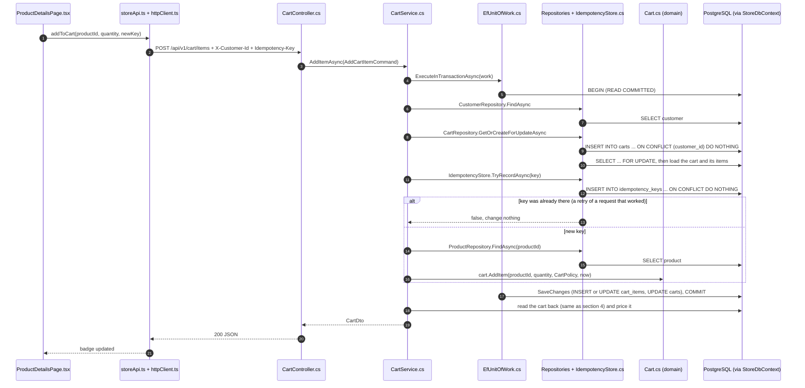

| # | File | Method | What happens |
|---|---|---|---|
| 1 | [ProductDetailsPage.tsx:31](../frontend/src/pages/ProductDetailsPage.tsx#L31) → [storeApi.ts](../frontend/src/api/storeApi.ts) | `addToCart` | a new idempotency key per click |
| 2 | [httpClient.ts](../frontend/src/api/httpClient.ts) | `post` | POST **with a key**, so it is safe to retry |
| 3 | [CartController.cs:34-44](../backend/src/IplStore.Api/Controllers/CartController.cs#L34-L44) | `AddItem` | body + header → `AddCartItemCommand` |
| 4 | [CartService.cs:64-107](../backend/src/IplStore.Application/Carts/CartService.cs#L64-L107) | `AddItemAsync` | quantity must be > 0; everything below runs in one transaction |
| 5 | [EfUnitOfWork.cs:29-57](../backend/src/IplStore.Infrastructure/Persistence/EfUnitOfWork.cs#L29-L57) | `ExecuteInTransactionAsync` | starts the retry strategy and the transaction |
| 6–7 | [CustomerRepository.cs](../backend/src/IplStore.Infrastructure/Repositories/CustomerRepository.cs) | `FindAsync` | unknown customer → 404 |
| 8–10 | [CartRepository.cs:29-55](../backend/src/IplStore.Infrastructure/Repositories/CartRepository.cs#L29-L55) | `GetOrCreateForUpdateAsync` | **first time for this customer:** the INSERT creates the cart row. **Every time:** the row is locked, so this customer's requests run one at a time |
| 11–12 | [IdempotencyStore.cs](../backend/src/IplStore.Infrastructure/Persistence/IdempotencyStore.cs) | `TryRecordAsync` | records the key in the same transaction as the change |
| 13 | IdempotencyStore.cs | — | key already there: a retry of a request that succeeded, nothing changes |
| 14–15 | [ProductRepository.cs](../backend/src/IplStore.Infrastructure/Repositories/ProductRepository.cs) | `FindAsync` | missing or inactive product → 404 |
| 16 | [Cart.cs:50-77](../backend/src/IplStore.Domain/Carts/Cart.cs#L50-L77) | `AddItem` | merges with an existing line, enforces limits (422); then `Product.CanFulfil` checks stock (422) |
| 17 | EfUnitOfWork.cs | `SaveChanges`, `Commit` | EF writes the changes; key and change commit together |
| 18 | [CartQueries.cs](../backend/src/IplStore.Infrastructure/Queries/CartQueries.cs) + pricing | `GetAsync` | the refreshed cart, as in section 4 |
| 19–21 | back up the chain | — | `CartDto` → JSON → [SessionContext.tsx](../frontend/src/context/SessionContext.tsx) `updateCart` updates the badge |

`PUT /cart/items/{id}` (+/−) and `DELETE` follow steps 3–10 and 16–21 without a key: setting a quantity twice gives the same result.

---

## 6. Write 2: place an order

The shopper clicks **Place order** on the cart page.

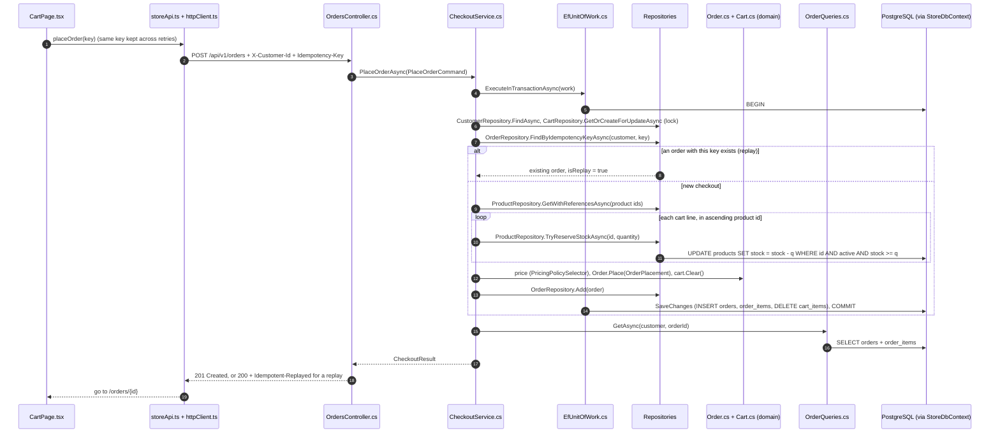

| # | File | Method | What happens |
|---|---|---|---|
| 1 | [CartPage.tsx:39-53](../frontend/src/pages/CartPage.tsx#L39-L53) | `checkout` | key = existing key or `crypto.randomUUID()`; kept until success |
| 2 | storeApi.ts → httpClient.ts | `placeOrder` → `post` | POST with the key, retried on network errors / 5xx |
| 3 | [OrdersController.cs:42-62](../backend/src/IplStore.Api/Controllers/OrdersController.cs#L42-L62) | `PlaceOrder` | header key → `PlaceOrderCommand` |
| 4–5 | [CheckoutService.cs:72-96](../backend/src/IplStore.Application/Orders/CheckoutService.cs#L72-L96) → EfUnitOfWork.cs | `PlaceOrderAsync` | key required (400 if missing); one transaction |
| 6 | CustomerRepository.cs, [CartRepository.cs](../backend/src/IplStore.Infrastructure/Repositories/CartRepository.cs) | — | customer exists; **lock the cart row** (same SQL as section 5, steps 8–10) |
| 7 | [OrderRepository.cs](../backend/src/IplStore.Infrastructure/Repositories/OrderRepository.cs) | `FindByIdempotencyKeyAsync` | checked **after** the lock, so a concurrent duplicate sees the first one's order |
| 8 | OrderRepository.cs | — | replay: return the original order, change nothing |
| 9 | [ProductRepository.cs](../backend/src/IplStore.Infrastructure/Repositories/ProductRepository.cs) | `GetWithReferencesAsync` | products with franchise and category, for the order snapshot (empty cart → 422) |
| 10–11 | ProductRepository.cs | `TryReserveStockAsync` | one statement checks and decrements; 0 rows = not enough stock → 422 and **everything** rolls back. The V002 trigger refreshes `product_catalog` in this same transaction |
| 12 | [PricingPolicySelector.cs](../backend/src/IplStore.Application/Pricing/PricingPolicySelector.cs), [OrderNumberGenerator.cs](../backend/src/IplStore.Infrastructure/Orders/OrderNumberGenerator.cs), [Order.cs](../backend/src/IplStore.Domain/Orders/Order.cs), [Cart.cs](../backend/src/IplStore.Domain/Carts/Cart.cs) | `Calculate`, `Next`, `Place`, `Clear` | price, order number, order built with its rules checked, cart emptied |
| 13 | OrderRepository.cs | `Add` | order handed to EF |
| 14 | EfUnitOfWork.cs | `SaveChanges`, `Commit` | the database also checks: unique key per customer, `total = subtotal + tax + shipping`, stock ≥ 0 |
| 15–16 | [OrderQueries.cs](../backend/src/IplStore.Infrastructure/Queries/OrderQueries.cs) | `GetAsync` | reads the committed order → `OrderDetailsDto.From(order)` |
| 17–19 | back up the chain | — | 201 + `Location` (new) or 200 + `Idempotent-Replayed` (repeat); the page opens the order |

---

## 7. Write 3: pay and cancel

### 7.1 Pay (or simulate a failed payment)

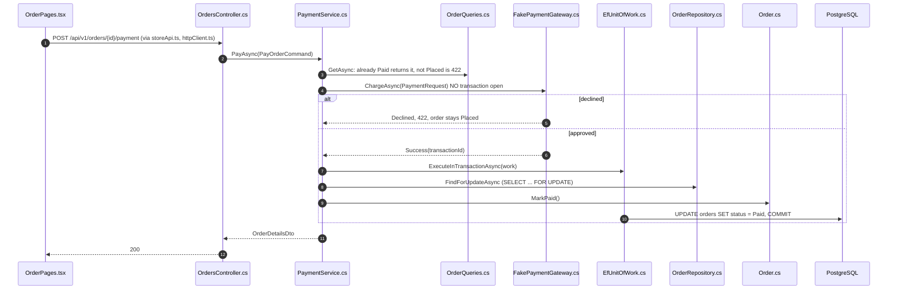

| # | File | What happens |
|---|---|---|
| 1 | [OrderPages.tsx:134-138](../frontend/src/pages/OrderPages.tsx#L134-L138) | Pay / Simulate failure buttons |
| 2 | [PaymentService.cs:53-102](../backend/src/IplStore.Application/Orders/PaymentService.cs#L53-L102) | `PayAsync` |
| 3 | [OrderQueries.cs](../backend/src/IplStore.Infrastructure/Queries/OrderQueries.cs) | current state; paying a paid order is a no-op (no second charge) |
| 4 | [FakePaymentGateway.cs](../backend/src/IplStore.Infrastructure/Payments/FakePaymentGateway.cs) | called **outside** any transaction, so no database lock is held while waiting |
| 5 | FakePaymentGateway.cs | declined: 422, the order stays Placed (retry or cancel) |
| 6–10 | EfUnitOfWork.cs, [OrderRepository.cs](../backend/src/IplStore.Infrastructure/Repositories/OrderRepository.cs), [Order.cs](../backend/src/IplStore.Domain/Orders/Order.cs) | lock the order row, Placed → Paid, commit |
| 11–12 | back up the chain | the updated order |

### 7.2 Cancel

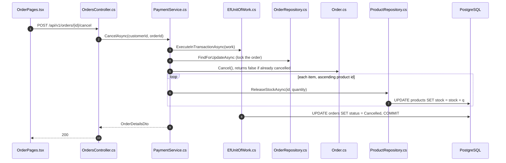

| # | File | What happens |
|---|---|---|
| 1 | [OrderPages.tsx:145](../frontend/src/pages/OrderPages.tsx#L145) | Cancel button |
| 2 | [PaymentService.cs:104-127](../backend/src/IplStore.Application/Orders/PaymentService.cs#L104-L127) | `CancelAsync` |
| 3–4 | EfUnitOfWork.cs, OrderRepository.cs | transaction, order row locked |
| 5 | [Order.cs](../backend/src/IplStore.Domain/Orders/Order.cs) | only Placed can be cancelled; cancelling twice does nothing the second time |
| 6–7 | [ProductRepository.cs](../backend/src/IplStore.Infrastructure/Repositories/ProductRepository.cs) | stock goes back (trigger refreshes the catalogue) |
| 8 | EfUnitOfWork.cs | commit |
| 9–10 | back up the chain | the cancelled order |

---

## 8. The way back to the browser

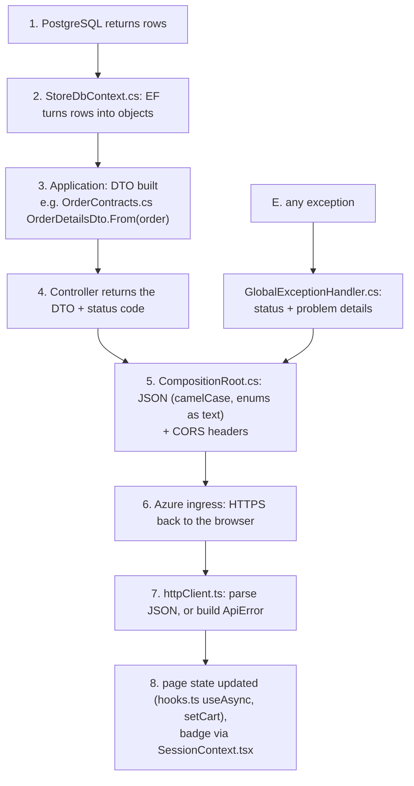

| # | File | What happens |
|---|---|---|
| 1–2 | [StoreDbContext.cs](../backend/src/IplStore.Infrastructure/Persistence/StoreDbContext.cs) | rows become entities or DTOs (the order list is projected **in SQL**) |
| 3 | [OrderContracts.cs](../backend/src/IplStore.Application/Orders/OrderContracts.cs), [CartContracts.cs](../backend/src/IplStore.Application/Carts/CartContracts.cs) | the response shape; entities never leave the server |
| 4 | [Controllers/](../backend/src/IplStore.Api/Controllers/) | 200, 201 + `Location`, or 200 + `Idempotent-Replayed` |
| 5 | [CompositionRoot.cs:64-68, 98-99](../backend/src/IplStore.Api/Composition/CompositionRoot.cs#L64-L99) | JSON settings; CORS allows only the Static Web Apps origin and exposes `Location`, `Idempotent-Replayed` |
| 6 | Azure ingress | HTTPS |
| 7 | [httpClient.ts:111-123, 137](../frontend/src/api/httpClient.ts#L111-L137) | success → data; error → `ApiError(status, message, code, field errors)` |
| 8 | pages, [hooks.ts](../frontend/src/hooks.ts), [SessionContext.tsx](../frontend/src/context/SessionContext.tsx) | screen updates; errors shown by `ErrorBanner` |
| E | [GlobalExceptionHandler.cs:47-63](../backend/src/IplStore.Api/ErrorHandling/GlobalExceptionHandler.cs#L47-L63) | exception → status (table below) |

| Exception | Status | Example |
|---|---|---|
| `RequestValidationException` | 400 | quantity ≤ 0, bad search input, missing checkout key |
| `MissingCustomerIdentityException` | 401 | no / invalid `X-Customer-Id` |
| `EntityNotFoundException` | 404 | unknown product, someone else's order |
| `ConcurrencyConflictException` | 409 | a unique violation that got past the checks |
| `DomainException` | 422 | not enough stock, cart limit, payment declined |
| (rate limiter) | 429 | more than 100 requests in 10 s per customer |
| anything else | 500 | logged with a trace id |

---

## 9. When something fails

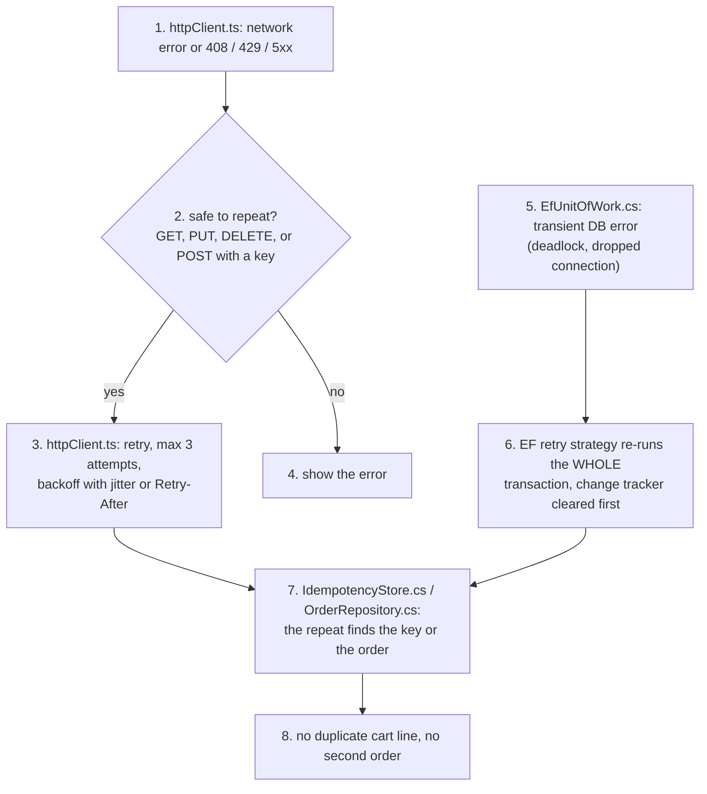

| # | File | What happens |
|---|---|---|
| 1–4 | [httpClient.ts:92-121](../frontend/src/api/httpClient.ts#L92-L121), [config.ts](../frontend/src/config.ts) | browser-side retry, only for requests that cannot cause a duplicate |
| 5–6 | [EfUnitOfWork.cs:35-56](../backend/src/IplStore.Infrastructure/Persistence/EfUnitOfWork.cs#L35-L56), [DependencyInjection.cs:81-86](../backend/src/IplStore.Infrastructure/DependencyInjection.cs#L81-L86) | server-side retry of the whole transaction |
| 7 | [IdempotencyStore.cs](../backend/src/IplStore.Infrastructure/Persistence/IdempotencyStore.cs), [OrderRepository.cs](../backend/src/IplStore.Infrastructure/Repositories/OrderRepository.cs) | a repeat finds what the first attempt committed |
| 8 | — | if the connection drops **during** `COMMIT`, nobody knows whether it committed; both retries are still safe because of step 7 |

---

## 10. First time vs every time

| What | First time | Every time after |
|---|---|---|
| Database schema | migration job runs V001–V004 (section 2.1) | checks checksums, usually runs nothing |
| Demo data (dev) | seed inserts customers and products | seed runs again, inserts nothing |
| Container start | pull image, resolve the Key Vault secret, register services | same for each new replica or revision |
| Database connection | first TCP + TLS + login at the readiness check | taken from the pool (up to 50 per replica) |
| EF Core model | built on first use | cached for the life of the process |
| Each query | compiled on first use | cached |
| CORS | the browser sends an `OPTIONS` preflight (custom headers) | may repeat often: no `Access-Control-Max-Age` is set |
| Customer's cart row | first cart change inserts it (section 5, step 9) | `ON CONFLICT DO NOTHING`, then lock |
| Add-to-cart key | stored, change applied | found, change skipped |
| Checkout key | order created, 201 | original order returned, 200 + `Idempotent-Replayed` |

---

## 11. Short answers for the panel

> **"Walk me through a read."** `ProductListPage.tsx` calls `storeApi.searchProducts`; `httpClient.ts` adds the shopper header. In the API, `CompositionRoot.cs` middleware checks CORS and the rate limit, `ProductsController` calls `CatalogService.SearchAsync`, which validates input, and `CatalogQueries` applies each filter and runs one indexed `SELECT` on `product_catalog` through the read-only context. No transaction, no joins.

> **"Walk me through a write."** Same front half to `CartController`, then `CartService` opens a transaction through `EfUnitOfWork`. `CartRepository` creates-if-missing and locks the customer's cart row, `IdempotencyStore` records the key, `Cart.AddItem` applies the rules, and `EfUnitOfWork` saves and commits. For checkout, `ProductRepository` reserves stock with one conditional `UPDATE` per line, `Order.Place` checks the order, and triggers refresh the catalogue in the same transaction.

> **"What happens only the first time?"** Per environment the migration job builds the schema under an advisory lock; per replica the first database connection is opened by the readiness check; per process EF builds its model and compiles each query; per customer the first cart change creates the cart row. Everything after that is pooled or cached.
