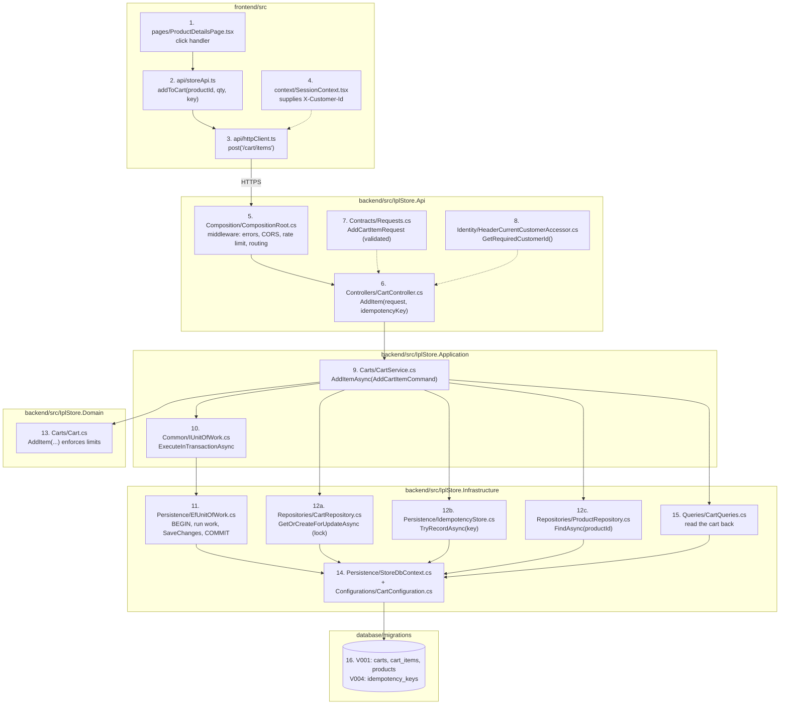
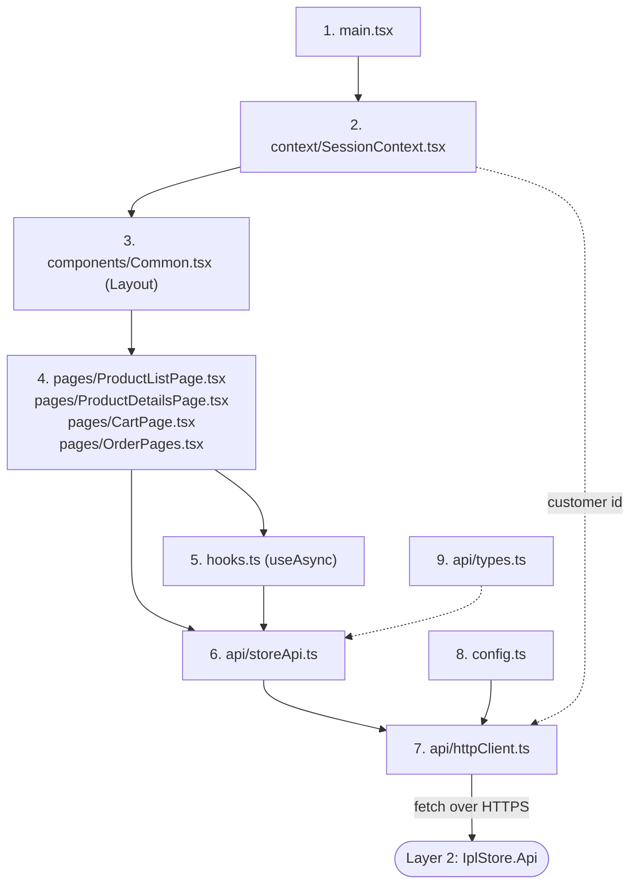
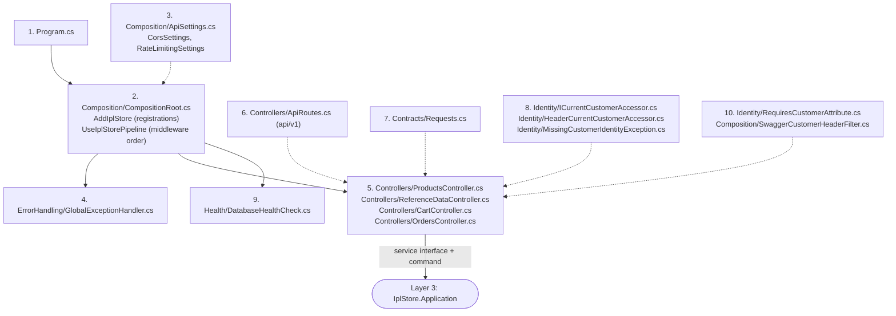
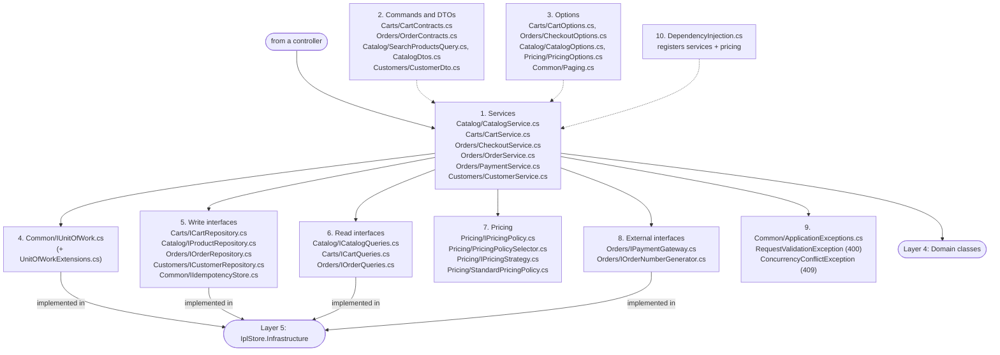
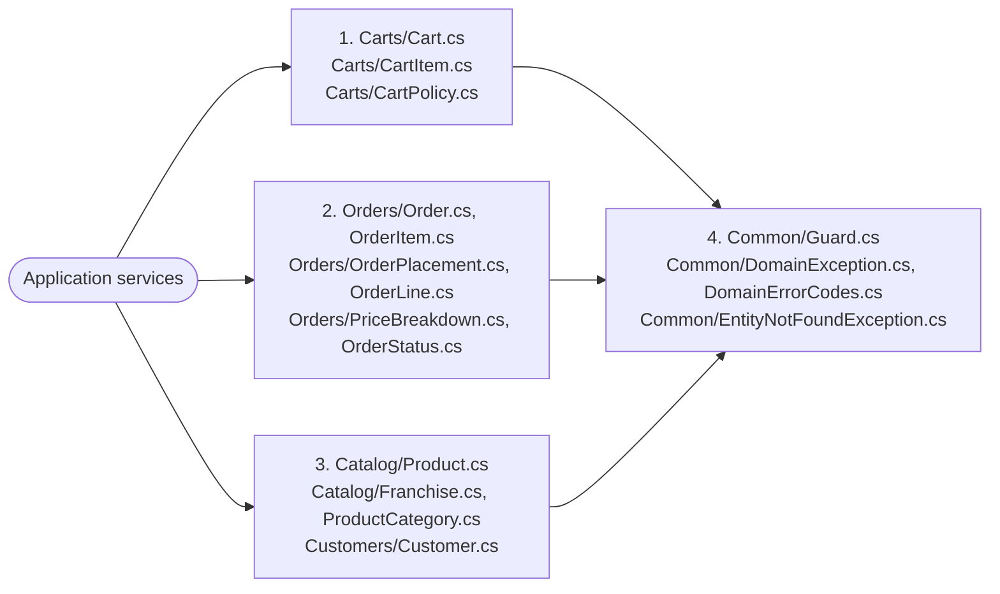
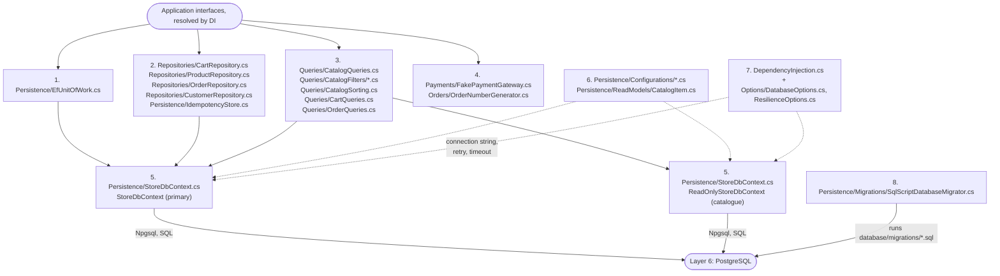
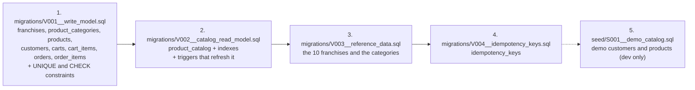

# 18. From the Screen to the Database: Which File Does What

**How to read this document:** every box in every diagram is a **real file** in the repository, and every **number** in a diagram matches a **row** in the table under it. Each row says what the file is for, who calls it, and what it calls next.

Related: [17 request data path](17-request-data-path.md) (the same calls as timed sequences with SQL), [12 design guide](12-design-guide.md) (class diagrams and patterns).

**Contents**

1. [The repository in one picture](#1-the-repository-in-one-picture)
2. [One click traced through every file: "Add to cart"](#2-one-click-traced-through-every-file-add-to-cart)
3. [Layer 1: UI (`frontend/src`)](#3-layer-1-ui-frontendsrc)
4. [Layer 2: HTTP (`backend/src/IplStore.Api`)](#4-layer-2-http-backendsrciplstoreapi)
5. [Layer 3: Application (`backend/src/IplStore.Application`)](#5-layer-3-application-backendsrciplstoreapplication)
6. [Layer 4: Domain (`backend/src/IplStore.Domain`)](#6-layer-4-domain-backendsrciplstoredomain)
7. [Layer 5: Infrastructure (`backend/src/IplStore.Infrastructure`)](#7-layer-5-infrastructure-backendsrciplstoreinfrastructure)
8. [Layer 6: Database (`database/`)](#8-layer-6-database-database)
9. [Every screen → every file it reaches](#9-every-screen--every-file-it-reaches)
10. [Short answers for the panel](#10-short-answers-for-the-panel)

---

## 1. The repository in one picture

```
frontend/src/                         LAYER 1  UI: what the shopper sees, and the HTTP calls it makes
├── main.tsx                          starts React, defines the URL routes
├── pages/*.tsx                       one file per screen (product list, product, cart, orders)
├── components/Common.tsx             header + navigation (Layout), shared pieces (Money, PriceTable, ErrorBanner)
├── context/SessionContext.tsx        which shopper is selected, cart badge count
├── hooks.ts                          useAsync: load data for a page, money formatting
├── api/storeApi.ts                   one function per backend endpoint
├── api/httpClient.ts                 the only place that calls fetch(): headers, retries, errors
├── api/types.ts                      TypeScript shapes of the API's JSON
└── config.ts                         API base URL and retry settings

backend/src/IplStore.Api/             LAYER 2  HTTP: turns HTTP into a use-case call and back
├── Program.cs                        process entry point
├── Composition/CompositionRoot.cs    registers everything + defines the middleware order
├── Controllers/*Controller.cs        one class per resource; each action calls ONE service method
├── Contracts/Requests.cs             shapes of request bodies / query strings (+ validation attributes)
├── Identity/*                        who is calling (X-Customer-Id today)
├── ErrorHandling/GlobalExceptionHandler.cs   exception -> HTTP status + problem details
└── Health/DatabaseHealthCheck.cs     /health/ready

backend/src/IplStore.Application/     LAYER 3  Application: the use cases
├── <Feature>/<Feature>Service.cs     the use case (CartService, CheckoutService, ...)
├── <Feature>/*Contracts.cs, *Dtos.cs commands in, DTOs out
├── <Feature>/I*Repository.cs, I*Queries.cs   interfaces the use case needs (implemented in Infrastructure)
├── Common/IUnitOfWork.cs             "run this in one transaction"
└── Pricing/*                         how a basket becomes money

backend/src/IplStore.Domain/          LAYER 4  Domain: business rules, no dependencies
├── Carts/Cart.cs, Orders/Order.cs    aggregates that enforce the rules
└── Common/DomainException.cs         "a business rule was broken"

backend/src/IplStore.Infrastructure/  LAYER 5  Infrastructure: how the interfaces are fulfilled
├── Persistence/EfUnitOfWork.cs       transaction + retry
├── Repositories/*Repository.cs       writes (and the SQL for locks / atomic updates)
├── Queries/*Queries.cs               reads for screens
├── Persistence/StoreDbContext.cs     EF Core: classes <-> tables, connection
└── DependencyInjection.cs            which class implements which interface, connection string

database/                             LAYER 6  Database: tables, constraints, triggers
├── migrations/V001..V004*.sql        the schema + franchises and categories
└── seed/S001__demo_catalog.sql       demo customers and products
```

---

## 2. One click traced through every file: "Add to cart"

The shopper is on a product page and clicks **Add to cart**. Follow the numbers.



| # | File | Method / part | What happens here |
|---|---|---|---|
| 1 | [pages/ProductDetailsPage.tsx](../frontend/src/pages/ProductDetailsPage.tsx#L31) | add-to-cart handler | creates an idempotency key, calls the API module |
| 2 | [api/storeApi.ts](../frontend/src/api/storeApi.ts) | `addToCart` | knows the URL `/cart/items` and the body shape |
| 3 | [api/httpClient.ts](../frontend/src/api/httpClient.ts#L84-L125) | `send` | adds headers, calls `fetch`, retries safely, turns errors into `ApiError` |
| 4 | [context/SessionContext.tsx](../frontend/src/context/SessionContext.tsx) | stored customer id | the selected shopper becomes the `X-Customer-Id` header |
| 5 | [Composition/CompositionRoot.cs](../backend/src/IplStore.Api/Composition/CompositionRoot.cs#L52-L76) | `UseIplStorePipeline` | exception handler → CORS → rate limiter → routes to the controller |
| 6 | [Controllers/CartController.cs](../backend/src/IplStore.Api/Controllers/CartController.cs#L34-L44) | `AddItem` | builds `AddCartItemCommand`, calls the service, returns its result |
| 7 | [Contracts/Requests.cs](../backend/src/IplStore.Api/Contracts/Requests.cs) | `AddCartItemRequest` | JSON body shape; `[Range]` / `[Required]` → automatic 400 |
| 8 | [Identity/HeaderCurrentCustomerAccessor.cs](../backend/src/IplStore.Api/Identity/HeaderCurrentCustomerAccessor.cs#L15-L31) | `GetRequiredCustomerId` | reads `X-Customer-Id`; missing or invalid → 401 |
| 9 | [Carts/CartService.cs](../backend/src/IplStore.Application/Carts/CartService.cs#L64-L107) | `AddItemAsync` | the use case: validate, then run the steps below in one transaction |
| 10 | [Common/IUnitOfWork.cs](../backend/src/IplStore.Application/Common/IUnitOfWork.cs) | `ExecuteInTransactionAsync` | interface: "run this work in one transaction" |
| 11 | [Persistence/EfUnitOfWork.cs](../backend/src/IplStore.Infrastructure/Persistence/EfUnitOfWork.cs#L29-L57) | implementation | retry strategy, `BEGIN`, run the work, `SaveChanges`, `COMMIT` |
| 12a | [Repositories/CartRepository.cs](../backend/src/IplStore.Infrastructure/Repositories/CartRepository.cs#L29-L55) | `GetOrCreateForUpdateAsync` | creates the cart row if missing, locks it, loads it |
| 12b | [Persistence/IdempotencyStore.cs](../backend/src/IplStore.Infrastructure/Persistence/IdempotencyStore.cs) | `TryRecordAsync` | records the key; a repeat returns false and nothing changes |
| 12c | [Repositories/ProductRepository.cs](../backend/src/IplStore.Infrastructure/Repositories/ProductRepository.cs) | `FindAsync` | loads the product (404 if missing or inactive) |
| 13 | [Carts/Cart.cs](../backend/src/IplStore.Domain/Carts/Cart.cs#L50-L77) | `AddItem` | merges with an existing line, enforces per-line and per-cart limits (422) |
| 14 | [Persistence/StoreDbContext.cs](../backend/src/IplStore.Infrastructure/Persistence/StoreDbContext.cs) + [Configurations/CartConfiguration.cs](../backend/src/IplStore.Infrastructure/Persistence/Configurations/CartConfiguration.cs) | EF Core | turns the changed `Cart` into `INSERT/UPDATE cart_items` and sends SQL via Npgsql |
| 15 | [Queries/CartQueries.cs](../backend/src/IplStore.Infrastructure/Queries/CartQueries.cs) | `GetAsync` | after commit, reads the cart with current prices; the service prices it and returns `CartDto` |
| 16 | [V001](../database/migrations/V001__write_model.sql), [V004](../database/migrations/V004__idempotency_keys.sql) | tables | `carts`, `cart_items`, `products`, `idempotency_keys` + their constraints |

The response goes back the same way: `CartService` returns `CartDto` → `CartController` returns 200 → `httpClient.ts` parses JSON → `ProductDetailsPage.tsx` updates the badge through `SessionContext.tsx`.

---

## 3. Layer 1: UI (`frontend/src`)



| # | File | Role | Called by | Calls next |
|---|---|---|---|---|
| 1 | [main.tsx](../frontend/src/main.tsx) | starts React; routes `/`, `/products/:id`, `/cart`, `/orders`, `/orders/:id` to pages | the browser (via `index.html`) | `SessionContext`, `Layout`, pages |
| 2 | [context/SessionContext.tsx](../frontend/src/context/SessionContext.tsx) | holds the selected shopper (stored in the browser) and the cart badge count | `main.tsx` wraps the app in it | `storeApi.listCustomers`, `storeApi.getCart` |
| 3 | [components/Common.tsx](../frontend/src/components/Common.tsx) | `Layout` (header, nav, shopper picker), `Money`, `PriceTable`, `ErrorBanner`, `Pager` | `main.tsx`, pages | `useSession` |
| 4 | [pages/*.tsx](../frontend/src/pages/) | one screen each; show data, handle clicks | router in `main.tsx` | `hooks.ts`, `storeApi.ts` |
| 5 | [hooks.ts](../frontend/src/hooks.ts) | `useAsync`: run a loader, track loading/error, ignore stale results; money formatting | pages | the loader passed in (a `storeApi` function) |
| 6 | [api/storeApi.ts](../frontend/src/api/storeApi.ts) | one function per endpoint (URL + body); pages never call `fetch` | pages, `SessionContext` | `httpClient.ts` |
| 7 | [api/httpClient.ts](../frontend/src/api/httpClient.ts) | the only `fetch`: adds `X-Customer-Id`, `Idempotency-Key`, JSON headers; retries only safe requests; maps errors to `ApiError` | `storeApi.ts` | the API over HTTPS |
| 8 | [config.ts](../frontend/src/config.ts) | API base URL (Azure: real API URL baked in at build; local: `/api/v1` through the Vite proxy) and retry policy | `httpClient.ts` | — |
| 9 | [api/types.ts](../frontend/src/api/types.ts) | TypeScript types of the JSON the API returns | `storeApi.ts`, pages | — |

Also: [styles.css](../frontend/src/styles.css) (all layout and spacing), [vite.config.ts](../frontend/vite.config.ts) (dev server, `/api` proxy), [httpClient.test.ts](../frontend/src/api/httpClient.test.ts) (retry tests).

---

## 4. Layer 2: HTTP (`backend/src/IplStore.Api`)



| # | File | Role | Called by | Calls next |
|---|---|---|---|---|
| 1 | [Program.cs](../backend/src/IplStore.Api/Program.cs) | entry point: build the app, migrate if configured (or `--migrate-only`), run | `dotnet IplStore.Api.dll` | `CompositionRoot` |
| 2 | [Composition/CompositionRoot.cs](../backend/src/IplStore.Api/Composition/CompositionRoot.cs) | **registrations**: options + validation, `AddApplication`, `AddInfrastructure`, controllers, CORS, rate limiter, health. **Middleware order**: exception handler → Swagger → CORS → rate limiter → controllers + health endpoints | `Program.cs` | every other API file |
| 3 | [Composition/ApiSettings.cs](../backend/src/IplStore.Api/Composition/ApiSettings.cs) | typed settings for `Cors` and `RateLimiting` sections | `CompositionRoot` | — |
| 4 | [ErrorHandling/GlobalExceptionHandler.cs](../backend/src/IplStore.Api/ErrorHandling/GlobalExceptionHandler.cs) | maps exceptions to 400/401/404/409/422/500 problem details | the exception-handler middleware | — |
| 5 | [Controllers/*Controller.cs](../backend/src/IplStore.Api/Controllers/) | one action per endpoint: bind input, get the customer id, build a command, call **one** service method | routing | an Application service interface |
| 6 | [Controllers/ApiRoutes.cs](../backend/src/IplStore.Api/Controllers/ApiRoutes.cs) | the `api/v1` prefix | controllers | — |
| 7 | [Contracts/Requests.cs](../backend/src/IplStore.Api/Contracts/Requests.cs) | request shapes with validation attributes (invalid → automatic 400 from `[ApiController]`) | model binding | converted to commands / queries |
| 8 | [Identity/](../backend/src/IplStore.Api/Identity/) | `ICurrentCustomerAccessor` interface; `HeaderCurrentCustomerAccessor` reads `X-Customer-Id`; missing/invalid → `MissingCustomerIdentityException` → 401 | controllers | — (swap for a JWT-claims accessor later) |
| 9 | [Health/DatabaseHealthCheck.cs](../backend/src/IplStore.Api/Health/DatabaseHealthCheck.cs) | `/health/ready`: can we reach PostgreSQL? | Container Apps readiness probe | `StoreDbContext.CanConnectAsync` |
| 10 | [Identity/RequiresCustomerAttribute.cs](../backend/src/IplStore.Api/Identity/RequiresCustomerAttribute.cs), [Composition/SwaggerCustomerHeaderFilter.cs](../backend/src/IplStore.Api/Composition/SwaggerCustomerHeaderFilter.cs) | show the `X-Customer-Id` box in Swagger for cart and order endpoints | Swagger | — |

Configuration for this layer: [appsettings.json](../backend/src/IplStore.Api/appsettings.json) (`Cors`, `RateLimiting`, `Swagger`), overridden on Azure by environment variables from Terraform.

---

## 5. Layer 3: Application (`backend/src/IplStore.Application`)



| # | File(s) | Role | Called by | Calls next |
|---|---|---|---|---|
| 1 | [Catalog/CatalogService.cs](../backend/src/IplStore.Application/Catalog/CatalogService.cs) | browse/search: validate and normalise input, paging | `ProductsController`, `ReferenceDataController` | `ICatalogQueries` |
| 1 | [Carts/CartService.cs](../backend/src/IplStore.Application/Carts/CartService.cs) | get, add, update, remove cart lines; prices the cart | `CartController` | `IUnitOfWork`, `ICartRepository`, `IProductRepository`, `IIdempotencyStore`, `ICartQueries`, `IPricingPolicy`, `Cart` |
| 1 | [Orders/CheckoutService.cs](../backend/src/IplStore.Application/Orders/CheckoutService.cs) | place an order: lock, replay check, reserve stock, price, create order, clear cart | `OrdersController.PlaceOrder` | `IUnitOfWork`, `ICartRepository`, `IOrderRepository`, `IProductRepository`, `IPricingPolicy`, `IOrderNumberGenerator`, `Order`, `IOrderQueries` |
| 1 | [Orders/OrderService.cs](../backend/src/IplStore.Application/Orders/OrderService.cs) | order history list and details | `OrdersController.List/Get` | `IOrderQueries` |
| 1 | [Orders/PaymentService.cs](../backend/src/IplStore.Application/Orders/PaymentService.cs) | pay (gateway outside the transaction) and cancel (release stock) | `OrdersController.Pay/Cancel` | `IPaymentGateway`, `IUnitOfWork`, `IOrderRepository`, `IProductRepository`, `Order` |
| 1 | [Customers/CustomerService.cs](../backend/src/IplStore.Application/Customers/CustomerService.cs) | list demo customers | `ReferenceDataController.Customers` | `ICustomerRepository` |
| 2 | [Carts/CartContracts.cs](../backend/src/IplStore.Application/Carts/CartContracts.cs), [Orders/OrderContracts.cs](../backend/src/IplStore.Application/Orders/OrderContracts.cs), [Catalog/*](../backend/src/IplStore.Application/Catalog/) | **commands** coming in (e.g. `AddCartItemCommand`) and **DTOs** going out (e.g. `CartDto`, `OrderDetailsDto` with its `From` mapper) | controllers build commands; services return DTOs | — |
| 3 | `*Options.cs`, [Common/Paging.cs](../backend/src/IplStore.Application/Common/Paging.cs) | tunable limits (cart limits, checkout key rules, page sizes, GST, shipping) | services | — (bound from appsettings by `CompositionRoot`) |
| 4 | [Common/IUnitOfWork.cs](../backend/src/IplStore.Application/Common/IUnitOfWork.cs) | "run this work in one transaction" | write use cases | → `EfUnitOfWork` |
| 5 | `I*Repository.cs`, [Common/IIdempotencyStore.cs](../backend/src/IplStore.Application/Common/IIdempotencyStore.cs) | what a write use case needs from storage (lock a cart, reserve stock, add an order, record a key) | write use cases | → `Repositories/*`, `IdempotencyStore` |
| 6 | `I*Queries.cs` | what a screen needs to read | services | → `Queries/*` |
| 7 | [Pricing/](../backend/src/IplStore.Application/Pricing/) | `IPricingPolicy` is what services use; `PricingPolicySelector` picks the best registered `IPricingStrategy`; `StandardPricingPolicy` = GST + shipping | `CartService`, `CheckoutService` | — |
| 8 | [Orders/IPaymentGateway.cs](../backend/src/IplStore.Application/Orders/IPaymentGateway.cs), [Orders/IOrderNumberGenerator.cs](../backend/src/IplStore.Application/Orders/IOrderNumberGenerator.cs) | external things a use case needs | `PaymentService`, `CheckoutService` | → `FakePaymentGateway`, `OrderNumberGenerator` |
| 9 | [Common/ApplicationExceptions.cs](../backend/src/IplStore.Application/Common/ApplicationExceptions.cs) | 400 validation errors, 409 conflicts | services, `EfUnitOfWork` | → `GlobalExceptionHandler` |
| 10 | [DependencyInjection.cs](../backend/src/IplStore.Application/DependencyInjection.cs) | registers the services and pricing strategies | `CompositionRoot` | — |

**Rule:** an Application file never mentions EF Core, SQL or HTTP. It only knows the interfaces in rows 4–8.

---

## 6. Layer 4: Domain (`backend/src/IplStore.Domain`)



| # | File(s) | Role | Called by |
|---|---|---|---|
| 1 | [Carts/Cart.cs](../backend/src/IplStore.Domain/Carts/Cart.cs), [CartItem.cs](../backend/src/IplStore.Domain/Carts/CartItem.cs), [CartPolicy.cs](../backend/src/IplStore.Domain/Carts/CartPolicy.cs) | cart rules: merge lines, max quantity per line, max distinct lines, quantity 0 removes | `CartService`, `CheckoutService` |
| 2 | [Orders/Order.cs](../backend/src/IplStore.Domain/Orders/Order.cs) and the other `Orders/*` files | order rules: built only by `Order.Place(OrderPlacement)`, lines snapshot the product, subtotal must match, Placed → Paid / Cancelled only; `PriceBreakdown` is the money value object | `CheckoutService`, `PaymentService` |
| 3 | [Catalog/Product.cs](../backend/src/IplStore.Domain/Catalog/Product.cs) and friends | product, franchise, category, customer entities; `Product.CanFulfil` | services, repositories |
| 4 | [Common/](../backend/src/IplStore.Domain/Common/) | argument guards; `DomainException` (→ 422) with stable codes; `EntityNotFoundException` (→ 404) | every domain class |

**Rule:** Domain files reference nothing else in the solution. They get no dependency injection; everything they need comes in as method parameters (e.g. `CartPolicy`).

---

## 7. Layer 5: Infrastructure (`backend/src/IplStore.Infrastructure`)



| # | File(s) | Role | Implements | Calls next |
|---|---|---|---|---|
| 1 | [Persistence/EfUnitOfWork.cs](../backend/src/IplStore.Infrastructure/Persistence/EfUnitOfWork.cs) | retry strategy → `BEGIN` (READ COMMITTED) → work → `SaveChanges` → `COMMIT`; unique-violation → 409 | `IUnitOfWork` | `StoreDbContext` |
| 2 | [Repositories/CartRepository.cs](../backend/src/IplStore.Infrastructure/Repositories/CartRepository.cs) | create-if-missing + `SELECT ... FOR UPDATE` lock on the customer's cart | `ICartRepository` | `StoreDbContext` |
| 2 | [Repositories/ProductRepository.cs](../backend/src/IplStore.Infrastructure/Repositories/ProductRepository.cs) | load products; reserve / release stock with one conditional `UPDATE` | `IProductRepository` | `StoreDbContext` |
| 2 | [Repositories/OrderRepository.cs](../backend/src/IplStore.Infrastructure/Repositories/OrderRepository.cs) | find by idempotency key, add order, lock an order | `IOrderRepository` | `StoreDbContext` |
| 2 | [Repositories/CustomerRepository.cs](../backend/src/IplStore.Infrastructure/Repositories/CustomerRepository.cs) | find / list customers | `ICustomerRepository` | `StoreDbContext` |
| 2 | [Persistence/IdempotencyStore.cs](../backend/src/IplStore.Infrastructure/Persistence/IdempotencyStore.cs) | `INSERT ... ON CONFLICT DO NOTHING` on `idempotency_keys` | `IIdempotencyStore` | `StoreDbContext` |
| 3 | [Queries/CatalogQueries.cs](../backend/src/IplStore.Infrastructure/Queries/CatalogQueries.cs) + [CatalogFilters/](../backend/src/IplStore.Infrastructure/Queries/CatalogFilters/) + [CatalogSorting.cs](../backend/src/IplStore.Infrastructure/Queries/CatalogSorting.cs) | product search: apply every registered filter, sort, page; product details; franchises, categories | `ICatalogQueries` | `ReadOnlyStoreDbContext` |
| 3 | [Queries/CartQueries.cs](../backend/src/IplStore.Infrastructure/Queries/CartQueries.cs) | cart lines joined with current catalogue data | `ICartQueries` | `StoreDbContext` (primary: read-your-writes) |
| 3 | [Queries/OrderQueries.cs](../backend/src/IplStore.Infrastructure/Queries/OrderQueries.cs) | order list (projection in SQL) and details | `IOrderQueries` | `StoreDbContext` |
| 4 | [Payments/FakePaymentGateway.cs](../backend/src/IplStore.Infrastructure/Payments/FakePaymentGateway.cs), [Orders/OrderNumberGenerator.cs](../backend/src/IplStore.Infrastructure/Orders/OrderNumberGenerator.cs) | demo payment provider (in memory); `IPL-yyyyMMdd-XXXXXXXX` numbers | `IPaymentGateway`, `IOrderNumberGenerator` | — |
| 5 | [Persistence/StoreDbContext.cs](../backend/src/IplStore.Infrastructure/Persistence/StoreDbContext.cs) | EF Core context: one `DbSet` per table; `ReadOnlyStoreDbContext` (same file) cannot save | — | Npgsql → PostgreSQL |
| 6 | [Persistence/Configurations/](../backend/src/IplStore.Infrastructure/Persistence/Configurations/), [ReadModels/CatalogItem.cs](../backend/src/IplStore.Infrastructure/Persistence/ReadModels/CatalogItem.cs) | how each class maps to its **existing** table (names, keys, precision, `ComplexProperty(Price)`); `CatalogItem` = a row of `product_catalog` | — | — |
| 7 | [DependencyInjection.cs](../backend/src/IplStore.Infrastructure/DependencyInjection.cs), [Options/](../backend/src/IplStore.Infrastructure/Options/) | registers every class above against its interface; builds the Npgsql connection (connection string, retry on failure, timeout, snake_case, pool) | — | — |
| 8 | [Persistence/Migrations/SqlScriptDatabaseMigrator.cs](../backend/src/IplStore.Infrastructure/Persistence/Migrations/SqlScriptDatabaseMigrator.cs) | applies `database/migrations` and `database/seed` (ordered, transactional, checksummed, advisory-locked) | `IDatabaseMigrator` | PostgreSQL |

**Rule:** Infrastructure decides **how**, never **whether**. It contains no business rules; those stay in Application and Domain.

---

## 8. Layer 6: Database (`database/`)



| # | File | Creates | Used by (Layer 5 file) |
|---|---|---|---|
| 1 | [V001__write_model.sql](../database/migrations/V001__write_model.sql) | the write tables and their rules (no oversold stock, one cart per customer, unique idempotency key per customer, totals that add up) | repositories, `CartQueries`, `OrderQueries` |
| 2 | [V002__catalog_read_model.sql](../database/migrations/V002__catalog_read_model.sql) | flat `product_catalog`, its search/filter indexes, and the triggers that keep it in step with `products`, `franchises`, `product_categories` | `CatalogQueries`, `CartQueries` |
| 3 | [V003__reference_data.sql](../database/migrations/V003__reference_data.sql) | the franchises and product categories | `CatalogQueries` |
| 4 | [V004__idempotency_keys.sql](../database/migrations/V004__idempotency_keys.sql) | the table that makes "add to cart" retries safe | `IdempotencyStore` |
| 5 | [seed/S001__demo_catalog.sql](../database/seed/S001__demo_catalog.sql) | demo customers (Aarav, Priya) and demo products (`ON CONFLICT DO NOTHING`) | migrator when `Database:SeedDemoData` is true; read by `CustomerRepository`, `CatalogQueries` |

The migrator records each applied script in a `schema_migrations` table it creates itself.

---

## 9. Every screen → every file it reaches

| On screen | Layer 1 file | Layer 2 file → action | Layer 3 file → method | Layer 5 file(s) | Tables |
|---|---|---|---|---|---|
| Shopper picker | `components/Common.tsx`, `context/SessionContext.tsx` | `ReferenceDataController` → `Customers` | `CustomerService` → `ListAsync` | `CustomerRepository` | `customers` |
| Cart badge | `context/SessionContext.tsx` | `CartController` → `Get` | `CartService` → `GetAsync` | `CartQueries` | `carts`, `cart_items`, `product_catalog` |
| Team buttons, filters | `pages/ProductListPage.tsx` | `ReferenceDataController` → `Franchises`, `Categories` | `CatalogService` → `ListFranchisesAsync`, `ListCategoriesAsync` | `CatalogQueries` | `franchises`, `product_categories` |
| Product grid, search | `pages/ProductListPage.tsx` | `ProductsController` → `Search` | `CatalogService` → `SearchAsync` | `CatalogQueries`, `CatalogFilters/*`, `CatalogSorting` | `product_catalog` |
| Product page | `pages/ProductDetailsPage.tsx` | `ProductsController` → `Get` | `CatalogService` → `GetProductAsync` | `CatalogQueries` | `product_catalog` |
| Add to cart | `pages/ProductDetailsPage.tsx` | `CartController` → `AddItem` | `CartService` → `AddItemAsync` | `EfUnitOfWork`, `CartRepository`, `IdempotencyStore`, `ProductRepository`, `CartQueries` | `carts`, `cart_items`, `idempotency_keys`, `products` |
| + / − / Remove | `pages/CartPage.tsx` | `CartController` → `UpdateItem` / `RemoveItem` | `CartService` → `UpdateItemAsync` / `RemoveItemAsync` | `EfUnitOfWork`, `CartRepository`, `ProductRepository`, `CartQueries` | `carts`, `cart_items` |
| Place order | `pages/CartPage.tsx` | `OrdersController` → `PlaceOrder` | `CheckoutService` → `PlaceOrderAsync` | `EfUnitOfWork`, `CartRepository`, `OrderRepository`, `ProductRepository`, `OrderNumberGenerator`, `OrderQueries` | `orders`, `order_items`, `products` (trigger → `product_catalog`), `cart_items` |
| My orders | `pages/OrderPages.tsx` (`OrdersPage`) | `OrdersController` → `List` | `OrderService` → `ListAsync` | `OrderQueries` | `orders` |
| Order details | `pages/OrderPages.tsx` (`OrderDetailsPage`) | `OrdersController` → `Get` | `OrderService` → `GetAsync` | `OrderQueries` | `orders`, `order_items` |
| Pay / Simulate failure | `pages/OrderPages.tsx` | `OrdersController` → `Pay` | `PaymentService` → `PayAsync` | `FakePaymentGateway`, `EfUnitOfWork`, `OrderRepository`, `OrderQueries` | `orders` |
| Cancel order | `pages/OrderPages.tsx` | `OrdersController` → `Cancel` | `PaymentService` → `CancelAsync` | `EfUnitOfWork`, `OrderRepository`, `ProductRepository`, `OrderQueries` | `orders`, `products` (trigger → `product_catalog`) |

Every row goes through the same two UI files on the way out (`api/storeApi.ts` → `api/httpClient.ts`) and the same API files on the way in (`CompositionRoot.cs` middleware, `GlobalExceptionHandler.cs` on errors). Pricing (`Pricing/*`) is used by the cart and place-order rows.

---

## 10. Short answers for the panel

> **"Which file handles a click?"** The page file handles the click and calls one function in `storeApi.ts`; `httpClient.ts` is the only place that calls `fetch`. On the server, `CompositionRoot.cs` defines the middleware, one controller action receives it and calls one Application service method. The service uses interfaces (`IUnitOfWork`, repositories, queries); `Infrastructure/DependencyInjection.cs` maps those to `EfUnitOfWork` and the repository/query classes, which talk to PostgreSQL through `StoreDbContext`.

> **"Where would a change go?"** A screen or layout → a page file and `styles.css`. A new endpoint → a controller action and a request shape in `Requests.cs`. A business rule → the domain class or the Application service. How data is stored or queried → a repository, query class or EF configuration. The schema → a new `database/migrations/V00n` file.
