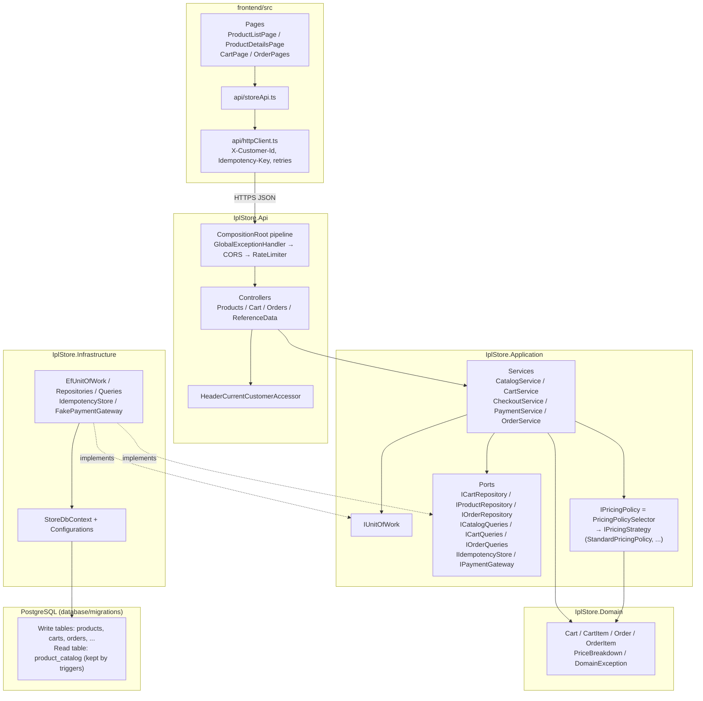
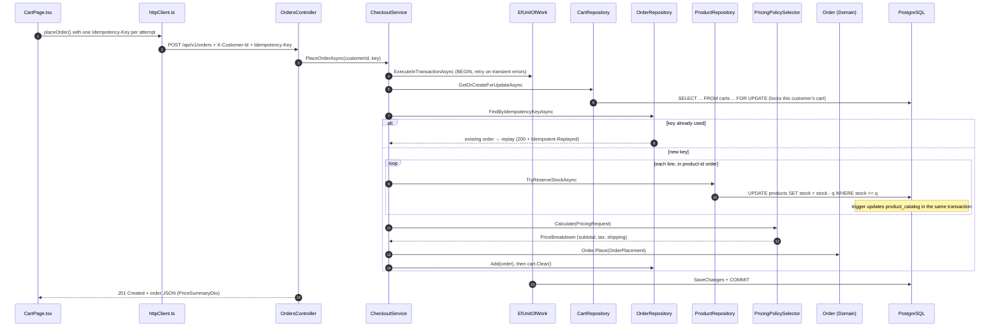
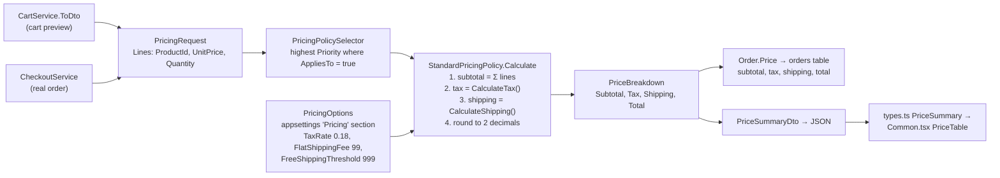
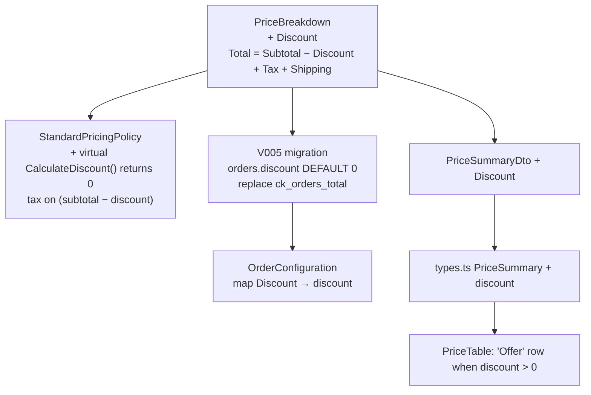

# 21. Class Tour and Change Impact

Every class in the project, grouped by project. For each one: what it does, what happens if you change it, and what happens if you delete it. Then two worked examples of which classes a change touches: **taxation** and **offers**.

- [1. The flow through the classes](#1-the-flow-through-the-classes)
- [2. Class tour by project](#2-class-tour-by-project)
- [3. How a price is calculated today](#3-how-a-price-is-calculated-today)
- [4. Example: changing taxation](#4-example-changing-taxation)
- [5. Example: adding an offer](#5-example-adding-an-offer)
- [6. Rules of thumb for any change](#6-rules-of-thumb-for-any-change)

---

## 1. The flow through the classes

### 1.1 Layers and dependencies

Arrows show "calls" or "depends on". Domain depends on nothing. Infrastructure implements the interfaces (ports) that Application defines.



### 1.2 Checkout, step by step

Checkout is the most important flow: the panel is most likely to ask about it.



The other flows use the same path with fewer steps:

| Flow | Path |
|---|---|
| Search | `ProductListPage` → `ProductsController` → `CatalogService` → `CatalogQueries` (+ `ICatalogFilter`s, `CatalogSorting`) → `SELECT` from `product_catalog` |
| View cart | `CartPage` → `CartController` → `CartService` → `CartQueries` → `PricingPolicySelector` for the totals |
| Add to cart | `ProductDetailsPage` → `CartController` → `CartService` → `EfUnitOfWork` → `CartRepository` (lock) → `IdempotencyStore` → `Cart.AddItem` → commit |
| Pay | `OrderPages` → `OrdersController` → `PaymentService` → `FakePaymentGateway` (outside the transaction) → `OrderRepository` (lock) → `Order` marked Paid |
| Cancel | `OrderPages` → `OrdersController` → `PaymentService` → `Order` marked Cancelled → `ProductRepository.ReleaseStockAsync` |

---

## 2. Class tour by project

### 2.1 IplStore.Domain: business rules

Pure C#, with no EF, HTTP or database code.

| Class | Purpose | If you change it | If you delete it |
|---|---|---|---|
| [Cart](../backend/src/IplStore.Domain/Carts/Cart.cs) | Cart aggregate: add or merge lines, change quantity, remove, clear, enforce limits. | The cart rules change everywhere, because every path goes through it. Unit tests catch wrong rules. | Nothing compiles: cart service, repository, EF config and tests use it. |
| [CartItem](../backend/src/IplStore.Domain/Carts/CartItem.cs) | One cart line (product, quantity). | A new field needs a migration column and an EF config update. | Same as `Cart`. |
| [CartPolicy](../backend/src/IplStore.Domain/Carts/CartPolicy.cs) | Limits passed into `Cart`, built from `CartOptions`. | Different limits. Normally change config instead. | `Cart` doesn't compile. |
| [Order](../backend/src/IplStore.Domain/Orders/Order.cs) | Order aggregate. `Order.Place` validates and creates the order; it also checks that the price subtotal equals the sum of the lines. Status changes Placed → Paid / Cancelled. | Pay and cancel rules change. | Checkout, payment and history break. |
| [OrderItem](../backend/src/IplStore.Domain/Orders/OrderItem.cs) | A saved order line, with a snapshot of name, price, franchise and category. | Schema change needed. | Orders have no lines. |
| [OrderLine](../backend/src/IplStore.Domain/Orders/OrderLine.cs) | Input record for `Order.Place` (a priced line). | Checkout must supply any new field. | `Order.Place` breaks. |
| [OrderPlacement](../backend/src/IplStore.Domain/Orders/OrderPlacement.cs) | Parameter object for `Order.Place`. | Adding a field is one property; no signatures change. | `Order.Place` breaks. |
| [OrderStatus](../backend/src/IplStore.Domain/Orders/OrderStatus.cs) | Placed / Paid / Cancelled. | A new status means checking the payment rules, the UI and the `ck_orders_status` constraint. | Doesn't compile. |
| [PriceBreakdown](../backend/src/IplStore.Domain/Orders/PriceBreakdown.cs) | Value object: subtotal, tax, shipping, currency; `Total` is computed. | **Changes the money shape everywhere**: DB columns, DTO, UI. See sections 4 and 5. | Pricing and orders break. |
| [Product](../backend/src/IplStore.Domain/Catalog/Product.cs), [Franchise](../backend/src/IplStore.Domain/Catalog/Franchise.cs), [ProductCategory](../backend/src/IplStore.Domain/Catalog/ProductCategory.cs), [Customer](../backend/src/IplStore.Domain/Customers/Customer.cs) | Write-model entities. Stock is not changed through `Product`; that's a single SQL update. | A new property → migration, EF config, maybe the V002 trigger function. | Repositories, configs and checkout break. |
| [DomainException](../backend/src/IplStore.Domain/Common/DomainException.cs) | A business rule was broken. Has a stable code. Mapped to 422. | The HTTP mapping changes. | Every rule check breaks. |
| [EntityNotFoundException](../backend/src/IplStore.Domain/Common/EntityNotFoundException.cs) | Not found. Mapped to 404. | Same. | Same. |
| [DomainErrorCodes](../backend/src/IplStore.Domain/Common/DomainErrorCodes.cs) | The list of error code strings clients rely on. | Renaming a code breaks the frontend and the tests. | Doesn't compile. |
| [Guard](../backend/src/IplStore.Domain/Common/Guard.cs) | Small argument checks. | — | Domain classes don't compile. |

### 2.2 IplStore.Application: use cases and ports

| Class | Purpose | If you change it | If you delete it |
|---|---|---|---|
| [CatalogService](../backend/src/IplStore.Application/Catalog/CatalogService.cs) | Validates search input and paging, calls `ICatalogQueries`. | Search validation changes. | `ProductsController` breaks. |
| [CartService](../backend/src/IplStore.Application/Carts/CartService.cs) | Get, add, update and remove cart lines. Prices the cart preview ([line 187](../backend/src/IplStore.Application/Carts/CartService.cs#L187)). | The cart flow changes. Concurrency tests protect it. | `CartController` breaks. |
| [CheckoutService](../backend/src/IplStore.Application/Orders/CheckoutService.cs) | **The core use case.** In one transaction: lock the cart → check the idempotency key → reserve stock in product-id order → price ([line 155](../backend/src/IplStore.Application/Orders/CheckoutService.cs#L155)) → `Order.Place` → clear the cart. | Highest risk. Moving the key check before the lock allows duplicate orders. Changing the lock order allows deadlocks. | Checkout is gone. |
| [PaymentService](../backend/src/IplStore.Application/Orders/PaymentService.cs) | Pay: calls the gateway outside the transaction, then marks Paid under a lock. Cancel: marks Cancelled and releases stock. | Calling the gateway inside the transaction would hold locks while waiting on the provider. | Pay and cancel break. |
| [OrderService](../backend/src/IplStore.Application/Orders/OrderService.cs) | Order history list and details. Another customer's order returns 404. | — | History endpoints break. |
| [CustomerService](../backend/src/IplStore.Application/Customers/CustomerService.cs) | Demo customer list for the picker. | — | Picker breaks. |
| [IPricingPolicy](../backend/src/IplStore.Application/Pricing/IPricingPolicy.cs) | What cart and checkout call: `Calculate(PricingRequest)` → `PriceBreakdown`. Also defines `PricingRequest` and `PricingLine`. | New pricing inputs (coupon, category, region) go into `PricingRequest` / `PricingLine`. | Pricing doesn't compile. |
| [IPricingStrategy](../backend/src/IplStore.Application/Pricing/IPricingStrategy.cs) | One strategy: `Priority` + `AppliesTo` + `Calculate`. | Every strategy must follow. | Selector doesn't compile. |
| [PricingPolicySelector](../backend/src/IplStore.Application/Pricing/PricingPolicySelector.cs) | Picks the highest-priority strategy whose `AppliesTo` is true. | The selection rule changes for everyone. | Cart and checkout have no `IPricingPolicy`. |
| [StandardPricingPolicy](../backend/src/IplStore.Application/Pricing/StandardPricingPolicy.cs) | Default strategy: subtotal + GST + shipping. Template Method with `CalculateTax` and `CalculateShipping` steps. Priority 0, always applies. | All prices change. | The selector throws at startup ("At least one IPricingStrategy must be registered"). |
| [PricingOptions](../backend/src/IplStore.Application/Pricing/PricingOptions.cs) | Currency, `TaxRate`, `FlatShippingFee`, `FreeShippingThreshold`. Read with `IOptionsMonitor`, so a config change applies on the next request. | New pricing settings go here. | Pricing doesn't compile. |
| [CartOptions](../backend/src/IplStore.Application/Carts/CartOptions.cs), [CheckoutOptions](../backend/src/IplStore.Application/Orders/CheckoutOptions.cs), [CatalogOptions](../backend/src/IplStore.Application/Catalog/CatalogOptions.cs), [PagingOptions](../backend/src/IplStore.Application/Common/Paging.cs) | Settings bound from `appsettings`. | A new property gets a config key. | The service that reads it doesn't compile. |
| [IUnitOfWork](../backend/src/IplStore.Application/Common/IUnitOfWork.cs) + [UnitOfWorkExtensions](../backend/src/IplStore.Application/Common/UnitOfWorkExtensions.cs) | "Run this work in one transaction, and retry on transient errors." | — | Every write use case breaks. |
| [IIdempotencyStore](../backend/src/IplStore.Application/Common/IIdempotencyStore.cs) | Remembers which add-to-cart keys were applied. | — | Duplicate add-to-cart protection breaks. |
| [ICartRepository](../backend/src/IplStore.Application/Carts/ICartRepository.cs), [IProductRepository](../backend/src/IplStore.Application/Catalog/IProductRepository.cs), [IOrderRepository](../backend/src/IplStore.Application/Orders/IOrderRepository.cs), [ICustomerRepository](../backend/src/IplStore.Application/Customers/ICustomerRepository.cs) | Write-side ports. | A new method needs an Infrastructure implementation. | Services break. |
| [ICatalogQueries](../backend/src/IplStore.Application/Catalog/ICatalogQueries.cs), [ICartQueries](../backend/src/IplStore.Application/Carts/ICartQueries.cs), [IOrderQueries](../backend/src/IplStore.Application/Orders/IOrderQueries.cs) | Read-side ports (CQRS-lite). | Same. | Same. |
| [IPaymentGateway](../backend/src/IplStore.Application/Orders/IPaymentGateway.cs), [IOrderNumberGenerator](../backend/src/IplStore.Application/Orders/IOrderNumberGenerator.cs) | Ports for external or replaceable pieces. | — | Payment and checkout break. |
| [SearchProductsQuery](../backend/src/IplStore.Application/Catalog/SearchProductsQuery.cs), [ProductSearchCriteria](../backend/src/IplStore.Application/Catalog/ProductSearchCriteria.cs), [ProductSort](../backend/src/IplStore.Application/Catalog/ProductSort.cs) | Raw search input → validated criteria → sort options. | A new filter adds a property here. | Search breaks. |
| [CatalogDtos](../backend/src/IplStore.Application/Catalog/CatalogDtos.cs), [CartContracts](../backend/src/IplStore.Application/Carts/CartContracts.cs), [OrderContracts](../backend/src/IplStore.Application/Orders/OrderContracts.cs) | Shapes returned to the API, and commands. `PriceSummaryDto` is in `OrderContracts`. | **Renaming a field changes the JSON** and breaks [types.ts](../frontend/src/api/types.ts). | Controllers break. |
| [ApplicationExceptions](../backend/src/IplStore.Application/Common/ApplicationExceptions.cs) | Validation (400) and concurrency conflict (409) errors. | — | Error mapping breaks. |
| [DependencyInjection](../backend/src/IplStore.Application/DependencyInjection.cs) | Registers services and pricing strategies (`AddPricingStrategy<T>()`). | A new strategy is one line here. | The API fails at startup. |

### 2.3 IplStore.Infrastructure: database and external adapters

| Class | Purpose | If you change it | If you delete it |
|---|---|---|---|
| [StoreDbContext](../backend/src/IplStore.Infrastructure/Persistence/StoreDbContext.cs) | EF Core context. Maps classes to tables that the SQL migrations created. | A new `DbSet` needs a table from a migration. | All data access breaks. |
| [Configurations/*](../backend/src/IplStore.Infrastructure/Persistence/Configurations/) (9 classes) | Map each entity to its table and columns. [OrderConfiguration](../backend/src/IplStore.Infrastructure/Persistence/Configurations/OrderConfiguration.cs) maps `PriceBreakdown` to the `subtotal`, `tax`, `shipping` and `currency` columns. | A wrong column name causes runtime SQL errors, and integration tests catch it. | EF guesses the mapping and queries fail at runtime. |
| [CatalogItem](../backend/src/IplStore.Infrastructure/Persistence/ReadModels/CatalogItem.cs) | Row class for `product_catalog`. Read-only for the app; written by triggers. | Must match the V002 columns. | Search breaks. |
| [EfUnitOfWork](../backend/src/IplStore.Infrastructure/Persistence/EfUnitOfWork.cs) | Transaction + retry. Maps concurrency errors to 409. Handles a connection lost during commit. | Changes commit and retry behaviour for every write. | The app fails at startup. |
| [IdempotencyStore](../backend/src/IplStore.Infrastructure/Persistence/IdempotencyStore.cs) | `INSERT ... ON CONFLICT DO NOTHING` into `idempotency_keys`. | — | Add-to-cart duplicates possible. |
| [CartRepository](../backend/src/IplStore.Infrastructure/Repositories/CartRepository.cs) | Race-free get-or-create + `FOR UPDATE` lock. | **Removing the lock brings back lost updates.** | Cart and checkout break. |
| [ProductRepository](../backend/src/IplStore.Infrastructure/Repositories/ProductRepository.cs) | `TryReserveStockAsync`: one conditional `UPDATE`. `ReleaseStockAsync` on cancel. | Read-then-write would allow **overselling**. | Checkout breaks. |
| [OrderRepository](../backend/src/IplStore.Infrastructure/Repositories/OrderRepository.cs) | Add order, find by idempotency key, lock an order for payment. | — | Checkout and payment break. |
| [CustomerRepository](../backend/src/IplStore.Infrastructure/Repositories/CustomerRepository.cs) | Finds customers. | — | Checkout breaks. |
| [CatalogQueries](../backend/src/IplStore.Infrastructure/Queries/CatalogQueries.cs) | Search on `product_catalog`: filters, sorting, paging. | — | Product list breaks. |
| [CatalogFilters/*](../backend/src/IplStore.Infrastructure/Queries/CatalogFilters/) | `SearchTermFilter`, `FranchiseFilter`, `CategoryFilter`, `InStockFilter` (Specification pattern). | A new filter is a class plus one DI line. | Delete the class and its DI line: **that filter is silently ignored**. Delete only the class: compile error. |
| [CatalogSorting](../backend/src/IplStore.Infrastructure/Queries/CatalogSorting.cs) | Sort orders, always ending with product id so pages are stable. | Dropping the id tiebreak makes rows repeat or go missing across pages. | Search breaks. |
| [CartQueries](../backend/src/IplStore.Infrastructure/Queries/CartQueries.cs), [OrderQueries](../backend/src/IplStore.Infrastructure/Queries/OrderQueries.cs) | Read the cart view and order history from the primary. | — | Cart and history break. |
| [FakePaymentGateway](../backend/src/IplStore.Infrastructure/Payments/FakePaymentGateway.cs) | Demo payment: approves unless a decline is simulated. | Replace it with a real adapter in DI; nothing else changes. | Payment breaks. |
| [OrderNumberGenerator](../backend/src/IplStore.Infrastructure/Orders/OrderNumberGenerator.cs) | `IPL-yyyyMMdd-XXXXXXXX`. | Format changes for new orders only. | Checkout breaks. |
| [SqlScriptDatabaseMigrator](../backend/src/IplStore.Infrastructure/Persistence/Migrations/SqlScriptDatabaseMigrator.cs) | Applies `V*.sql` once each: advisory lock, checksum, `schema_migrations`. | Changes how every environment is migrated. | No migrations run. |
| [DatabaseOptions](../backend/src/IplStore.Infrastructure/Options/DatabaseOptions.cs), [ResilienceOptions](../backend/src/IplStore.Infrastructure/Options/ResilienceOptions.cs) | Connection string, seeding, retry settings. | Set in config. | Doesn't compile. |
| [DependencyInjection](../backend/src/IplStore.Infrastructure/DependencyInjection.cs) | Registers every adapter. **This is where you swap an implementation.** | — | The app fails at startup. |

### 2.4 IplStore.Api: HTTP layer

| Class | Purpose | If you change it | If you delete it |
|---|---|---|---|
| [Program.cs](../backend/src/IplStore.Api/Program.cs) | Entry point. Runs migrations (or `--migrate-only`), starts the pipeline. | — | Nothing runs. |
| [CompositionRoot](../backend/src/IplStore.Api/Composition/CompositionRoot.cs) | Binds settings, registers layers, sets the middleware order, health checks. | **Order matters**: rate limiting before CORS would make preflights count. | Nothing is wired. |
| [ApiSettings](../backend/src/IplStore.Api/Composition/ApiSettings.cs) | `CorsSettings`, `RateLimitingSettings`. | Set in config or Terraform env vars. | Doesn't compile. |
| [ProductsController](../backend/src/IplStore.Api/Controllers/ProductsController.cs) | `GET /api/v1/products`, product details. | — | Product endpoints are gone. |
| [CartController](../backend/src/IplStore.Api/Controllers/CartController.cs) | Get / add / update / remove cart lines. | — | Cart endpoints are gone. |
| [OrdersController](../backend/src/IplStore.Api/Controllers/OrdersController.cs) | Checkout (201, or 200 + `Idempotent-Replayed`), history, pay, cancel. | — | Order endpoints are gone. |
| [ReferenceDataController](../backend/src/IplStore.Api/Controllers/ReferenceDataController.cs) | Franchises, categories, customers. | — | Filters and picker are empty. |
| [ApiRoutes](../backend/src/IplStore.Api/Controllers/ApiRoutes.cs) | URL constants (`/api/v1`). | Changing them breaks frontend URLs. | Doesn't compile. |
| [Requests.cs](../backend/src/IplStore.Api/Contracts/Requests.cs) | Query-string and body models. | Must match the frontend. | Doesn't compile. |
| [GlobalExceptionHandler](../backend/src/IplStore.Api/ErrorHandling/GlobalExceptionHandler.cs) | One place that maps exceptions to 400 / 401 / 404 / 409 / 422 / 500 problem JSON. | Status codes change for every endpoint. | Errors become raw 500s. |
| [ICurrentCustomerAccessor](../backend/src/IplStore.Api/Identity/ICurrentCustomerAccessor.cs) + [HeaderCurrentCustomerAccessor](../backend/src/IplStore.Api/Identity/HeaderCurrentCustomerAccessor.cs) | Who is calling (`X-Customer-Id` today). | Swap to a JWT-claims version in one DI line. | Every cart and order endpoint breaks. |
| [MissingCustomerIdentityException](../backend/src/IplStore.Api/Identity/MissingCustomerIdentityException.cs) | No or invalid header. Mapped to 401. | — | Doesn't compile. |
| [RequiresCustomerAttribute](../backend/src/IplStore.Api/Identity/RequiresCustomerAttribute.cs) + [SwaggerCustomerHeaderFilter](../backend/src/IplStore.Api/Composition/SwaggerCustomerHeaderFilter.cs) | Shows the header field in Swagger only. | — | Swagger stops showing the header; the API still works. |
| [DatabaseHealthCheck](../backend/src/IplStore.Api/Health/DatabaseHealthCheck.cs) | `/health/ready`: Container Apps only sends traffic when the database is reachable. | — | Traffic can reach a replica with no database connection. |

### 2.5 frontend/src

| File | Purpose | If you change it | If you delete it |
|---|---|---|---|
| [main.tsx](../frontend/src/main.tsx) | App start and routes. | Route changes = URL changes. | Blank page. |
| [config.ts](../frontend/src/config.ts) | Client settings, e.g. `apiBaseUrl`. | Points the UI at a different API. | Nothing compiles. |
| [api/httpClient.ts](../frontend/src/api/httpClient.ts) | **The only `fetch`.** Adds headers, retries safely. | Changes retry and header behaviour everywhere. | Every page breaks. |
| [api/storeApi.ts](../frontend/src/api/storeApi.ts) | One function per endpoint. | A new endpoint is a new function. | Every page breaks. |
| [api/types.ts](../frontend/src/api/types.ts) | TypeScript copies of the API DTOs, including `PriceSummary`. | Must match the backend field names. | Doesn't compile. |
| [context/SessionContext.tsx](../frontend/src/context/SessionContext.tsx) | Selected demo customer + cart badge. | — | No customer, so cart calls return 401. |
| [hooks.ts](../frontend/src/hooks.ts) | `useAsync`: loads data, ignores stale responses. | — | Pages don't compile. |
| [components/Common.tsx](../frontend/src/components/Common.tsx) | Layout, nav, `Money`, `PriceTable` (Subtotal / GST / Shipping / Total), error banner. | Nav, layout and price rows change here. | All pages break. |
| [pages/ProductListPage.tsx](../frontend/src/pages/ProductListPage.tsx) | List, search, filters (kept in the URL). | — | Home page is gone. |
| [pages/ProductDetailsPage.tsx](../frontend/src/pages/ProductDetailsPage.tsx) | Details + add to cart (one key per add). | — | Details page is gone. |
| [pages/CartPage.tsx](../frontend/src/pages/CartPage.tsx) | Cart, quantities, checkout (one key per checkout attempt). | A new key on each retry would allow duplicate orders. | Cart page is gone. |
| [pages/OrderPages.tsx](../frontend/src/pages/OrderPages.tsx) | History, details, pay, cancel. | — | Orders pages are gone. |

### 2.6 database/

| File | Purpose | Rule |
|---|---|---|
| [V001__write_model.sql](../database/migrations/V001__write_model.sql) | Write tables and constraints, including `ck_orders_total CHECK (total = subtotal + tax + shipping)` ([line 120](../database/migrations/V001__write_model.sql#L120)). | **Never edit an applied script.** The checksum fails and the deploy stops. Add `V005__...sql` instead. |
| [V002__catalog_read_model.sql](../database/migrations/V002__catalog_read_model.sql) | `product_catalog`, indexes, `project_product`, triggers. | Same. |
| [V003__reference_data.sql](../database/migrations/V003__reference_data.sql) | Franchises and categories. | Same. |
| [V004__idempotency_keys.sql](../database/migrations/V004__idempotency_keys.sql) | Add-to-cart idempotency table. | Same. |
| [seed/S001__demo_catalog.sql](../database/seed/S001__demo_catalog.sql) | Demo data (dev only). | — |

---

## 3. How a price is calculated today

Both cart and checkout call the **same** `IPricingPolicy`, so the total shown in the cart is the total charged at checkout.



Key code:

- **Steps:** [StandardPricingPolicy.cs](../backend/src/IplStore.Application/Pricing/StandardPricingPolicy.cs)
  - `Calculate`, which runs subtotal → tax → shipping
  - `CalculateTax`, a virtual step
  - `CalculateShipping`, a virtual step
- **Settings:** [PricingOptions.cs](../backend/src/IplStore.Application/Pricing/PricingOptions.cs), with values in [appsettings.json:50-55](../backend/src/IplStore.Api/appsettings.json#L50-L55).
- **Registration:** [DependencyInjection.cs:24-28](../backend/src/IplStore.Application/DependencyInjection.cs#L24-L28) registers the strategies and the selector.
- **Saving:** [OrderConfiguration.cs:21-27](../backend/src/IplStore.Infrastructure/Persistence/Configurations/OrderConfiguration.cs#L21-L27) maps `PriceBreakdown` to the `orders` columns.
- **Display:** [Common.tsx:111-140](../frontend/src/components/Common.tsx#L111-L140), `PriceTable`.

**Orders keep the price they were placed with.** `orders.subtotal/tax/shipping/total` are a snapshot, so changing pricing later never changes old orders.

---

## 4. Example: changing taxation

How far a change spreads depends on **whether the shape of `PriceBreakdown` changes**. There are three levels.

### 4.1 Level 1: change the GST rate (18% → 12%)

**Classes touched: none.** It's a config change.

| Where | Change |
|---|---|
| Local: [appsettings.json:52](../backend/src/IplStore.Api/appsettings.json#L52) | `"TaxRate": 0.12` |
| Azure: [compute.tf](../infra/terraform/compute.tf) `api_settings` | Add `Pricing__TaxRate = "0.12"`, then `terraform apply`. That creates a new revision. |

- `StandardPricingPolicy` reads `IOptionsMonitor<PricingOptions>.CurrentValue` on each call. Locally, an edit to `appsettings.json` applies on the next request without a restart. In Azure, the env var change creates a new revision.
- `PricingOptions` has `[Range(0, 1)]`, so a typo like `12` (instead of `0.12`) stops the app at startup instead of charging 1200% tax.
- Old orders keep 18%.
- Tests: [StandardPricingPolicyTests](../backend/tests/IplStore.UnitTests/Application/StandardPricingPolicyTests.cs) set their own rate, so they still pass.

### 4.2 Level 2: different GST per category (e.g. jerseys 12%, everything else 18%)

**The total is still "one tax number"**, so `PriceBreakdown`, the database, the API JSON and the UI don't change.

| # | File | Change | Why |
|---|---|---|---|
| 1 | [IPricingPolicy.cs](../backend/src/IplStore.Application/Pricing/IPricingPolicy.cs) | Add `string CategoryCode` to `PricingLine` | The tax step needs to know each line's category. Today a line only has id, price and quantity. |
| 2 | [CartService.cs:187](../backend/src/IplStore.Application/Carts/CartService.cs#L187) | Pass the line's category when building `PricingLine` | The cart preview must use the same input. |
| 3 | [CheckoutService.cs:155](../backend/src/IplStore.Application/Orders/CheckoutService.cs#L155) | Pass `product.Category.Code` when building `PricingLine` | Checkout must use the same input. |
| 4 | [ICartQueries.cs](../backend/src/IplStore.Application/Carts/ICartQueries.cs) / [CartQueries.cs](../backend/src/IplStore.Infrastructure/Queries/CartQueries.cs) | Include the category code in `CartLineView` if only the name is there | The cart read path needs the code, not just the display name. |
| 5 | [PricingOptions.cs](../backend/src/IplStore.Application/Pricing/PricingOptions.cs) | Add `Dictionary<string, decimal> CategoryTaxRates` | The rates are settings, not code. |
| 6 | [appsettings.json](../backend/src/IplStore.Api/appsettings.json) | `"CategoryTaxRates": { "JERSEY": 0.12 }` | Values. |
| 7 | **New** `CategoryGstPricingPolicy : StandardPricingPolicy` | Override `CalculateTax` (rate per line's category, falling back to `TaxRate`). `Priority => 10`. `AppliesTo => true`. | Template Method: only the tax step changes. Shipping and rounding are reused. |
| 8 | [DependencyInjection.cs](../backend/src/IplStore.Application/DependencyInjection.cs) | `services.AddPricingStrategy<CategoryGstPricingPolicy>();` | Strategy: the selector picks it because it has a higher priority than the standard one. |
| 9 | Tests | New unit tests for the new class; existing tests unchanged | |

The new class:

```csharp
public sealed class CategoryGstPricingPolicy : StandardPricingPolicy
{
    public CategoryGstPricingPolicy(IOptionsMonitor<PricingOptions> options) : base(options) { }

    public override int Priority => 10;

    protected override decimal CalculateTax(decimal taxableAmount, PricingRequest request, PricingOptions options) =>
        request.Lines.Sum(l =>
            l.LineTotal * (options.CategoryTaxRates.TryGetValue(l.CategoryCode, out var rate) ? rate : options.TaxRate));
}
```

**Not touched:** `PricingPolicySelector`, `StandardPricingPolicy`, `Order`, `PriceBreakdown`, `OrderConfiguration`, migrations, controllers, `types.ts`, `PriceTable`.

**Faster alternative:** store a GST rate on `product_categories` (migration V005) and load it with the product. That's better when the business edits rates often, but it touches the database, the entities and the repositories.

### 4.3 Level 3: show the tax split (CGST + SGST, or IGST for another state)

**This changes the shape of `PriceBreakdown`**, so the change goes through every layer:

| Layer | File | Change |
|---|---|---|
| Pricing input | [IPricingPolicy.cs](../backend/src/IplStore.Application/Pricing/IPricingPolicy.cs) | Add the shipping state to `PricingRequest` |
| Callers | [CartService.cs](../backend/src/IplStore.Application/Carts/CartService.cs), [CheckoutService.cs](../backend/src/IplStore.Application/Orders/CheckoutService.cs), [OrderContracts.cs](../backend/src/IplStore.Application/Orders/OrderContracts.cs) (`PlaceOrderCommand`), [OrdersController.cs](../backend/src/IplStore.Api/Controllers/OrdersController.cs) | Accept and pass the state |
| Domain | [PriceBreakdown.cs](../backend/src/IplStore.Domain/Orders/PriceBreakdown.cs) | Add `Cgst`, `Sgst`, `Igst`. `Tax` becomes their sum. |
| Strategy | [StandardPricingPolicy.cs](../backend/src/IplStore.Application/Pricing/StandardPricingPolicy.cs) or a new subclass | Fill the split |
| Database | **New** `V005__tax_split.sql` | `ALTER TABLE orders ADD COLUMN cgst numeric(12,2) NOT NULL DEFAULT 0, ...` |
| EF mapping | [OrderConfiguration.cs](../backend/src/IplStore.Infrastructure/Persistence/Configurations/OrderConfiguration.cs) | Map the new columns |
| API JSON | [OrderContracts.cs](../backend/src/IplStore.Application/Orders/OrderContracts.cs) `PriceSummaryDto` | New fields |
| Frontend | [types.ts](../frontend/src/api/types.ts) `PriceSummary`, [Common.tsx](../frontend/src/components/Common.tsx) `PriceTable` | New rows |
| Tests | Pricing tests, an order test, integration tests | |

**The lesson:** a change *inside* a pricing step stays in Application. A change to *what a price contains* goes through every layer, because the price is saved and shown.

---

## 5. Example: adding an offer

Two typical offers:
- **Offer A:** 10% off when the subtotal is ₹2,000 or more.
- **Offer B:** 15% off every CSK item.

Today `PriceBreakdown` has no discount field, and the database enforces `total = subtotal + tax + shipping`. So any offer that shows "you saved ₹X" changes the price shape (Level 3 in section 4). It's built once as a generic discount line; after that, each new offer is just a new strategy class.

### 5.1 Decisions to make first

| Question | Recommended answer | Why |
|---|---|---|
| Is GST charged before or after the discount? | **After the discount** (on `subtotal - discount`) | In India, GST is normally charged on the discounted value when the discount is shown on the invoice. Confirm with the business. |
| Can offers stack? | **No**: the selector picks the one highest-priority strategy | Simple and predictable. Stacking would need a different design (a list of discount steps). |
| Does free shipping use the subtotal before or after the discount? | Decide and write it down | Otherwise a discount can silently move an order under the free-shipping threshold. |
| What if the offer ends between viewing the cart and checkout? | Checkout re-prices. The order stores what was actually charged. | Checkout is the source of truth. The cart is a preview. |

### 5.2 One-time change: add a discount line to the price



| # | Layer | File | Change |
|---|---|---|---|
| 1 | Domain | [PriceBreakdown.cs](../backend/src/IplStore.Domain/Orders/PriceBreakdown.cs) | Add `decimal Discount`, with a default of `0` so existing callers still compile. `Total => Subtotal - Discount + Tax + Shipping`. |
| 2 | Domain | [Order.cs](../backend/src/IplStore.Domain/Orders/Order.cs) | No change: `Total = placement.Price.Total` and the subtotal check (sum of lines) still holds, because the discount is separate from the subtotal. Add a guard: `Discount <= Subtotal`. |
| 3 | Application | [StandardPricingPolicy.cs](../backend/src/IplStore.Application/Pricing/StandardPricingPolicy.cs) | Add a Template Method step: `protected virtual decimal CalculateDiscount(...) => 0m;`. In `Calculate`: discount → tax on `subtotal - discount` → shipping. Default behaviour is unchanged. |
| 4 | Database | **New** `database/migrations/V005__order_discount.sql` | See below. |
| 5 | Infrastructure | [OrderConfiguration.cs](../backend/src/IplStore.Infrastructure/Persistence/Configurations/OrderConfiguration.cs) | `price.Property(p => p.Discount).HasColumnName("discount").HasPrecision(12, 2);` |
| 6 | Application | [OrderContracts.cs](../backend/src/IplStore.Application/Orders/OrderContracts.cs) | Add `Discount` to `PriceSummaryDto` and to `From(...)`. Cart and order responses both use it. |
| 7 | Frontend | [types.ts](../frontend/src/api/types.ts) | `discount: number;` in `PriceSummary` |
| 8 | Frontend | [Common.tsx](../frontend/src/components/Common.tsx) `PriceTable` | An "Offer" row after Subtotal, shown only when `discount > 0` |
| 9 | Tests | Pricing, order, and an integration test that places a discounted order | Proves the database check constraint accepts it |

The migration, written to be safe while the old version is still running:

```sql
-- V005__order_discount.sql
SET lock_timeout = '5s';

ALTER TABLE orders ADD COLUMN discount numeric(12,2) NOT NULL DEFAULT 0;

ALTER TABLE orders DROP CONSTRAINT ck_orders_total;
ALTER TABLE orders ADD CONSTRAINT ck_orders_total
    CHECK (total = subtotal - discount + tax + shipping);
ALTER TABLE orders ADD CONSTRAINT ck_orders_discount
    CHECK (discount >= 0 AND discount <= subtotal);
```

Why it's safe:
- The old API version doesn't know about `discount`, so its inserts get `0`, and the new check still holds.
- Existing rows also get `0`, and the new check holds for them too.

**If you forget the migration:** checkout fails with a check-constraint error (`ck_orders_total`), because the new total doesn't equal `subtotal + tax + shipping`. That's the database stopping an order with wrong totals from being saved.

### 5.3 Each offer after that: one class + one DI line + settings

Offer A, 10% off at ₹2,000 or more:

```csharp
public sealed class ThresholdOfferPricingPolicy : StandardPricingPolicy
{
    private readonly IOptionsMonitor<OfferOptions> _offer;

    public ThresholdOfferPricingPolicy(IOptionsMonitor<PricingOptions> pricing, IOptionsMonitor<OfferOptions> offer)
        : base(pricing) => _offer = offer;

    public override int Priority => 20;

    public override bool AppliesTo(PricingRequest request) =>
        _offer.CurrentValue.Enabled && request.Lines.Sum(l => l.LineTotal) >= _offer.CurrentValue.MinSubtotal;

    protected override decimal CalculateDiscount(decimal subtotal, PricingRequest request, PricingOptions options) =>
        subtotal * _offer.CurrentValue.Percent;
}
```

| # | File | Change |
|---|---|---|
| 1 | **New** `Application/Pricing/OfferOptions.cs` | `Enabled`, `MinSubtotal`, `Percent` (with `[Range]`), plus `StartsAt` / `EndsAt` if the offer is time-limited |
| 2 | [CompositionRoot.cs](../backend/src/IplStore.Api/Composition/CompositionRoot.cs) | `services.AddValidatedOptions<OfferOptions>(configuration, "Offer");` |
| 3 | [appsettings.json](../backend/src/IplStore.Api/appsettings.json) / Terraform env vars | `"Offer": { "Enabled": true, "MinSubtotal": 2000, "Percent": 0.10 }` |
| 4 | **New** `ThresholdOfferPricingPolicy.cs` | As above |
| 5 | [DependencyInjection.cs](../backend/src/IplStore.Application/DependencyInjection.cs) | `services.AddPricingStrategy<ThresholdOfferPricingPolicy>();` |
| 6 | Tests | Applies at 2000, doesn't apply at 1999.99, disabled means standard pricing |

Offer B, 15% off CSK items:
- `PricingLine` needs `FranchiseCode`. That's the same kind of change as `CategoryCode` in section 4.2: `IPricingPolicy.cs`, `CartService`, `CheckoutService`, `CartQueries`.
- `CalculateDiscount` then sums only the CSK lines.

A coupon code that the customer types adds input from the user:

| Layer | File | Change |
|---|---|---|
| Pricing input | [IPricingPolicy.cs](../backend/src/IplStore.Application/Pricing/IPricingPolicy.cs) | `PricingRequest` gets `string? CouponCode` |
| Command | [OrderContracts.cs](../backend/src/IplStore.Application/Orders/OrderContracts.cs) | `PlaceOrderCommand` gets `CouponCode` |
| API | [OrdersController.cs](../backend/src/IplStore.Api/Controllers/OrdersController.cs), [Requests.cs](../backend/src/IplStore.Api/Contracts/Requests.cs) | Accept it in the request body |
| Services | [CartService.cs](../backend/src/IplStore.Application/Carts/CartService.cs), [CheckoutService.cs](../backend/src/IplStore.Application/Orders/CheckoutService.cs) | Pass it into `PricingRequest` |
| Frontend | [storeApi.ts](../frontend/src/api/storeApi.ts), [CartPage.tsx](../frontend/src/pages/CartPage.tsx) | Send it; add an input box |
| Validation | the strategy's `AppliesTo` | An unknown or expired code means standard pricing. Or reject it with a `DomainException` (422) and a new code in [DomainErrorCodes](../backend/src/IplStore.Domain/Common/DomainErrorCodes.cs). |
| Database | (optional) a `coupon_code` column on `orders` (another migration) | Records which coupon was used |

### 5.4 What never changes for an offer

These don't need to change:

- `PricingPolicySelector`
- `Order.Place` logic
- every repository
- `CartRepository` / `ProductRepository` locking
- idempotency
- `GlobalExceptionHandler`
- the controllers (except for a coupon code)

The concurrency and duplicate-order guarantees are untouched, because pricing is a pure calculation inside the existing transaction.

---

## 6. Rules of thumb for any change

| If the change is… | It touches… |
|---|---|
| A **value** (rate, fee, threshold, limit) | Config only (`appsettings.json` or a Terraform env var). No code. |
| A **rule inside one step** (how tax or shipping is computed) | One new strategy class + one DI line + tests. |
| A **new input** to a rule (category, franchise, coupon, state) | `PricingRequest` / `PricingLine` + both callers (`CartService`, `CheckoutService`), and sometimes the read query. |
| **What a price contains** (discount, tax split) | Every layer: Domain → migration → EF config → DTO → `types.ts` → UI. |
| A **new table or column** | A new `V00N` migration (never edit an old one) + EF config + maybe the V002 trigger function. |
| **Who the user is** (real login) | One new `ICurrentCustomerAccessor` + one DI line, plus JWT auth middleware. |
| **A real payment provider** | One new `IPaymentGateway` adapter + one DI line. |

**Short answer for the panel:** "Pricing is a Strategy with a selector, and each strategy is a Template Method. A new tax rate is config. A new tax rule is one subclass that overrides one step, plus one DI line. Only changes to what a price contains, like a discount line, go through every layer: domain, migration, mapping, DTO and UI. That's on purpose, because the price is saved on the order and the database checks the total."
