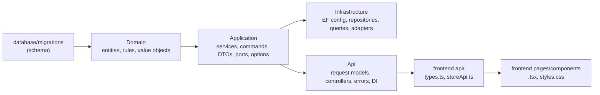

# 22. Change Reasoning Playbook: From a Request to the Files, Layer by Layer

Use this when the panel asks for a change: logic, UI, or both. It answers three questions in order:

1. **What kind of change is it?** (section 1)
2. **Which layers does it reach, and in what order?** (sections 2-4)
3. **Which files, and why each one?** (section 5, worked examples)

Recipe-style lists for common changes are in [08-change-playbook.md](08-change-playbook.md). Pricing, tax and offer examples are in [21 §4-5](21-class-tour-and-change-impact.md#4-example-changing-taxation).

---

## 1. Classify the request: ask these questions in order

Each "yes" adds work in a specific layer.

| # | Question | If yes, it touches | Why |
|---|---|---|---|
| Q1 | Is it only a **value** (rate, limit, threshold, page size)? | `appsettings.json` (+ Terraform env var for Azure). **Stop here.** | Values are in Options classes read via `IOptionsMonitor`. No code. |
| Q2 | Does the user **see something new, moved, or restyled**? | `frontend/src` (`.tsx`, `styles.css`) | Presentation lives only in the frontend. |
| Q3 | Is the data the UI needs **already in the API response**? If **no** → | DTO (Application) + query/mapping (Infrastructure) + `types.ts` | The API contract must carry the field before the UI can show it. |
| Q4 | Is the data **already stored** in the database? If **no** → | Migration `V00N` + Domain entity + EF configuration (+ V002 function if search needs it) | New data needs a column, a property, and a mapping between them. |
| Q5 | Does the client **send something new** (a field, a header, a new action)? | Request model (Api) → command (Application) → maybe Domain input | Input flows inward: HTTP → use case → business rule. |
| Q6 | Is there a **new rule or decision**? | Domain (if it protects one aggregate) **or** Application (if it coordinates several) **or** a new Strategy class (if it's one variant of an existing behaviour) | See section 3: where logic belongs. |
| Q7 | Is there a **new state or action** (e.g. "ship order")? | Domain state transition + error code + use case + endpoint + UI button (+ DB check constraint) | A new action is a new use case end to end. |
| Q8 | Does it talk to a **new external system** (payment, email, search)? | Port interface (Application) + adapter (Infrastructure) + one DI line | Ports and adapters: the core never depends on a vendor. |
| Q9 | Does it change **who may do it**? | Auth in Api (`ICurrentCustomerAccessor`, `[Authorize]`, roles) | Identity and permissions are an API concern. |

**Shortcut:**
- Q1 only → config.
- Q2 only → frontend only.
- Q3 → contract change.
- Q4 → schema change.
- Q5–Q7 → full stack.

---

## 2. Which way changes ripple

Changes **ripple outward from where the data or rule lives**. If you change something in an inner layer, everything outside that uses it may need to follow. Inner layers never change because of outer ones, unless outer needs bring new data inward (Q4/Q5).

**What forces what.** If you change the left column, check the right column:

| If you change… | …you must also change | Why |
|---|---|---|
| A request model in [Requests.cs](../backend/src/IplStore.Api/Contracts/Requests.cs) | The command record in Application (`*Contracts.cs`) and the controller mapping | The controller turns HTTP input into a command. |
| A command (e.g. `PlaceOrderCommand`) | The service that handles it | The service reads the new field. |
| What the Domain needs to make a decision (e.g. `OrderPlacement`) | The service that builds it | Domain methods take parameter objects. A new field is one property, and only the builder changes. |
| A Domain entity property that must be saved | Migration `V00N` + `*Configuration.cs` in Infrastructure | EF maps properties to columns, and the column must exist first. |
| A product field used in search | Also `project_product` in a new migration + [CatalogItem](../backend/src/IplStore.Infrastructure/Persistence/ReadModels/CatalogItem.cs) | Search reads `product_catalog`, which the trigger fills. |
| A DTO record (e.g. `ProductSummaryDto`) | Its mapping (`From` / `Projection` / the `Select` in a query class) + [types.ts](../frontend/src/api/types.ts) | The JSON shape changed, so both ends must agree. |
| `types.ts` | The `.tsx` files that show the field | TypeScript will show errors where the shape no longer matches. |
| `PricingRequest` / `PricingLine` | **Both** [CartService](../backend/src/IplStore.Application/Carts/CartService.cs#L187) and [CheckoutService](../backend/src/IplStore.Application/Orders/CheckoutService.cs#L155) | The cart preview and checkout must price the same way. |
| `PriceBreakdown` (what a price contains) | Migration + [OrderConfiguration](../backend/src/IplStore.Infrastructure/Persistence/Configurations/OrderConfiguration.cs) + `PriceSummaryDto` + `types.ts` + `PriceTable` | Prices are saved on the order and shown in the UI. See [21 §5](21-class-tour-and-change-impact.md#5-example-adding-an-offer). |
| `OrderStatus` | The DB check constraint `ck_orders_status` (V001) + UI button visibility | The database and the UI both know the list of statuses. |
| A new error | [DomainErrorCodes](../backend/src/IplStore.Domain/Common/DomainErrorCodes.cs) (+ maybe a UI message) | Clients rely on stable codes. [GlobalExceptionHandler](../backend/src/IplStore.Api/ErrorHandling/GlobalExceptionHandler.cs) maps `DomainException` → 422 for you. |
| A new Options class | Bind it in [CompositionRoot](../backend/src/IplStore.Api/Composition/CompositionRoot.cs) + `appsettings.json` (+ Terraform if Azure differs) | Unbound options silently use their defaults. |
| A new interface implementation | A DI line in `DependencyInjection.cs` | Without registration it's never used. For filters, nothing fails, so the filter is silently ignored. |
| An applied migration (V001–V004) | **Never.** Add `V005` | The checksum check stops the deploy. |

**Order to make changes in:** database → Domain → Application → Infrastructure → Api → frontend → tests.

- Outer layers compile against inner ones, so you fix compile errors in one direction.
- The column must exist before EF maps it.
- The UI comes last, because it depends on the JSON shape.

---

## 3. Where logic belongs: placement rules

| The logic is… | Put it in | Example in this repo |
|---|---|---|
| A rule that keeps **one aggregate** valid | **Domain** entity method | `Cart.AddItem` limits, `Order.Place` subtotal check, `Order.Cancel` state rule |
| **Steps** that use several aggregates, a transaction, or ports | **Application** service | `CheckoutService`: lock → key → reserve → price → place |
| **One variant** of an existing behaviour | **New Strategy class** (+ DI line) | Pricing: `StandardPricingPolicy`, a future offer or GST rule |
| **One step that differs** inside a fixed algorithm | **Template Method** subclass overriding one `protected virtual` step | `CalculateTax`, `CalculateShipping` |
| **One more search condition** | **New `ICatalogFilter`** class (Specification) | `FranchiseFilter`, `InStockFilter` |
| A **tunable value** | **Options** class + `appsettings` | `CartOptions.MaxQuantityPerLine`, `PricingOptions.TaxRate` |
| **SQL, locking, EF mapping** | **Infrastructure** | `CartRepository` `FOR UPDATE`, `ProductRepository` conditional `UPDATE` |
| An **external system** | **Port** in Application + **adapter** in Infrastructure | `IPaymentGateway` → `FakePaymentGateway` |
| **HTTP** shape, status codes, headers | **Api** | `OrdersController` 201 vs 200 + `Idempotent-Replayed` |
| **Who the caller is / may do** | **Api** identity | `ICurrentCustomerAccessor` |
| **Display** | **Frontend** | `PriceTable`, `CartPage` |

**When a new class is added because of a pattern**, say so in one line:

| Pattern | Add a class when… | One-line reason |
|---|---|---|
| Strategy | a new pricing rule | "Open/Closed: add a strategy, don't edit the existing one." |
| Template Method | only one pricing step differs | "Reuse the fixed steps and rounding; override only the step that changes." |
| Specification (filters) | a new search condition | "Each filter is independent and composable; `CatalogQueries` doesn't change." |
| Ports and adapters | a new external service | "The core depends on an interface; the vendor is swappable in DI." |
| Parameter object | a new input to a domain call or pricing | "Add a property, not a parameter; signatures stay stable." |
| Options | a new tunable value | "Change behaviour by config, validated at startup." |

---

## 4. The standard steps for any change

1. **Classify** with section 1. Say the answer out loud: "This is a contract change, no schema change."
2. **List the files** with section 2, inner to outer.
3. **Change them in that order**, building as you go: `dotnet build backend/IplStore.sln`.
4. **Test.**
   - `dotnet test backend/tests/IplStore.UnitTests`, which takes seconds.
   - Add one test for the new rule.
5. **Frontend.**
   - `cd frontend; npm run build` is the type check: it shows every place the shape no longer matches.
   - `npm run dev` lets you look at the result.
6. **Explain** each file in one line: what changed, and why that layer.

---

## 5. Worked examples

Each table is in the order you'd make the changes.

### Example A: UI only. Show "My orders" beside the cart

**Classification:** Q2 only. The data is already loaded by existing endpoints. Frontend only.

| # | Layer | File | Change | Why |
|---|---|---|---|---|
| 1 | Frontend page | [CartPage.tsx](../frontend/src/pages/CartPage.tsx) | Render the orders list next to the cart, reusing `OrdersPage` from [OrderPages.tsx](../frontend/src/pages/OrderPages.tsx) | Reuse the existing component; it already loads its own data via `storeApi.listOrders`. |
| 2 | Frontend style | [styles.css](../frontend/src/styles.css) | A two-column layout (grid or flex) that stacks on narrow screens | Position is styling, not logic. |
| 3 | (optional) Nav | [Common.tsx:16-20](../frontend/src/components/Common.tsx#L16-L20) | Move or keep the `My orders` `<NavLink>` | The nav order lives in `Layout`. |

**Not touched:** backend, `types.ts`, `storeApi.ts`, database. Step-by-step detail: [15-ui-layout-changes.md](15-ui-layout-changes.md).

### Example B: Data stored but not exposed. Show available sizes on the product card (list page)

**Classification:** Q2 + Q3. Sizes are stored in `product_catalog.attributes` and returned by the **details** endpoint, but not by the **list** endpoint. This is a contract change with no schema change.

| # | Layer | File | Change | Why |
|---|---|---|---|---|
| 1 | Application | [CatalogDtos.cs](../backend/src/IplStore.Application/Catalog/CatalogDtos.cs) `ProductSummaryDto` | Add `IReadOnlyList<string> Sizes` | The list's API contract must carry the field. |
| 2 | Infrastructure | [CatalogQueries.cs:42](../backend/src/IplStore.Infrastructure/Queries/CatalogQueries.cs#L42) | Fill `Sizes` from `Attributes` in the `Select` | The query builds the DTO. The data is already in the read table, so no join is needed. |
| 3 | Frontend contract | [types.ts](../frontend/src/api/types.ts) `ProductSummary` | `sizes: string[]` | Keep the TypeScript copy in line with the JSON. |
| 4 | Frontend UI | [Common.tsx `ProductCard`](../frontend/src/components/Common.tsx#L72) | Show the sizes | Display. |
| 5 | Tests | Integration test on `GET /products` | Assert `sizes` is present | Proves the contract. |

**Not touched:** Domain (no new rule), migrations (data already stored), controllers (they return whatever the service gives).

**Contract note:** adding a field is backward compatible, because old clients ignore it. Renaming or removing a field would break them, which is why `/api/v1` exists ([ApiRoutes](../backend/src/IplStore.Api/Controllers/ApiRoutes.cs)).

### Example C: Logic only, no contract change. "Max 2 autographed photos per cart"; other items keep the limit of 10

**Classification:** Q1 is not enough (one global limit exists, but not per category), so this is Q6. The API shape doesn't change: the existing `422 cart.quantity_limit_exceeded` response is reused.

| # | Layer | File | Change | Why |
|---|---|---|---|---|
| 1 | Application options | [CartOptions.cs](../backend/src/IplStore.Application/Carts/CartOptions.cs) | Add `Dictionary<string,int> MaxQuantityPerCategory`; `ToPolicy(categoryCode)` picks the category limit, or falls back to `MaxQuantityPerLine` | The limit is a tunable value, so it belongs in config. |
| 2 | Config | [appsettings.json](../backend/src/IplStore.Api/appsettings.json) | `"MaxQuantityPerCategory": { "AUTOGRAPHED_PHOTO": 2 }` | The value itself, keyed by the category code from [V003](../database/migrations/V003__reference_data.sql#L23). |
| 3 | Application service | [CartService.cs](../backend/src/IplStore.Application/Carts/CartService.cs) `AddItemAsync` (line 94) **and** `UpdateItemAsync` (line 135) | Pass the product's category code to `ToPolicy(...)` | **Both paths** must apply the rule, or a customer adds 1 and then sets the quantity to 9. `FindAsync` may not load `Category`; if not, load it (as `GetWithReferencesAsync` does). |
| 4 | Domain | [Cart.cs](../backend/src/IplStore.Domain/Carts/Cart.cs), [CartPolicy.cs](../backend/src/IplStore.Domain/Carts/CartPolicy.cs) | **No change** | `Cart` already enforces "quantity ≤ policy limit". Only *which* limit is passed changes. Parameter object design paying off. |
| 5 | Tests | Unit tests on `CartService` | 2 allowed, 3 rejected for the category; 10 still allowed elsewhere | Proves the rule and the fallback. |

**Not touched:** API, DTOs, database, frontend. The UI already shows the 422 message in its `ErrorBanner`.

**Alternative:** store the limit on `product_categories` (V005 + entity + EF config). Choose this if the business edits limits often. It costs a schema change.

### Example D: Both, and the contract reaches the Domain. "Gift message at checkout"

**Classification:** Q2 + Q4 + Q5. The client sends a new field, it must be saved with the order, and it's shown in order details. Every layer changes, so this is the clearest "contract changed, so Domain changed, so others followed" case.

| # | Layer | File | Change | Why this file |
|---|---|---|---|---|
| 1 | Database | **New** `database/migrations/V005__order_gift_message.sql`: `ALTER TABLE orders ADD COLUMN gift_message varchar(200);` | Nullable, so the old API version can still insert | Data must be stored. Never edit V001. |
| 2 | Domain | [OrderPlacement.cs](../backend/src/IplStore.Domain/Orders/OrderPlacement.cs) | Add `string? GiftMessage` | It's an input to placing an order. Parameter object: one property, no signature change. |
| 3 | Domain | [Order.cs](../backend/src/IplStore.Domain/Orders/Order.cs) | Add the `GiftMessage` property. In `Place`, trim it and enforce ≤ 200 characters (`DomainException` with a new code) | Order keeps itself valid. The rule lives with the data it protects. |
| 4 | Domain | [DomainErrorCodes.cs](../backend/src/IplStore.Domain/Common/DomainErrorCodes.cs) | `OrderGiftMessageTooLong = "order.gift_message_too_long"` | Stable code for clients and tests. |
| 5 | Application | [OrderContracts.cs](../backend/src/IplStore.Application/Orders/OrderContracts.cs) | `PlaceOrderCommand` gets `GiftMessage`. `OrderDetailsDto` gets `GiftMessage`, filled in `From(...)` | Input contract (command) and output contract (DTO). |
| 6 | Application | [CheckoutService.cs:159](../backend/src/IplStore.Application/Orders/CheckoutService.cs#L159) | Pass `command.GiftMessage` into `OrderPlacement` | The service is the only place that turns a command into a domain call. |
| 7 | Infrastructure | [OrderConfiguration.cs](../backend/src/IplStore.Infrastructure/Persistence/Configurations/OrderConfiguration.cs) | `builder.Property(o => o.GiftMessage).HasMaxLength(200);` | Map the property to the new column. |
| 8 | Api | [Requests.cs](../backend/src/IplStore.Api/Contracts/Requests.cs) | **New** `PlaceOrderRequest { [StringLength(200)] string? GiftMessage }` | HTTP input model. `[StringLength]` gives a fast 400 before the domain rule runs. |
| 9 | Api | [OrdersController.cs:47](../backend/src/IplStore.Api/Controllers/OrdersController.cs#L47) | Accept `[FromBody] PlaceOrderRequest? request` and map it to the command | Today checkout has no body. This adds one, and it's optional, so old clients still work. |
| 10 | Frontend contract | [types.ts](../frontend/src/api/types.ts) `OrderDetails`, [storeApi.ts:87](../frontend/src/api/storeApi.ts#L87) `placeOrder(key, giftMessage?)` | Send it, and read it back | Both ends of the contract. |
| 11 | Frontend UI | [CartPage.tsx](../frontend/src/pages/CartPage.tsx) (textarea), [OrderPages.tsx](../frontend/src/pages/OrderPages.tsx) (show it) | Input and display | Presentation. |
| 12 | Tests | `OrderTests` (length rule), checkout unit test (passes through), integration test (saved and returned) | | One test per layer that owns logic. |

**Idempotency check:** a replay with the same key returns the **original** order, including its original gift message, even if the retry sent a different one. That's correct: a retry must not change a placed order. Say this if the panel asks.

**Why each layer changed, in one sentence:** "The client sends a new field (Api request → command). The order must store and validate it (Domain + migration + EF mapping). The details page must show it (DTO → types.ts → UI)."

### Example E: New action. "Mark an order as shipped"

**Classification:** Q7 + Q9. `OrderStatus.Shipped` already exists in [OrderStatus.cs](../backend/src/IplStore.Domain/Orders/OrderStatus.cs), and V001's `ck_orders_status` already allows `'Shipped'`, so **no migration** is needed.

| # | Layer | File | Change | Why |
|---|---|---|---|---|
| 1 | Domain | [Order.cs](../backend/src/IplStore.Domain/Orders/Order.cs) | `MarkShipped()`: only from `Paid`, otherwise a `DomainException`. Calling it twice does nothing, like `MarkPaid`. | The state rule belongs to the aggregate. |
| 2 | Domain | [DomainErrorCodes.cs](../backend/src/IplStore.Domain/Common/DomainErrorCodes.cs) | `OrderNotShippable` | Stable 422 code. |
| 3 | Application | A new `FulfilmentService` (or a method on `PaymentService`) | Inside `IUnitOfWork`: `FindForUpdateAsync` → `MarkShipped()` | Same shape as pay and cancel: lock the order, change the state, commit. A new service keeps payment and fulfilment separate (Single Responsibility). |
| 4 | Application | [DependencyInjection.cs](../backend/src/IplStore.Application/DependencyInjection.cs) | `services.AddScoped<IFulfilmentService, FulfilmentService>();` | Register the new use case. |
| 5 | Infrastructure | **No change** | `OrderRepository.FindForUpdateAsync` already exists | Reuse the port. |
| 6 | Api | [OrdersController.cs](../backend/src/IplStore.Api/Controllers/OrdersController.cs) | `POST /orders/{id}/ship` | New action = new endpoint. |
| 7 | Api / security | Auth | **Needs a staff role.** Today any `X-Customer-Id` could call it. Add JWT auth with an admin role (RBAC) before exposing it. | A customer must not ship their own order. Name this gap. |
| 8 | Frontend | [storeApi.ts](../frontend/src/api/storeApi.ts), [OrderPages.tsx](../frontend/src/pages/OrderPages.tsx) | `shipOrder(id)`; show "Shipped" status. An admin button only exists in an admin UI. | Display, and an action for staff. |
| 9 | Check related rules | [Order.cs `Cancel`](../backend/src/IplStore.Domain/Orders/Order.cs#L125) | Already only allows `Placed`, so a shipped order can't be cancelled | Check existing transitions when you add a state. |

---

## 6. How to explain a change to the panel

For each file, one line in this order: **what** changed, **why this layer**, **what would break without it**. Then close with the risk and the test.

> "This was a contract change that reached the Domain. I added a nullable column in a new migration, because applied scripts are immutable. The Order aggregate validates the message, because the rule belongs with the data. The command and DTO carry it. EF maps it. The controller accepts an optional body, so old clients still work. The UI sends and shows it. Risk: a replay returns the original message, which is the correct behaviour. Tests: a domain rule test and an integration test."

---

## 7. Quick reference: request → layers

| Request | Config | Frontend | DTO / types | Domain | Migration | Api | New class (pattern) |
|---|---|---|---|---|---|---|---|
| Change a rate or limit | ✅ | | | | | | |
| Move or restyle UI | | ✅ | | | | | |
| Show a field already in the JSON | | ✅ | | | | | |
| Show a stored field not in the JSON | | ✅ | ✅ | | | | |
| Show a new field | | ✅ | ✅ | ✅ | ✅ | | |
| New input from the user | | ✅ | ✅ | maybe | maybe | ✅ | |
| New business rule on one aggregate | maybe | | | ✅ | | | |
| New pricing or tax rule | ✅ | | | | | | ✅ Strategy / Template Method |
| New search filter | | ✅ | | | | ✅ | ✅ Specification |
| New action or state | | ✅ | ✅ | ✅ | maybe | ✅ | maybe (new service) |
| New external system | ✅ | | | | | | ✅ Port + adapter |
| Real login | ✅ | ✅ | | | | ✅ | ✅ new `ICurrentCustomerAccessor` |
